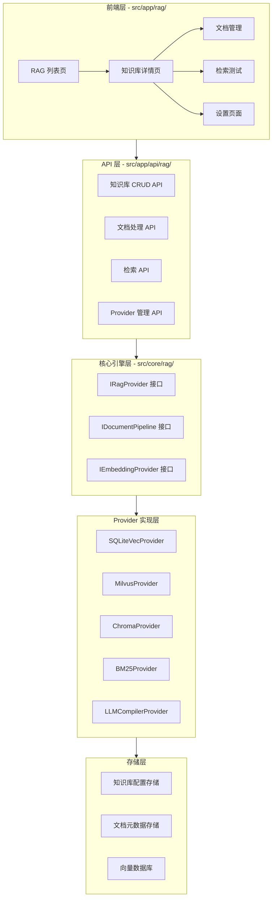
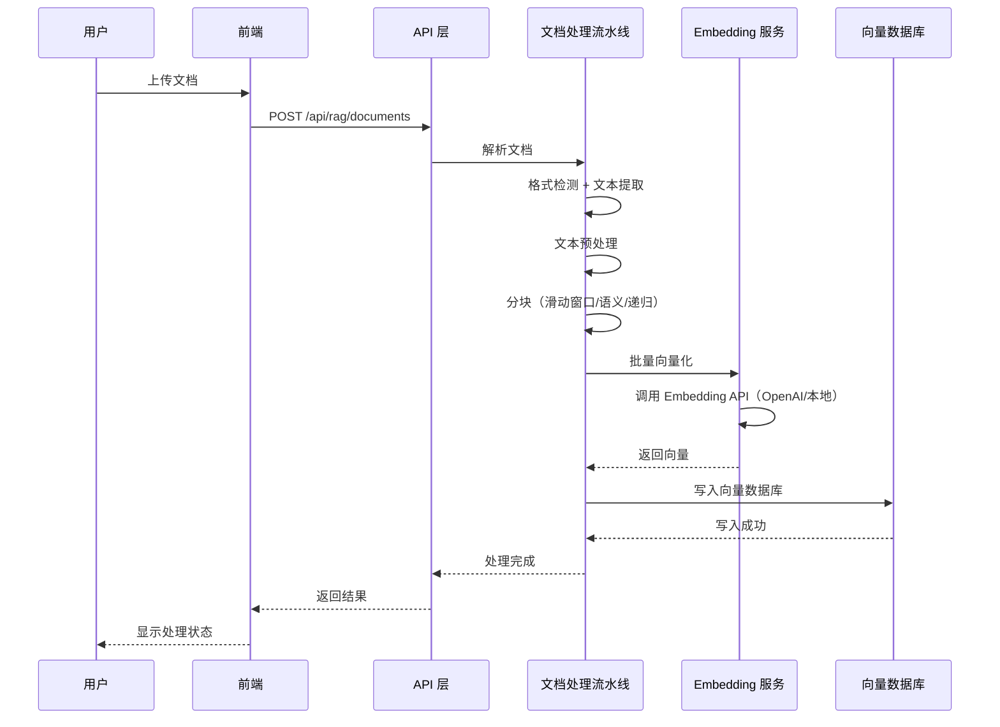

## 用户需求

用户要求完整实现 RAG 模块，具体功能包括：

1. **知识库管理**：创建、读取、更新、删除知识库
2. **文档处理流水线**：上传、解析、分块、向量化、写入向量库
3. **5 种 Provider 实现**：SQLiteVecProvider、MilvusProvider、ChromaProvider、BM25Provider、LLMCompilerProvider
4. **检索测试界面**：向量检索/混合检索、TopK、相似度阈值调节
5. **与 Agent 集成**：通过已有的 RagBinding 类型
6. **两种 Embedding 方案可配置切换**：OpenAI text-embedding-3-small + 本地模型支持
7. **前端页面完整实现**：/rag 列表页 + /rag/[id] 详情页

## 功能边界

### 输入

- 用户通过前端页面上传文档（PDF、DOCX、MD、TXT、CSV、XLSX）
- 用户配置知识库参数（Provider、分块策略、Embedding 模型、TopK 等）
- 用户通过检索测试界面查询知识库

### 输出

- 完整的 RAG 知识库管理界面
- 文档处理流水线（解析、分块、向量化）
- 向量检索和混合检索能力
- 与 Agent 执行引擎的集成接口

### 边界条件

- 文件大小限制：50MB
- 支持格式：PDF、DOCX、MD、TXT、CSV、XLSX
- 并发处理：排队机制，显示队列状态
- 错误处理：格式不支持、解析失败、API 超时等

## 产品概述

RAG 知识库是智能体应用平台的核心差异化能力。用户可以在页面上完成知识库的创建、文档上传、处理流水线和检索配置，全程可视化。支持 5 种向量数据库 Provider，两种 Embedding 方案可配置切换，提供向量检索和混合检索能力。

## 核心功能

1. **知识库管理界面**：卡片网格展示知识库列表，支持创建、编辑、删除操作
2. **文档处理流水线**：上传 → 格式检测 → 文本提取 → 预处理 → 分块 → 预览 → 向量化 → 写入向量库
3. **多种 Provider 支持**：SQLiteVec、Milvus、ChromaDB、BM25、LLMCompiler 五种向量数据库方案
4. **检索测试界面**：支持向量检索/混合检索模式，可调节 TopK、相似度阈值、向量/关键词权重
5. **Agent 集成**：通过 RagBinding 接口与应用绑定，在 Agent 执行时自动检索相关知识
6. **配置化 Embedding**：支持 OpenAI text-embedding-3-small 和本地模型（如 sentence-transformers）可配置切换

## 技术栈

### 核心技术

- **前端框架**：Next.js 15 + React 19 + TypeScript
- **样式**：Tailwind CSS + CSS 变量（主题系统）
- **状态管理**：Zustand
- **图标**：Lucide React
- **后端**：Next.js Route Handlers（API 路由）

### 新增依赖

- **sqlite-vec**：SQLite 向量扩展，用于 SQLiteVecProvider
- **pdf-parse**：PDF 文档解析
- **mammoth**：DOCX 文档解析
- **csv-parser**：CSV 文件解析
- **xlsx**：Excel 文件解析
- **@langchain/textsplitters**：文本分块工具（递归字符分割、语义分割）

### 路径别名

- **@/rag/***：新增 RAG 模块路径别名

## 技术架构

### 系统架构



### 模块划分

| 模块 | 职责 | 目录 |
| --- | --- | --- |
| **类型定义层** | RAG 相关接口和类型 | `src/core/rag/types.ts` |
| **Provider 接口层** | IRagProvider、IDocumentPipeline、IEmbeddingProvider 抽象接口 | `src/core/rag/interfaces.ts` |
| **Provider 实现层** | 5 种向量数据库 Provider 实现 | `src/core/rag/providers/` |
| **文档处理层** | 文档解析、分块、向量化流水线 | `src/core/rag/pipeline/` |
| **Embedding 层** | Embedding 模型管理（OpenAI + 本地） | `src/core/rag/embedding/` |
| **存储层** | 知识库配置和文档元数据持久化 | `src/core/rag/storage/` |
| **API 层** | RESTful API 路由 | `src/app/api/rag/` |
| **前端页面层** | UI 组件和页面 | `src/app/rag/` |
| **状态管理层** | Zustand Store | `src/stores/rag-store.ts` |


### 数据流



## 实现细节

### 核心目录结构

```
src/core/rag/
├── types.ts                    # RAG 相关类型定义
├── interfaces.ts               # 抽象接口定义（IRagProvider、IDocumentPipeline、IEmbeddingProvider）
├── providers/
│   ├── index.ts                # Provider 注册表和工厂
│   ├── sqlite-vec.ts           # SQLiteVecProvider 实现
│   ├── milvus.ts               # MilvusProvider 实现
│   ├── chroma.ts               # ChromaProvider 实现
│   ├── bm25.ts                 # BM25Provider 实现
│   └── llm-compiler.ts         # LLMCompilerProvider 实现
├── pipeline/
│   ├── index.ts                # 文档处理流水线主入口
│   ├── parsers/
│   │   ├── index.ts            # 解析器注册表
│   │   ├── pdf.ts              # PDF 解析器
│   │   ├── docx.ts             # DOCX 解析器
│   │   ├── markdown.ts         # Markdown 解析器
│   │   ├── text.ts             # 纯文本解析器
│   │   ├── csv.ts              # CSV 解析器
│   │   └── xlsx.ts             # Excel 解析器
│   ├── chunkers/
│   │   ├── index.ts            # 分块器注册表
│   │   ├── fixed-size.ts       # 固定大小滑动窗口分块
│   │   ├── semantic.ts         # 语义分块
│   │   └── recursive.ts        # 递归字符分块
│   └── preview.ts              # 分块预览工具
├── embedding/
│   ├── index.ts                # Embedding 管理器
│   ├── openai.ts               # OpenAI Embedding 实现
│   └── local.ts                # 本地 Embedding 实现（sentence-transformers）
└── storage/
    ├── index.ts                # 存储层入口
    ├── knowledge-base.ts       # 知识库配置存储
    └── document.ts             # 文档元数据存储

src/app/api/rag/
├── route.ts                    # GET /api/rag（知识库列表）POST /api/rag（创建知识库）
├── [id]/
│   ├── route.ts                # GET/PUT/DELETE /api/rag/:id（知识库详情/更新/删除）
│   ├── documents/
│   │   ├── route.ts            # GET/POST /api/rag/:id/documents（文档列表/上传）
│   │   └── [docId]/
│   │       └── route.ts        # GET/DELETE /api/rag/:id/documents/:docId（文档详情/删除）
│   ├── search/
│   │   └── route.ts            # POST /api/rag/:id/search（检索接口）
│   ├── chunk-preview/
│   │   └── route.ts            # POST /api/rag/:id/chunk-preview（分块预览）
│   └── stats/
│       └── route.ts            # GET /api/rag/:id/stats（统计信息）

src/app/rag/
├── page.tsx                    # 知识库列表页
├── [id]/
│   └── page.tsx                # 知识库详情页
└── components/
    ├── KnowledgeBaseCard.tsx   # 知识库卡片组件
    ├── CreateKBModal.tsx       # 创建知识库弹窗
    ├── DocumentList.tsx        # 文档列表组件
    ├── DocumentUpload.tsx      # 文档上传组件
    ├── ChunkPreview.tsx        # 分块预览组件
    ├── SearchPlayground.tsx    # 检索测试界面
    ├── StatsBar.tsx            # 统计信息栏
    └── SettingsPanel.tsx       # 设置面板

src/stores/
└── rag-store.ts                # RAG 状态管理
```

### 关键接口设计

```typescript
// IRagProvider 接口
interface IRagProvider {
  readonly id: string
  readonly name: string
  readonly description: string
  readonly version: string

  // 生命周期
  initialize(config: RagProviderConfig): Promise<void>
  destroy(): Promise<void>

  // 文档操作
  indexDocument(doc: ProcessedDocument): Promise<IndexResult>
  indexBatch(docs: ProcessedDocument[], onProgress?: ProgressCallback): Promise<IndexResult[]>
  deleteDocument(docId: string): Promise<void>
  clearAll(): Promise<void>

  // 检索
  search(query: string, options?: SearchOptions): Promise<SearchResult[]>
  hybridSearch(query: string, options?: HybridSearchOptions): Promise<SearchResult[]>

  // 元数据
  getDocument(docId: string): Promise<DocumentInfo | null>
  listDocuments(filter?: DocumentFilter): Promise<DocumentInfo[]>
  healthCheck(): Promise<HealthStatus>
  getStats(): Promise<RagStats>
}

// IDocumentPipeline 接口
interface IDocumentPipeline {
  parse(file: FileInput): Promise<ParsedContent>
  chunk(content: ParsedContent, strategy: ChunkStrategy): Promise<ChunkResult>
  embed(chunks: ChunkResult, model: EmbeddingModel): Promise<EmbeddingResult>
  process(file: FileInput, options?: ProcessOptions): Promise<ProcessedDocument>
}

// IEmbeddingProvider 接口
interface IEmbeddingProvider {
  readonly id: string
  readonly name: string
  readonly dimensions: number

  embed(text: string): Promise<number[]>
  embedBatch(texts: string[], onProgress?: ProgressCallback): Promise<number[][]>
  healthCheck(): Promise<boolean>
}
```

### 性能与可靠性

**性能优化**

- **批量处理**：文档分块后批量向量化，减少 API 调用次数
- **增量索引**：支持单文档重新处理，避免全量重建
- **并发控制**：限制同时处理的文档数量，防止资源耗尽
- **缓存策略**：Embedding 结果缓存，相同文本不重复向量化

**可靠性保障**

- **原子写入**：配置文件使用 `.tmp` + `rename` 模式
- **错误重试**：Embedding API 调用使用指数退避重试（最多 3 次）
- **状态追踪**：文档处理状态实时更新（pending/processing/completed/failed）
- **资源限制**：文件大小限制 50MB，队列长度限制

**空间复杂度**

- 向量存储：每个向量 1536 维 * 4 字节 = 6KB（OpenAI text-embedding-3-small）
- 10 万文档 * 平均 50 块 = 500 万向量 * 6KB = 30GB

**时间复杂度**

- 向量检索：O(log n) 使用 HNSW 索引
- 文档处理：O(n) 其中 n 为文档字符数

## 设计风格

采用现代极简风格，与现有 Manta 平台设计语言保持一致。使用 React + TypeScript + Tailwind CSS + shadcn/ui 组件库。

### 设计原则

- **一致性**：遵循现有 Manta 平台的设计规范和 CSS 变量系统
- **清晰性**：信息层次分明，操作流程清晰
- **专业性**：体现 AI Native 平台的技术感和专业性

### 页面规划

1. **知识库列表页** (`/rag`)

- 顶部：标题栏 + 创建按钮
- 主体：卡片网格展示知识库
- 每个卡片：图标、名称、文档数、分块数、Provider、最后更新时间
- 空状态：引导创建第一个知识库

2. **知识库详情页** (`/rag/[id]`)

- 顶部：返回按钮 + 知识库名称 + 操作按钮（添加文档、检索测试、设置）
- 统计栏：总文档数、总分块数、向量维度、Provider、健康状态
- 主体区域：Tab 切换（文档列表、检索测试、设置）
- 文档列表：搜索、排序、状态筛选、文档操作（预览、重新处理、删除）

## Agent Extensions

### SubAgent

- **code-explorer**
- **用途**：在实现过程中探索代码库，查找相关实现模式、依赖关系和调用链
- **预期结果**：提供准确的代码位置、现有模式参考和实现建议