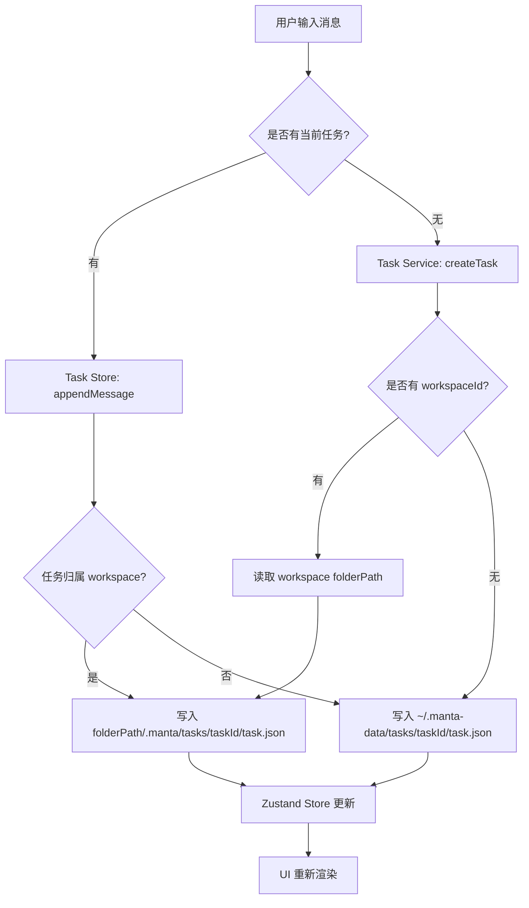

## 用户需求

重构项目中「会话」与「工作空间」的概念，使两者的关系更清晰、数据存储更合理。

## 产品概述

将现有「Conversation（会话）」全面改名为「Task（任务）」，工作空间需用户显式选择本地文件夹路径，任务的数据文件直接保存到所选文件夹下。未归属工作空间的任务则保存在系统目录。侧边栏从双 Tab 切换模式合并为单一导航视图，按工作空间分组展示所有任务。

## 核心功能

- **工作空间文件夹绑定**：创建/编辑工作空间时选择本地文件夹，工作空间的 Agent/知识库/工作流绑定等额外配置写入文件夹内的 `.manta-workspace.json`
- **任务双路径存储**：归属工作空间的任务保存至 `{folder}/.manta/tasks/{taskId}/`，独立任务保存至 `~/.manta-data/tasks/{taskId}/`
- **Conversation → Task 全量重命名**：类型定义、存储层函数、API 路由路径、Zustand stores、UI 组件等所有引用全部更新
- **侧边栏合并视图**：移除「会话/工作空间」Tab 切换，改为单一列表，工作空间作为分组标题，每个工作空间下方展示其任务列表，顶部展示「独立任务」分组
- **零数据迁移**：旧 `~/.manta-data/conversations/` 目录保留不动，新结构从 `~/.manta-data/tasks/` 读写

## 技术栈

- 前端框架：Next.js App Router + React + TypeScript
- 状态管理：Zustand + SWR 缓存
- 样式方案：Tailwind CSS
- 数据存储：纯文件系统 JSON（Node.js fs 模块）
- 后端：src/app/api/ 下的 Next.js API Routes（需同步更新到 packages/backend Fastify 路由）

## 实现方案

### 整体策略

采用**新旧并存、逐步切换**的方式：新增 Task 存储层、Task 服务、Task API 路由和 Task Store，旧 Conversation 代码保留不动但不再被新 UI 调用。重命名采取**全局查找替换 + 手动验证**策略，确保所有引用一致更新。

### 核心设计决策

1. **存储层重构**：新增 `src/core/storage/task/` 目录，独立于旧的 `storage/conversation/`。新存储层支持两种路径模式：

- 独立任务路径：`~/.manta-data/tasks/{taskId}/task.json`
- 工作空间任务路径：`{workspaceFolder}/.manta/tasks/{taskId}/task.json`

2. **Workspace 增加 folderPath 字段**：`WorkspaceConfig` 接口新增 `folderPath?: string`，未设 folderPath 的工作空间其任务仍存系统目录。

3. **双写配置**：工作空间的基础元数据（id/name/folderPath/createdAt/updatedAt）存于 `~/.manta-data/workspaces/{id}/workspace.json`；Agent/知识库/工作流绑定存于 `{folderPath}/.manta-workspace.json`。

4. **API 路径迁移**：新增 `/api/tasks` 路由树，旧的 `/api/conversations` 保留不动以保证向后兼容，新功能只调新 API。

5. **侧边栏 Store 合并**：移除 `TabMode` 枚举，改为 `SidebarStore` 直接维护工作空间列表和任务列表。

### 目录结构

```
src/core/
├── types.ts                          # [MODIFY] 所有 Conversation* 类型重命名为 Task*
├── storage/
│   ├── task/
│   │   ├── store.ts                  # [NEW] 新 Task 存储层，支持双路径模式
│   │   └── types.ts                  # [NEW] Task 存储内部类型定义
│   ├── conversation/                 # [KEEP] 旧存储层保留不动
│   └── workspace/
│       └── store.ts                  # [MODIFY] 增加 folderPath 支持，更新函数命名
├── services/
│   ├── task.service.ts               # [NEW] 新 Task 服务层
│   └── workspace.service.ts          # [MODIFY] 增加 folderPath 相关逻辑
└── api/
    └── schemas/
        ├── task.schema.ts            # [NEW] Task 相关 Zod schema
        └── workspace.schema.ts       # [MODIFY] 增加 folderPath 校验

src/stores/
├── task-store.ts                     # [NEW] 新 Task Zustand Store
├── workspace-store.ts                # [MODIFY] 增加 folderPath，更新 conversationsByWs → tasksByWs
├── conversation-store.ts             # [KEEP] 旧 store 保留
└── sidebar-store.ts                  # [MODIFY] 移除 TabMode，改为统一视图模式

src/app/api/
├── tasks/
│   ├── route.ts                      # [NEW] GET/POST /api/tasks
│   └── [id]/
│       ├── route.ts                  # [NEW] GET/PATCH/DELETE /api/tasks/:id
│       ├── messages/route.ts         # [NEW] POST /api/tasks/:id/messages
│       ├── ai-stream/route.ts        # [NEW] POST/GET /api/tasks/:id/ai-stream
│       ├── agent/route.ts            # [NEW] PATCH /api/tasks/:id/agent
│       ├── stop/route.ts             # [NEW] POST /api/tasks/:id/stop
│       └── context/route.ts          # [NEW] GET /api/tasks/:id/context
├── conversations/                    # [KEEP] 旧 API 保留
└── workspaces/
    ├── route.ts                      # [MODIFY] 支持 folderPath 参数
    └── [id]/
        ├── route.ts                  # [MODIFY] 支持 folderPath 更新
        └── tasks/route.ts            # [NEW] 替代旧 conversations 子路由

src/app/components/
├── sidebar/
│   ├── TaskListView.tsx              # [NEW] 统一列表视图组件，替代 SidebarTabs + ConversationList + WorkspaceList
│   ├── WorkspaceGroup.tsx            # [NEW] 单个工作空间分组组件（可折叠）
│   ├── TaskItem.tsx                  # [NEW] 单个任务条目组件
│   ├── ConversationList.tsx          # [KEEP] 旧组件保留
│   ├── WorkspaceList.tsx             # [KEEP] 旧组件保留
│   └── SidebarTabs.tsx               # [MODIFY] 移除或改为仅顶部新建按钮
└── SidebarNav.tsx                    # [MODIFY] 使用新 TaskListView 替代旧的 Tab 切换

src/app/tasks/
├── page.tsx                          # [MODIFY] 涉及 Conversation 类型的引用改 Task
└── utils/
    └── types.ts                      # [MODIFY] 类型引用更新

src/core/engine/                      # [MODIFY] agent-loop.ts, stream-handler.ts 等涉及 conv 的引用
src/core/observability/               # [MODIFY] log/ 和 metrics/ 中的 Conversation 引用
src/core/context/                     # [MODIFY] prompt-builder.ts 等中的 Conversation 引用
```

### 数据流



### 关键代码结构

```typescript
// 新 Task 类型定义（替代原 Conversation）
export interface Task {
  id: string
  title: string
  agentName: string
  messages: TaskMessage[]
  context: TaskContext
  workspaceId?: string
  createdAt: string
  updatedAt: string
}

export interface TaskMessage {
  id: string
  role: 'user' | 'assistant' | 'system'
  content: string
  timestamp: string
  toolCalls?: ToolCallRecord[]
  usage?: { inputTokens?: number; outputTokens?: number; ... }
  stepUsages?: StepUsageRecord[]
  agentAppId?: string
}

export type TaskType = 'global' | 'workspace'

// 新 WorkspaceConfig 增加 folderPath
export interface WorkspaceConfig {
  id: string
  name: string
  description?: string
  folderPath?: string  // NEW: 用户选择的本地文件夹路径
  agentAppIds: string[]
  knowledgeBaseIds: string[]
  workflowIds: string[]
  createdAt: string
  updatedAt: string
}
```

### 实现注意要点

- **原子写入**：存储层复用已有 `atomicWrite`（tmp 文件 + rename）模式
- **路径安全**：folderPath 写入前需校验是否是合法目录、是否有写入权限
- **新建任务默认 agent**：初始值 `'main'` 延用现有逻辑
- **API 兼容**：旧的 `/api/conversations/*` 路由全部保留，新 UI 调新的 `/api/tasks/*` 路由
- **引擎层兼容**：agent-loop 等核心引擎通过适配层桥接新旧类型（Task ↔ Conversation），最小化引擎改动