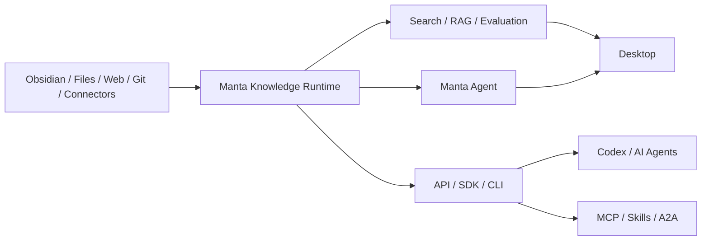

# Manta AI

> A local-first personal AI knowledge assistant that makes your documents, notes, and project material searchable, understandable, organized, and callable by AI.

[中文](README.md)

Manta AI turns knowledge scattered across Obsidian, Markdown, PDFs, Office documents, web pages, code repositories, and other sources into a personal AI knowledge base owned by the user. It works as a desktop application and exposes the same knowledge and task capabilities to Codex and other AI agents through APIs, an SDK, a CLI, MCP, Skills, and A2A.

Manta does not replace the content tools people already use:

- Obsidian, the filesystem, and other editors own reading, editing, and source maintenance.
- Manta owns ingestion, parsing, deduplication, chunking, indexing, retrieval, evaluation, organization, and citation.
- Desktop, SDK, CLI, and agent protocols share the same knowledge, permissions, and task state.

**Source material remains authoritative. Embeddings, chunks, summaries, and indexes are rebuildable derivatives.**

> [!NOTE]
> Manta is under active development. This README describes the complete product direction; actual availability follows the current release and published packages.

## What Manta can do

### Build a personal knowledge base

- Ingest content from local folders, Obsidian vaults, documents, web pages, Git repositories, and connectors.
- Parse different formats and extract text, headings, structure, metadata, and provenance.
- Detect duplicate or changed content while retaining document versions and processing records.
- Organize material by knowledge base, project, tag, path, or custom scope.
- Preserve citations that lead back to the original source location.

### Search, answer, and organize knowledge

- Search personal documents and project material using natural language.
- Support vector, keyword, hybrid, filtered, and reranked retrieval strategies.
- Restrict retrieval to selected documents, folders, knowledge bases, or the full library.
- Generate cited answers, summaries, comparisons, and topic collections from retrieved context.
- Supply retrieved context to Manta Agent, Codex, or another language model.
- Save organized results back into the local knowledge base as maintainable knowledge assets.

### Evaluate RAG and manage strategies

Manta provides repeatable retrieval evaluation instead of only showing a single search result.

- Use a Search Test tab inside a knowledge base to inspect recall for one document or a document set.
- Maintain evaluation datasets and compare strategies in a standalone Retrieval Lab.
- Configure parsing, chunking, embedding, retrieval, filtering, fusion, and reranking independently.
- Measure `Recall@K`, `Precision@K`, `MRR`, `nDCG@K`, zero-hit rate, and latency.
- Inspect matched documents, chunks, scores, provenance, and ranking changes.
- Save validated strategies as immutable local versions that can be published, switched, and rolled back.

### Run AI agents and tasks

- Let agents use the personal knowledge base, files, commands, and authorized tools.
- Record task inputs, steps, tool calls, approvals, outputs, and logs.
- Keep long-running ingestion, indexing, evaluation, and agent tasks running in the background.
- Refreshing, navigating away, or reconnecting a client does not cancel background work.
- Query progress, cancel, retry, or continue work from Desktop, the API, SDK, or CLI.
- Trace answers and actions through source citations and execution records.

### Serve knowledge to other AI systems

Manta can run as an independent local service. Codex, automation scripts, and other agents can call it within their granted permissions even when Manta Desktop is not open.

| Entry point | Capability |
|---|---|
| Desktop | Manage knowledge bases, search, Q&A, evaluation, agents, and settings |
| REST API | Access knowledge, retrieval, tasks, events, and administration |
| TypeScript SDK | Call Manta through an interface modeled after the OpenAI SDK |
| CLI | Ingest, retrieve, evaluate, run tasks, and manage the service from a terminal |
| MCP Server | Expose Manta knowledge and task capabilities as MCP tools |
| Skill Runtime | Load Skill resources and run scripts safely with an injected Manta SDK |
| A2A Server | Collaborate with other agents through Agent Cards and task protocols |

### Keep data local and controlled

- Store knowledge, configuration, extensions, work data, secrets, diagnostics, and cache in separate groups.
- Choose storage directories and volumes, then manage migration, synchronization, capacity, and health.
- Select local or remote models per task without requiring source knowledge to leave the device.
- Keep remote access disabled by default and require authentication plus explicit capability grants.
- Grant MCP, Skills, A2A, and external applications only the permissions they need.

## How it works



Knowledge is ingested and managed once, then shared by desktop search, RAG answers, agent tasks, CLI automation, and external AI systems. Every entry point uses the same citations, permission rules, and task state.

## Common use cases

- **Personal second brain**: make Obsidian and local documents available for semantic search, Q&A, and automatic organization.
- **Project knowledge assistant**: search requirements, designs, code, meeting notes, and historical decisions together.
- **Context service for Codex**: let Codex retrieve project knowledge on demand instead of repeatedly pasting long documents.
- **Local document Q&A**: use local models for retrieval-augmented generation without uploading the full knowledge base.
- **RAG strategy evaluation**: compare chunking, embedding, retrieval, and reranking against a stable dataset.
- **Knowledge automation**: batch ingest, organize, evaluate, and generate knowledge assets through the CLI, MCP, or Skills.
- **Multi-agent collaboration**: delegate knowledge queries and long-running work to Manta through A2A.

## Package architecture

Manta's public capabilities follow the package boundaries below. The table defines each package's responsibility. `@manta/rag` exists in the current repository; availability of the other public packages depends on the actual code and published version.

| Package | Responsibility |
|---|---|
| `@manta/contracts` | Zod schemas and public types for Job, RAG, Knowledge, Event, and API |
| `@manta/task-runtime` | Durable tasks, workers, leases, event journals, cancellation, recovery, and retries |
| `@manta/rag` | UI-free RAG core engine with explicit dependency injection |
| `@manta/sdk` | High-level TypeScript client modeled after the OpenAI SDK |
| `@manta/cli` | The `manta` command, built on the SDK |
| `@manta/mcp-server` | The `manta-mcp` executable that maps SDK capabilities to MCP tools |
| `@manta/skill-runtime` | Skill loading, script execution, permissions, timeouts, resources, and SDK injection |
| `@manta/a2a-server` | Future A2A Agent Card and task adaptation |

The package design follows four rules:

- `@manta/contracts` is the source of public contracts and does not depend on Desktop or a specific storage implementation.
- `@manta/rag` and `@manta/task-runtime` have no UI dependency and can run in Desktop, services, or scripts.
- The CLI, MCP Server, and A2A Server use Manta through `@manta/sdk` instead of accessing internal databases.
- Skill Runtime provides a controlled script environment and injects the SDK, resources, and secret references according to permissions.

## Local development

### Prerequisites

- Git
- Node.js and Corepack
- the pinned `pnpm@10.30.3` toolchain
- optional Ollama for local models

### Start Desktop

```bash
corepack enable
pnpm install
pnpm dev:desktop
```

On first launch, select a new empty directory or connect an existing complete Manta data directory.

After Desktop has initialized storage once, you can also start the browser development environment:

```bash
pnpm dev
```

### Verify

```bash
pnpm typecheck
pnpm test
pnpm build
```

## More documentation

- [ASH user guide](docs/guides/agent-storage-hub.md)
- [ASH development and packaging guide](docs/development/agent-storage-hub.md)
- [ASH troubleshooting](docs/troubleshooting/agent-storage-hub.md)
- [ASH verification record](docs/superpowers/verification/2026-07-11-agent-storage-hub.md)

## License

Private project. No redistribution license is granted.
