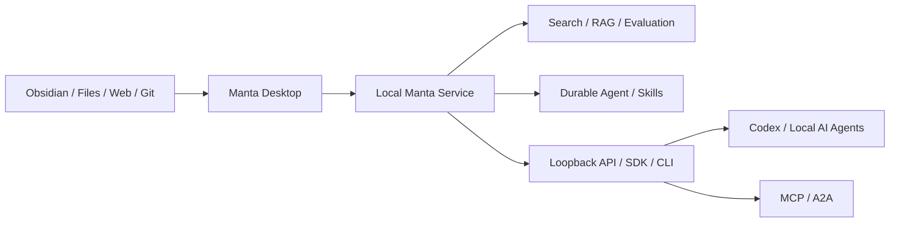

# Manta AI

> 本地优先的个人 AI 知识库助手，让你的文档、笔记与项目资料可以被可靠地检索、理解、整理和调用。

[English](README.en.md)

Manta AI 将分散在 Obsidian、Markdown、PDF、Office 文档、网页、代码仓库和其他数据源中的知识，组织成一个属于用户自己的 AI 知识库。Manta 的产品形态是 Desktop 客户端；它通过仅监听本机回环地址的 API、SDK、CLI、MCP、Skill 和 A2A，为 Codex 及其他本机 AI Agent 提供知识与任务能力。

Manta 不替代用户熟悉的内容工具：

- Obsidian、文件系统和其他编辑器负责阅读、编辑与维护原始资料。
- Manta 负责采集、解析、去重、分块、索引、检索、评测、整理和引用。
- Desktop、SDK、CLI 和 Agent 协议共享同一份知识、权限与任务状态。

**原始资料始终是事实源。Embedding、分块、摘要和索引都是可以重新生成的派生数据。**

> [!NOTE]
> Manta 正在持续开发。本 README 描述完整的产品能力方向，具体可用范围以当前版本和已发布包为准。

## Manta 能做什么

### 建立个人知识库

- 从本地文件夹、Obsidian Vault、文档、网页、Git 仓库和连接器采集内容。
- 大文件通过可恢复的分块 Upload Session 上传，并在完成时校验完整 SHA-256。
- 解析不同格式，提取正文、标题、目录、元数据和来源信息。
- 对重复或变化的内容进行识别，保留文档版本和处理记录。
- 按知识库、项目、标签、路径或自定义范围组织资料。
- 保存可以回到原文位置的引用，让搜索和回答都有来源。

### 搜索、问答与知识整理

- 使用自然语言检索个人文档和项目资料。
- 支持向量、关键词、混合检索、过滤和重排等检索策略。
- 在指定文档、文件夹、知识库或全部资料中限定搜索范围。
- 基于召回内容生成带来源的回答、摘要、对比和主题整理。
- 把检索结果作为上下文交给 Manta Agent、Codex 或其他大模型。
- 将整理结果保存回本地知识库，形成可以继续维护的知识资产。

### RAG 评测与策略管理

Manta 不只提供一次检索结果，还提供可重复的召回效果评测。

- 在独立 Retrieval Lab 中维护测试集并批量比较不同策略。
- 分别配置解析、分块、Embedding、检索、过滤、融合和 Rerank 策略。
- 查看 `Recall@K`、`MRR`、`nDCG@K`、零召回率和延迟。
- 检查具体命中的文档、Chunk、分数、来源和排序变化。
- 将验证通过的策略保存为本地不可变版本，并支持发布、切换与回滚。

### AI Agent 与任务

- 让 Agent 使用个人知识库、文件、命令和已授权工具完成任务。
- 为每个任务保存输入、步骤、工具调用、审批、结果和日志。
- 长时间运行的文档处理、索引、评测和 Agent 任务在后台继续执行。
- 切换 Desktop 功能页、重载界面、退出客户端或稍后重连不会取消后台任务。
- 可以从 Desktop、API、SDK 或 CLI 查询进度、取消、重试和继续任务。
- 通过来源引用和执行记录追踪答案与操作依据。

### 面向其他 AI 的知识服务

Manta Desktop 配套一个独立的本地后台 Service。即使没有打开 Desktop 窗口，Codex、自动化脚本和其他本机 Agent 也可以在授权范围内调用它；Manta 不提供浏览器产品或云服务。

| 入口 | 能力 |
|---|---|
| Desktop | 管理知识库、搜索、问答、评测、Agent 和设置 |
| Local REST API | 通过 loopback 访问知识、检索、任务、事件和管理能力 |
| TypeScript SDK | 以类似 OpenAI SDK 的方式调用 Manta |
| CLI | 在终端中导入、检索、评测、运行任务和管理服务 |
| MCP Server | 将 Manta 的知识和任务能力暴露为 MCP Tools |
| Skill Runtime | 加载 Skill 资源并安全执行脚本，同时注入 Manta SDK |
| A2A Server | 通过 Agent Card 和任务协议与其他 Agent 协作 |

### 本地优先的数据管理

- 知识、配置、扩展、工作数据、Secret、诊断信息和缓存分组保存。
- 用户可以选择数据目录和存储卷，并管理迁移、同步、容量与健康状态。
- 可以按任务配置本地模型或用户自行提供的模型端点；Manta 本身不托管云端控制面。
- API 只监听 loopback，不提供局域网或公网访问模式。
- MCP、Skill、A2A 和外部应用只获得被授予的权限。

## 工作方式



同一份知识只采集和管理一次，随后可以被桌面搜索、RAG 问答、Agent 任务、CLI 脚本和外部 AI 共同使用。不同入口共享相同的来源引用、权限规则和任务状态。

## 典型场景

- **个人第二大脑**：让 Obsidian 和本地文档可以被语义检索、问答和自动整理。
- **项目知识助手**：统一查询需求、设计、代码、会议记录和历史决策。
- **Codex 上下文服务**：让 Codex 按需检索项目知识，而不是反复粘贴长文档。
- **本地文档问答**：在不上传全部资料的情况下使用本地模型完成检索增强生成。
- **RAG 策略评测**：用固定测试集比较分块、Embedding、召回与重排效果。
- **知识自动化**：通过 CLI、MCP 或 Skill 批量导入、整理、评测和生成知识资产。
- **多 Agent 协作**：通过 A2A 把知识查询和长任务委派给 Manta。

## 包架构

Manta 的公共能力按以下包边界组织：

| Package | 职责 |
|---|---|
| `@manta/contracts` | Job、RAG、Knowledge、Event、API 的 Zod Schema 和公共类型 |
| `@manta/task-runtime` | 持久化任务、worker、lease、事件日志、取消、恢复、重试 |
| `@manta/rag` | 无 UI、显式依赖注入的 RAG 核心引擎 |
| `@manta/sdk` | 类似 OpenAI SDK 的高层 TypeScript Client |
| `@manta/service` | Desktop 配套的唯一实例本地 Service，持有数据与后台 Worker |
| `@manta/cli` | `manta` 命令，基于 SDK |
| `@manta/mcp-server` | `manta-mcp` 可执行程序，把 SDK 能力映射成 MCP Tools |
| `@manta/skill-runtime` | Skill 加载、脚本执行、权限、超时、资源与 SDK 注入 |
| `@manta/a2a-server` | 本机 A2A 1.0 Agent Card、Message、Task 与 Artifact 适配 |

包设计遵循四条规则：

- `@manta/contracts` 是公共契约源，不依赖 Desktop 或具体存储实现。
- `@manta/rag` 和 `@manta/task-runtime` 不依赖 UI，可以在 Desktop 本地 Service 或脚本环境中复用。
- CLI、MCP Server 和 A2A Server 通过 `@manta/sdk` 使用 Manta，不直接访问内部数据库。
- Skill Runtime 为脚本提供受控运行环境，并按权限注入 SDK、资源和 Secret 引用。

## 本地开发

### 前置条件

- Git
- Node.js 与 Corepack
- 项目锁定的 `pnpm@10.30.3`
- 使用本地模型时可选安装 Ollama

### 启动 Desktop

```bash
corepack enable
pnpm install
pnpm dev:desktop
```

首次启动时选择一个新的空目录，或连接已有的完整 Manta 数据目录。

### 验证

```bash
pnpm typecheck
pnpm test
pnpm build
```

## 更多文档

- [RAG 召回测评详细设计](docs/technical-design/11-rag-evaluation-v2.md)
- [ASH 用户指南](docs/guides/agent-storage-hub.md)
- [ASH 开发与打包指南](docs/development/agent-storage-hub.md)
- [ASH 故障排查](docs/troubleshooting/agent-storage-hub.md)
- [ASH 验证记录](docs/superpowers/verification/2026-07-11-agent-storage-hub.md)

## 许可证

公开发布的 `@manta/*` 包采用各自 `package.json` 中声明的 MIT License。Desktop 应用和仓库中未单独标注许可的其他内容保留所有权利。
