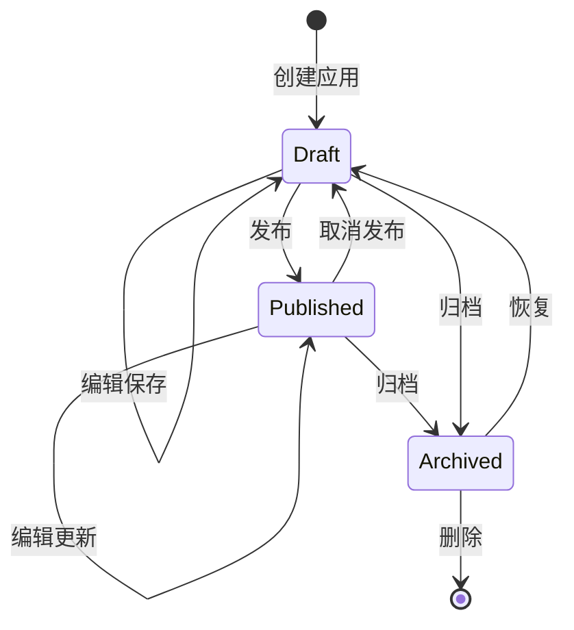
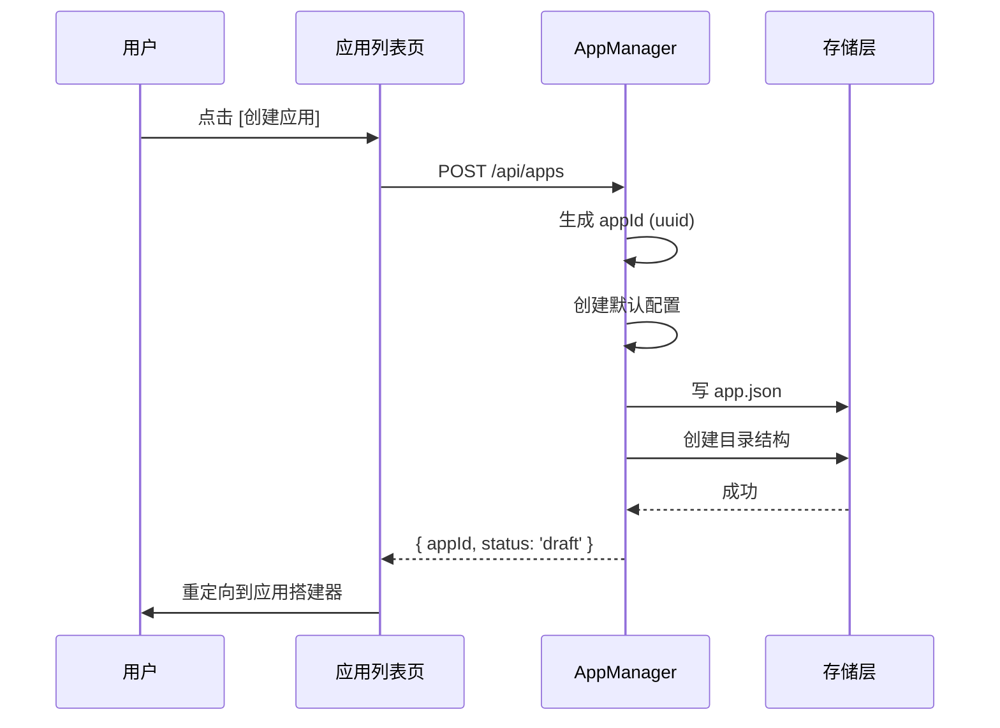
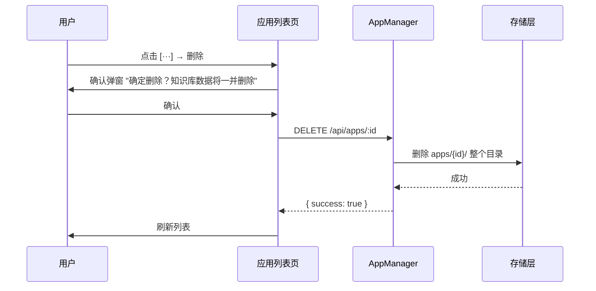
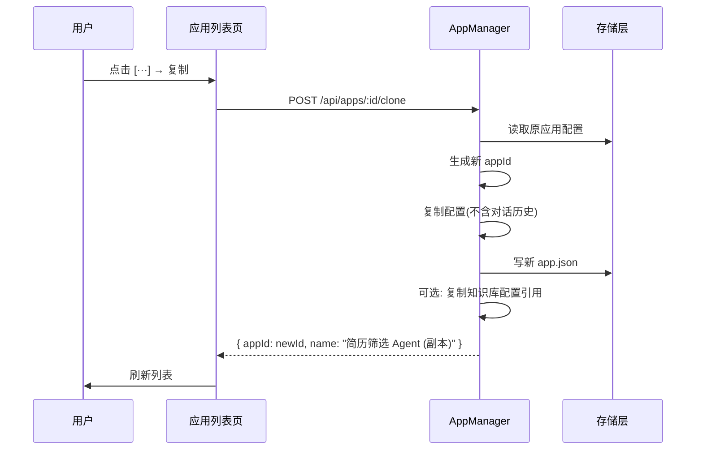

# PRD 02 — 应用管理 / App Management

---

## 中文版

### 1. 功能概述

应用管理是整个智能体应用平台的入口模块。用户在 `/apps` 页面查看、创建、管理自己的智能体应用。

### 2. 页面结构

#### 2.1 应用列表页 `/apps`

```
┌──────────────────────────────────────────────────────────┐
│  应用管理                                    [+ 创建应用]  │
├──────────────────────────────────────────────────────────┤
│  ┌─── 搜索应用 ────────┐  ┌── 状态筛选 ▼ ──┐  ┌ 排序 ▼ ─┐│
│  └─────────────────────┘  └────────────────┘  └─────────┘│
│                                                          │
│  ┌──────────────┐ ┌──────────────┐ ┌──────────────┐     │
│  │ 📄 简历筛选   │ │ 📋 JD生成器   │ │ 💬 客服助手   │     │
│  │ Agent        │ │ Agent        │ │ Agent        │     │
│  │ 已发布  🟢   │ │ 草稿    🟡   │ │ 已发布  🟢   │     │
│  │ 最后编辑 2h前 │ │ 最后编辑 1d前 │ │ 最后编辑 5d前 │     │
│  │              │ │              │ │              │     │
│  │ [打开] [···] │ │ [打开] [···] │ │ [打开] [···] │     │
│  └──────────────┘ └──────────────┘ └──────────────┘     │
│                                                          │
│  ┌──────────────────────────────────────────────┐       │
│  │ + 新建应用                                     │       │
│  │   从空白开始创建你的智能体应用                    │       │
│  └──────────────────────────────────────────────┘       │
└──────────────────────────────────────────────────────────┘
```

#### 2.2 应用详情页 `/apps/[id]`

```
┌──────────────────────────────────────────────────────────┐
│  ← 返回   简历筛选 Agent                    [编辑] [···]  │
├──────────────────────────────────────────────────────────┤
│  ┌─────────────┐ ┌─────────────┐ ┌─────────────┐        │
│  │ 📊 概览      │ │ 💬 对话      │ │ 📚 知识库    │        │
│  │ (active)    │ │             │ │             │        │
│  ├─────────────┤ ├─────────────┤ ├─────────────┤        │
│  │ 🛠️ 工具      │ │ 📋 自动化    │ │ 📈 评估      │        │
│  │             │ │             │ │             │        │
│  └─────────────┘ └─────────────┘ └─────────────┘        │
│                                                          │
│  ┌────────────────────────────────────────────────────┐  │
│  │  概览信息                                          │  │
│  │  名称: 简历筛选 Agent                               │  │
│  │  状态: 🟢 已发布                                     │  │
│  │  Agent: resume-screener (openclaw)                 │  │
│  │  知识库: 简历模板库 (120 文档)                       │  │
│  │  工具: web_search, file_read                       │  │
│  │  创建时间: 2026-06-01                              │  │
│  │  最近对话: 156 次                                   │  │
│  └────────────────────────────────────────────────────┘  │
└──────────────────────────────────────────────────────────┘
```

### 3. 状态机



### 4. 核心交互流程

#### 4.1 创建应用



#### 4.2 删除应用



#### 4.3 复制应用



### 5. 数据模型

```typescript
// 应用配置
interface AppConfig {
  id: string;                     // UUID
  name: string;                   // 应用名称
  description: string;            // 应用描述
  icon?: string;                  // 图标 (emoji 或 icon name)
  tags: string[];                 // 标签
  status: AppStatus;              // draft | published | archived
  
  // Agent 绑定
  agentId: string;                // 关联的 Agent ID (来自注册表)
  agentConfig: AgentOverrideConfig; // Agent 参数覆盖
  
  // 知识库
  ragConfig: RagBindingConfig;    // RAG 知识库绑定
  
  // 工具
  enabledTools: string[];         // 启用的工具 ID 列表
  
  // 自动化
  automations: Automation[];      // 自动化任务
  
  // 时间戳
  createdAt: string;              // ISO 8601
  updatedAt: string;
  publishedAt?: string;
  
  // 版本
  version: number;                // 配置版本号
}

type AppStatus = 'draft' | 'published' | 'archived';

interface AgentOverrideConfig {
  systemPrompt?: string;          // 覆盖 system prompt
  temperature?: number;           // 覆盖 temperature
  maxTokens?: number;
  model?: string;                 // 覆盖模型
}

interface RagBindingConfig {
  providerId: string;             // RAG Provider ID
  knowledgeBaseId: string;        // 知识库 ID
  topK: number;                   // 检索 TopK
  similarityThreshold: number;    // 相似度阈值
  hybridSearchEnabled: boolean;   // 是否启用混合检索
}

interface Automation {
  id: string;
  type: 'cron' | 'webhook' | 'manual';
  cronExpression?: string;        // cron 表达式
  webhookUrl?: string;            // webhook URL
  action: string;                 // 触发动作
  enabled: boolean;
}
```

### 6. API 设计

| 方法 | 路径 | 描述 |
|------|------|------|
| `GET` | `/api/apps` | 获取应用列表(支持搜索、筛选、排序) |
| `POST` | `/api/apps` | 创建新应用 |
| `GET` | `/api/apps/:id` | 获取应用详情 |
| `PUT` | `/api/apps/:id` | 更新应用配置 |
| `DELETE` | `/api/apps/:id` | 删除应用 |
| `POST` | `/api/apps/:id/clone` | 复制应用 |
| `PATCH` | `/api/apps/:id/status` | 更改应用状态(发布/归档) |

### 7. 异常处理

| 场景 | 处理方式 |
|------|---------|
| 创建时 Agent ID 不存在 | 返回 400 + 错误提示，建议先选择有效 Agent |
| 删除已发布的应用 | 二次确认弹窗，提示知识库数据将被永久删除 |
| 应用名称重复 | 允许重复（不同 ID 区分），不做唯一性校验 |
| 存储空间不足 | 返回 507，提示用户清理空间 |
| 并发编辑冲突 | 基于 version 字段做乐观锁，冲突时提示用户刷新 |

---

## English Version

### 1. Feature Overview

App Management is the entry module of the Agent Application Platform. Users view, create, and manage their agent applications on the `/apps` page.

### 2. Page Structure

#### 2.1 App List Page `/apps`

- Search bar with keyword filtering
- Status filter dropdown (All / Draft / Published / Archived)
- Sort options (by update time, name, creation time)
- App cards showing name, icon, status indicator, last edit time
- Quick actions: Open, context menu (Edit, Clone, Delete, Archive/Publish)
- Empty state with "Create your first app" CTA

#### 2.2 App Detail Page `/apps/[id]`

- Tab navigation: Overview, Chat, Knowledge, Tools, Automation, Evaluation
- Overview panel showing app metadata and stats
- Quick actions: Edit, Publish/Unpublish, Delete

### 3. State Machine

- `Draft` → `Published` (publish action)
- `Published` → `Draft` (unpublish)
- Any state → `Archived` (archive)
- `Archived` → `Draft` (restore)
- `Archived` → deleted (permanent delete)

### 4. Core Interactions

#### 4.1 Create App
User clicks [+ Create App] → POST `/api/apps` → generates UUID, creates default config, writes to storage → redirects to App Builder.

#### 4.2 Delete App
User selects delete → confirmation dialog warns about KB data loss → DELETE `/api/apps/:id` → removes entire app directory → refreshes list.

#### 4.3 Clone App
User selects clone → POST `/api/apps/:id/clone` → reads original config, generates new ID, copies config (excluding conversation history) → refreshes list with "Name (Copy)".

### 5. Data Model

See `AppConfig` interface above with fields for id, name, description, icon, tags, status, agentId, agentConfig, ragConfig, enabledTools, automations, and timestamps.

### 6. API Design

| Method | Path | Description |
|--------|------|-------------|
| `GET` | `/api/apps` | List apps (supports search, filter, sort) |
| `POST` | `/api/apps` | Create new app |
| `GET` | `/api/apps/:id` | Get app detail |
| `PUT` | `/api/apps/:id` | Update app config |
| `DELETE` | `/api/apps/:id` | Delete app |
| `POST` | `/api/apps/:id/clone` | Clone app |
| `PATCH` | `/api/apps/:id/status` | Change app status |

### 7. Error Handling

| Scenario | Handling |
|----------|----------|
| Non-existent Agent ID on creation | 400 + error message suggesting valid Agent selection |
| Deleting published app | Double confirmation dialog, KB data loss warning |
| Duplicate app name | Allowed (distinguished by ID), no uniqueness check |
| Insufficient storage | 507, prompt user to free space |
| Concurrent edit conflict | Optimistic locking via version field, prompt refresh |

---

## 变更记录 / Changelog

| 日期 | 版本 | 变更说明 |
|------|------|---------|
| 2026-06-12 | v1.0 | 初始版本 |

---

> 上一篇：[PRD 01 — 系统架构](./01-architecture.md)
> 下一篇：[PRD 03 — 应用搭建器](./03-app-builder.md)
