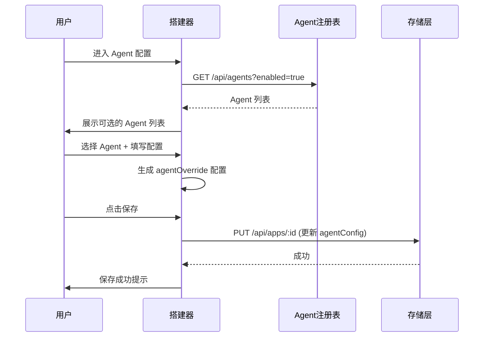
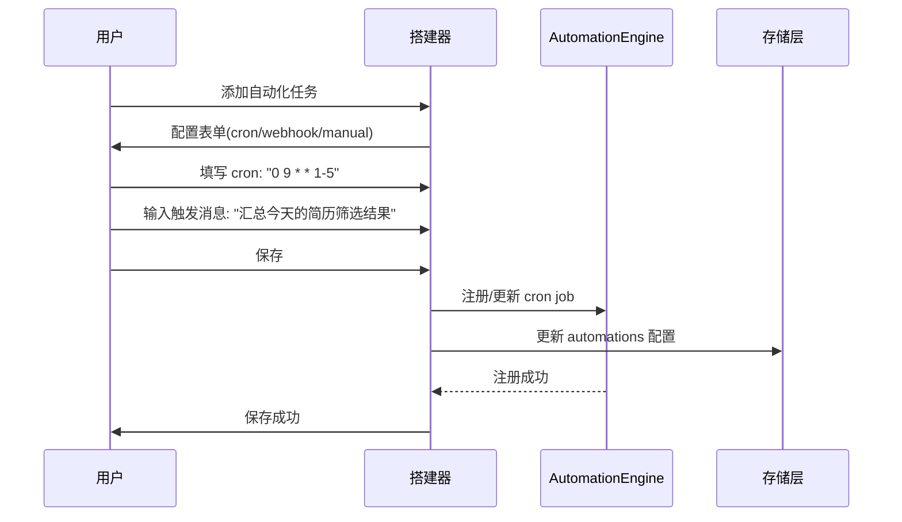

# PRD 03 — 应用搭建器 / App Builder

---

## 中文版

### 1. 功能概述

应用搭建器是平台的**核心创作工具**，让用户通过可视化配置界面搭建智能体应用。应用搭建器分为 **5 个配置区域**，通过左侧 Tab 导航切换。

### 2. 页面结构

```
┌──────────────────────────────────────────────────────────────────┐
│  ← 返回应用   应用搭建器    简历筛选 Agent    [草稿]  [保存] [发布] │
├────────┬─────────────────────────────────────────────────────────┤
│  📋 基础 │                                                       │
│  🤖 Agent│    ┌─────────────────────────────────────────────┐    │
│  📚 知识库│    │                                             │    │
│  🛠️ 工具  │    │          分步配置区域                        │    │
│  ⚡ 自动化│    │          (当前选中 Tab 内容)                  │    │
│  👁️ 预览  │    │                                             │    │
│         │    │                                             │    │
│         │    └─────────────────────────────────────────────┘    │
│         │                                                       │
│         │    右侧实时预览面板(可选折叠)                            │
│         │    ┌──────────────────────────────┐                   │
│         │    │  👁️ 实时预览                   │                   │
│         │    │  ─────────────────────────   │                   │
│         │    │  你好！我是简历筛选助手。       │                   │
│         │    │  请上传需要筛选的简历...        │                   │
│         │    │                              │                   │
│         │    │  📚 已加载知识库: 简历模板库     │                   │
│         │    │  🛠️ 可用工具: 搜索, 文件读取   │                   │
│         │    └──────────────────────────────┘                   │
└────────┴─────────────────────────────────────────────────────────┘
```

### 3. 配置区详解

#### 3.1 基础信息 Tab

| 字段 | 类型 | 必填 | 说明 |
|------|------|------|------|
| 应用名称 | text | ✅ | 2-30 字符 |
| 应用描述 | textarea | ❌ | 简要描述应用用途 |
| 图标 | emoji picker | ❌ | 默认 🤖 |
| 标签 | tag input | ❌ | 自由添加标签 |

#### 3.2 Agent 配置 Tab

| 配置项 | 类型 | 说明 |
|--------|------|------|
| **Agent 选择** | 下拉选择器 | 从注册表选择已安装 Agent，显示 Agent 名称、描述、版本 |
| **System Prompt** | 代码编辑器 (Markdown) | 覆盖 Agent 默认 system prompt，支持变量插值 `{{user_name}}` |
| **Temperature** | 滑块 (0-2, step 0.1) | 控制回复随机性 |
| **Max Tokens** | 数字输入 | 单次回复最大 token 数 |
| **Model** | 下拉选择器 | 从已配置 LLM Provider 中选择模型 |



#### 3.3 知识库配置 Tab

详见 [PRD 04 — RAG 知识库](./04-rag-knowledge.md)

核心交互：
- 选择 RAG Provider（SQLiteVec / Milvus / ChromaDB / BM25）
- 创建/选择知识库
- 文档上传与处理（拖拽上传 → 自动解析 → 分块预览 → 向量化）
- 检索参数配置（TopK、相似度阈值、混合检索开关）
- 检索测试（输入查询 → 预览检索结果）

#### 3.4 工具配置 Tab

| 配置项 | 类型 | 说明 |
|--------|------|------|
| 可用工具列表 | 多选列表 | 显示所有已注册工具，勾选启用 |
| 工具搜索 | 搜索框 | 按名称/描述搜索工具 |
| 工具详情 | 弹出面板 | 点击工具查看描述、参数、示例 |

工具来源：
1. 内置工具（bash, file_read, file_write, web_search, todo）
2. MCP 工具（通过 MCP 服务器注册的工具）
3. 自定义工具（未来支持）

#### 3.5 自动化配置 Tab

| 触发类型 | 配置 | 说明 |
|----------|------|------|
| **定时触发** | Cron 表达式 + 输入消息 | 定时自动执行 Agent 对话 |
| **Webhook 触发** | Webhook URL + 请求体映射 | 通过 HTTP 回调触发 Agent |
| **手动触发** | 输入模板 | 预设对话模板，一键发起 |



### 4. 预览面板

实时预览面板展示用户当前配置的效果：

- **对话模拟**：根据 system prompt 生成示例开场白
- **知识库状态**：显示已绑定的知识库名称和文档数
- **工具列表**：显示已启用的工具
- **自动化摘要**：显示已配置的自动化任务

### 5. 保存与发布

```
┌──────────────────────────────────────┐
│  [保存草稿]        [发布]             │
│  保存当前配置       保存并发布到应用空间 │
│  状态: 草稿         状态: 已发布       │
└──────────────────────────────────────┘
```

**保存草稿**：
- 仅更新 `app.json` 配置
- 状态保持 `draft`
- 不校验必填项完整性

**发布**：
- 校验必填项（名称、Agent 选择）
- 生成 `publishedAt` 时间戳
- 状态变为 `published`
- 应用在应用列表变为可用状态

### 6. 组件树

```
AppBuilderPage
├── BuilderHeader（面包屑 + 保存/发布按钮）
├── BuilderLayout
│   ├── SideTabs（左侧配置 Tab 导航）
│   │   ├── TabBasic（基础信息）
│   │   ├── TabAgent（Agent 配置）
│   │   ├── TabRag（知识库配置）
│   │   ├── TabTools（工具配置）
│   │   ├── TabAutomation（自动化配置）
│   │   └── TabPreview（预览）
│   └── ContentArea
│       ├── BasicForm（名称、描述、图标、标签）
│       ├── AgentConfig（Agent 选择器 + 参数面板）
│       ├── RagConfig（Provider 选择 + 文档管理 + 检索测试）
│       ├── ToolsConfig（工具选择列表）
│       ├── AutomationConfig（Cron/Webhook/Manual 配置）
│       └── PreviewPanel（实时预览面板）
```

### 7. 异常与边界处理

| 场景 | 处理 |
|------|------|
| Agent 注册表为空 | 提示"暂无可用 Agent，请先安装插件"并提供跳转链接 |
| Agent 已被卸载 | 显示警告 + "Agent 不可用，请重新选择" |
| 知识库 Provider 未安装 | 提示安装步骤（如 `pip install chromadb`） |
| 文档解析失败 | 显示失败原因 + 重新上传按钮 |
| 未保存离开页面 | 浏览器 beforeunload 弹窗 + "有未保存更改"提示 |
| 发布时必填项缺失 | 高亮缺失字段，阻止发布 |
| 网络中断 | 本地草稿自动保存到 localStorage |

---

## English Version

### 1. Feature Overview

The App Builder is the **core creation tool** of the platform, enabling users to build agent applications through a visual configuration interface. It consists of **5 configuration areas** navigated via left sidebar tabs.

### 2. Page Structure

- **Header**: Breadcrumb + Save/Publish buttons + status indicator
- **Left Sidebar**: Tab navigation (Basics, Agent, Knowledge, Tools, Automation, Preview)
- **Main Content**: Dynamic form area for the selected tab
- **Right Panel** (collapsible): Real-time preview of the app configuration

### 3. Configuration Tabs

#### 3.1 Basics Tab
Name (required, 2-30 chars), description (optional), icon (emoji picker), tags (free-form).

#### 3.2 Agent Tab
Select agent from registry, override system prompt (Markdown editor with variable interpolation), temperature slider (0-2), max tokens, model selection.

#### 3.3 Knowledge Tab
Configure RAG provider, create/select knowledge base, upload documents with visual processing pipeline, configure search parameters (TopK, similarity threshold, hybrid search), test retrieval queries.

#### 3.4 Tools Tab
Multi-select from available tools (built-in + MCP), search/filter tools, view tool details.

#### 3.5 Automation Tab
Configure cron-based, webhook-based, or manual trigger automations with templated messages.

### 4. Preview Panel

Shows live preview: simulated greeting message based on system prompt, knowledge base status, enabled tools list, automation summary.

### 5. Save & Publish

- **Save Draft**: Updates config only, keeps `draft` status, no required field validation
- **Publish**: Validates required fields (name, agent selection), sets `publishedAt`, changes status to `published`

### 6. Error & Edge Case Handling

| Scenario | Handling |
|----------|----------|
| Empty agent registry | "No agents available" message + link to plugin page |
| Agent uninstalled | Warning + "Agent unavailable, please reselect" |
| KB provider not installed | Installation steps (e.g., `pip install chromadb`) |
| Document parsing failure | Error reason + re-upload button |
| Leave without saving | beforeunload prompt + unsaved changes indicator |
| Missing required fields on publish | Highlight missing fields, block publish |
| Network interruption | Auto-save draft to localStorage |

---

## 变更记录 / Changelog

| 日期 | 版本 | 变更说明 |
|------|------|---------|
| 2026-06-12 | v1.0 | 初始版本 |

---

> 上一篇：[PRD 02 — 应用管理](./02-app-management.md)
> 下一篇：[PRD 04 — RAG 知识库](./04-rag-knowledge.md)
