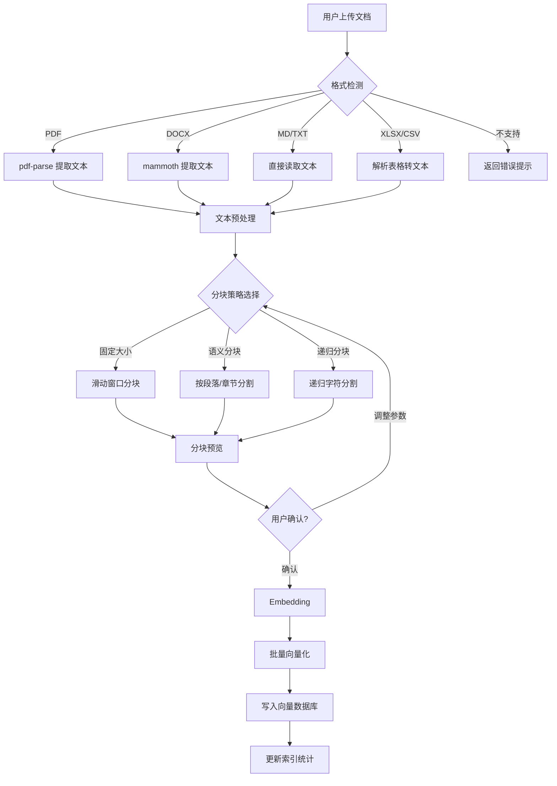

# PRD 03 — 知识库 / Knowledge Base

---

## 中文版

### 1. 功能概述

知识库是智能体应用平台的**核心差异化能力**。用户可以在页面上完成知识库的创建、文档上传、处理流水线和检索配置，全程可视化。

### 2. 整体流程


### 3. RAG Provider 接口设计

```typescript
// RAG Provider 抽象接口
interface IRagProvider {
  readonly id: string
  readonly name: string
  readonly description: string
  readonly version: string
  
  // 生命周期
  initialize(config: RagProviderConfig): Promise<void>
  destroy(): Promise<void>
  
  // 文档操作
  indexDocument(doc: ProcessedDocument): Promise<IndexResult>
  indexBatch(docs: ProcessedDocument[], onProgress?: ProgressCallback): Promise<IndexResult[]>
  deleteDocument(docId: string): Promise<void>
  clearAll(): Promise<void>
  
  // 检索
  search(query: string, options?: SearchOptions): Promise<SearchResult[]>
  hybridSearch(query: string, options?: HybridSearchOptions): Promise<SearchResult[]>
  
  // 元数据
  getDocument(docId: string): Promise<DocumentInfo | null>
  listDocuments(filter?: DocumentFilter): Promise<DocumentInfo[]>
  healthCheck(): Promise<HealthStatus>
  getStats(): Promise<RagStats>
}
```

### 4. Provider 实现规划

| Provider | 引擎 | 特点 | 适用场景 | 优先级 |
|----------|------|------|---------|--------|
| SQLiteVecProvider | sqlite-vec | 零配置本地向量库 | 小规模个人知识库 | P0 |
| ChromaProvider | ChromaDB | 开源嵌入式向量库 | 中型知识库 | P1 |
| BM25Provider | SQLite + BM25 | 关键词检索 | 混合检索补充 | P1 |
| MilvusProvider | Milvus | 分布式高性能向量库 | 大规模企业知识库 | P2 |

### 5. 文档处理流水线



### 6. 页面设计

#### 6.1 知识库列表页 `/rag`

```
┌──────────────────────────────────────────────────────────┐
│  知识库管理                                  [+ 新建知识库] │
├──────────────────────────────────────────────────────────┤
│  ┌──────────────────────┐ ┌──────────────────────┐      │
│  │ 📚 简历模板库          │ │ 📋 JD 模板库         │      │
│  │ 120 文档 · 15,230 块  │ │ 45 文档 · 8,100 块   │      │
│  │ SQLiteVec · 本地     │ │ ChromaDB · 本地     │      │
│  │ 最后更新: 2h前        │ │ 最后更新: 1d前        │      │
│  │                      │ │                      │      │
│  │ [管理] [删除]         │ │ [管理] [删除]         │      │
│  └──────────────────────┘ └──────────────────────┘      │
└──────────────────────────────────────────────────────────┘
```

#### 6.2 知识库详情页 `/rag/[id]`

```
┌──────────────────────────────────────────────────────────┐
│  ← 返回    简历模板库         [添加文档] [检索测试] [设置]   │
├──────────────────────────────────────────────────────────┤
│  ┌─ 统计 ──────────────────────────────────────────────┐ │
│  │ 总文档: 120  │  总分块: 15,230  │  向量维度: 1536    │ │
│  │ Provider: SQLiteVec  │  状态: 🟢 健康               │ │
│  └─────────────────────────────────────────────────────┘ │
│                                                          │
│  ┌─ 文档列表 ──────────────────────────────────────────┐ │
│  │  📄 resume-template-v2.md         ✅ 已索引         │ │
│  │  📄 senior-resume-guide.pdf       ⏳ 处理中...       │ │
│  │  📄 job-requirements.xlsx         ❌ 处理失败        │ │
│  └─────────────────────────────────────────────────────┘ │
└──────────────────────────────────────────────────────────┘
```

### 7. 检索测试界面

```
┌──────────────────────────────────────────────────────────┐
│  检索测试                                                  │
├──────────────────────────────────────────────────────────┤
│  ┌─ 查询输入 ──────────────────────────────────────────┐  │
│  │ 请输入测试查询...                        [搜索]      │  │
│  └─────────────────────────────────────────────────────┘  │
│                                                          │
│  检索模式: [向量检索 ▼]  TopK: [5 ▼]  阈值: [0.7 ▼]       │
│                                                          │
│  ┌─ 检索结果 ──────────────────────────────────────────┐  │
│  │ #1  📄 resume-template-v2.md  │  相似度: 0.92       │  │
│  │     "### 2. 工作经历..."                             │  │
│  │ #2  📄 senior-resume-guide.pdf │  相似度: 0.87       │  │
│  │     "高级候选人的简历通常包含..."                       │  │
│  └─────────────────────────────────────────────────────┘  │
└──────────────────────────────────────────────────────────┘
```

### 8. API 设计

| 方法 | 路径 | 描述 |
|------|------|------|
| `GET` | `/api/rag/knowledge-bases` | 获取知识库列表 |
| `POST` | `/api/rag/knowledge-bases` | 创建知识库 |
| `GET` | `/api/rag/knowledge-bases/:id` | 获取知识库详情 |
| `PUT` | `/api/rag/knowledge-bases/:id` | 更新知识库配置 |
| `DELETE` | `/api/rag/knowledge-bases/:id` | 删除知识库 |
| `GET` | `/api/rag/knowledge-bases/:id/documents` | 获取文档列表 |
| `POST` | `/api/rag/knowledge-bases/:id/documents` | 上传文档 (multipart) |
| `DELETE` | `/api/rag/knowledge-bases/:id/documents/:docId` | 删除文档 |
| `POST` | `/api/rag/knowledge-bases/:id/documents/:docId/process` | 处理文档 |
| `POST` | `/api/rag/knowledge-bases/:id/search` | 检索测试 |
| `GET` | `/api/rag/providers` | 获取可用 Provider 列表 |

### 9. 异常处理

| 场景 | 处理方式 |
|------|---------|
| 文件格式不支持 | 返回错误 + 支持的格式列表 |
| 文件过大 (>50MB) | 拒绝上传，提示拆分或压缩 |
| 解析内容为空 | 提示"未能提取有效文本内容" |
| Embedding API 超时 | 指数退避重试 (最多 3 次) |
| 向量库磁盘满 | 提示清理空间 |
| Provider 服务不可用 | 显示连接状态 + 重试按钮 |

---

## English Version

### 1. Feature Overview

RAG Knowledge Base is the **core differentiator** of the Agent Application Platform. Users can create knowledge bases, upload documents, run the processing pipeline, and configure retrieval — all visually.

### 2. End-to-End Flow

Create KB → Select Provider → Upload Docs → Parse → Chunk → Embed → Index → Test Search → Bind to App

### 3. RAG Provider Interface

Plug-and-play provider architecture via `IRagProvider` interface with lifecycle management, document CRUD, search/hybridSearch, healthCheck, and getStats.

### 4. Planned Providers

| Provider | Engine | Scale | Priority |
|----------|--------|-------|----------|
| SQLiteVecProvider | sqlite-vec | < 100K docs | P0 |
| ChromaProvider | ChromaDB | 10K-500K docs | P1 |
| BM25Provider | SQLite + BM25 | Any | P1 |
| MilvusProvider | Milvus | > 1M docs | P2 |

### 5. API Design

11 endpoints for KB CRUD, document upload/process, search test, and provider management.

---

## 变更记录 / Changelog

| 日期 | 版本 | 变更说明 |
|------|------|---------|
| 2026-06-14 | v2.0 | 重新组织：基于 PRD 04 重写，简化 Provider 规划，移除过度设计 |
| 2026-06-12 | v1.0 | 初始版本 |

---

> 上一篇：[PRD 02 — 工作空间](./02-workspace.md)
> 下一篇：[PRD 04 — 工作流](./04-workflow.md)
