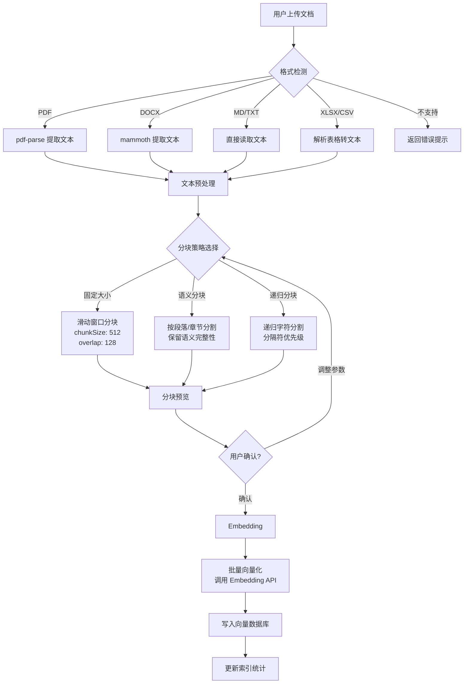

# PRD 04 — RAG 知识库 / RAG Knowledge Base

---

## 中文版

### 1. 功能概述

RAG 知识库是智能体应用平台的**核心差异化能力**。用户可以在页面上完成知识库的创建、文档上传、处理流水线和检索配置，全程可视化。

### 2. 整体流程


### 3. 页面设计

#### 3.1 知识库列表页 `/rag`

```
┌──────────────────────────────────────────────────────────┐
│  知识库管理                                  [+ 新建知识库] │
├──────────────────────────────────────────────────────────┤
│  ┌──────────────────────┐ ┌──────────────────────┐      │
│  │ 📚 简历模板库          │ │ 📋 JD 模板库         │      │
│  │ 120 文档 · 15,230 块  │ │ 45 文档 · 8,100 块   │      │
│  │ SQLiteVec · 本地     │ │ ChromaDB · 本地     │      │
│  │ 最后更新: 2h前        │ │ 最后更新: 1d前        │      │
│  │                      │ │                      │      │
│  │ [管理] [删除]         │ │ [管理] [删除]         │      │
│  └──────────────────────┘ └──────────────────────┘      │
│                                                          │
│  ┌──────────────────────────────────────────────┐       │
│  │ + 新建知识库                                    │       │
│  │   选择 Provider 开始创建                        │       │
│  └──────────────────────────────────────────────┘       │
└──────────────────────────────────────────────────────────┘
```

#### 3.2 知识库详情页 `/rag/[id]`

```
┌──────────────────────────────────────────────────────────┐
│  ← 返回    简历模板库         [添加文档] [检索测试] [设置]   │
├──────────────────────────────────────────────────────────┤
│  ┌─ 统计 ──────────────────────────────────────────────┐ │
│  │ 总文档: 120  │  总分块: 15,230  │  向量维度: 1536    │ │
│  │ Provider: SQLiteVec  │  状态: 🟢 健康               │ │
│  └─────────────────────────────────────────────────────┘ │
│                                                          │
│  ┌─ 文档列表 ──────────────────────────────────────────┐ │
│  │  ┌── 搜索文档... ──────────────────┐  ┌ 排序 ▼ ─┐  │ │
│  │  └─────────────────────────────────┘  └──────────┘  │ │
│  │                                                      │ │
│  │  ┌─────────────────────────────────────────────────┐ │ │
│  │  │ 📄 resume-template-v2.md         ✅ 已索引       │ │ │
│  │  │    42 块 · 12.5KB · 上传于 2h前                  │ │ │
│  │  │    [预览] [重新处理] [删除]                       │ │ │
│  │  ├─────────────────────────────────────────────────┤ │ │
│  │  │ 📄 senior-resume-guide.pdf       ⏳ 处理中...     │ │ │
│  │  │    解析中 · 245KB · 上传于 5min前                  │ │ │
│  │  ├─────────────────────────────────────────────────┤ │ │
│  │  │ 📄 job-requirements.xlsx         ❌ 处理失败      │ │ │
│  │  │    错误: 不支持的文件格式 · 上传于 1h前            │ │ │
│  │  │    [重新上传] [删除]                              │ │ │
│  │  └─────────────────────────────────────────────────┘ │ │
│  └─────────────────────────────────────────────────────┘ │
└──────────────────────────────────────────────────────────┘
```

### 4. 文档处理流水线



#### 4.1 分块预览界面

```
┌──────────────────────────────────────────────────────────┐
│  分块预览 ── resume-template-v2.md                        │
├──────────────────────────────────────────────────────────┤
│  策略: [滑动窗口 ▼]  块大小: [512 ▼]  重叠: [128 ▼]        │
│  预计分块数: 42 块                                       │
│                                                          │
│  ┌─ 块 #1 (0-498 字符) ─────────────────────────────────┐│
│  │ ## 简历模板 v2.0                                      ││
│  │                                                       ││
│  │ 本模板适用于技术岗位简历筛选，包含以下章节...            ││
│  │                                                       ││
│  │ ### 1. 基本信息                                        ││
│  │ - 姓名: [候选人的真实姓名]                              ││
│  │ - 联系方式: [电话/邮箱]                                ││
│  └───────────────────────────────────────────────────────┘│
│  ┌─ 块 #2 (370-892 字符) ────────────────────────────────┐│
│  │ ### 2. 工作经历                                        ││
│  │                                                       ││
│  │ 按时间倒序排列，每段经历包含...                          ││
│  └───────────────────────────────────────────────────────┘│
│                                                          │
│  共 42 块                                               │
│  [← 重新调整]  [确认并向量化 →]                           │
└──────────────────────────────────────────────────────────┘
```

### 5. RAG Provider 接口设计

```typescript
// RAG Provider 抽象接口
interface IRagProvider {
  readonly id: string;
  readonly name: string;
  readonly description: string;
  readonly version: string;
  
  // 生命周期
  initialize(config: RagProviderConfig): Promise<void>;
  destroy(): Promise<void>;
  
  // 文档操作
  indexDocument(doc: ProcessedDocument): Promise<IndexResult>;
  indexBatch(docs: ProcessedDocument[], onProgress?: ProgressCallback): Promise<IndexResult[]>;
  deleteDocument(docId: string): Promise<void>;
  clearAll(): Promise<void>;
  
  // 检索
  search(query: string, options?: SearchOptions): Promise<SearchResult[]>;
  hybridSearch(query: string, options?: HybridSearchOptions): Promise<SearchResult[]>;
  
  // 元数据
  getDocument(docId: string): Promise<DocumentInfo | null>;
  listDocuments(filter?: DocumentFilter): Promise<DocumentInfo[]>;
  healthCheck(): Promise<HealthStatus>;
  getStats(): Promise<RagStats>;
}

// 文档处理流水线接口
interface IDocumentPipeline {
  // 解析
  parse(file: FileInput): Promise<ParsedContent>;
  
  // 分块
  chunk(content: ParsedContent, strategy: ChunkStrategy): Promise<ChunkResult>;
  
  // 向量化
  embed(chunks: ChunkResult, model: EmbeddingModel): Promise<EmbeddingResult>;
  
  // 端到端
  process(file: FileInput, options?: ProcessOptions): Promise<ProcessedDocument>;
}

// 相关类型
interface SearchOptions {
  topK: number;                    // 返回结果数
  similarityThreshold?: number;    // 相似度阈值
  filter?: Record<string, unknown>; // 元数据过滤
}

interface HybridSearchOptions extends SearchOptions {
  vectorWeight: number;            // 向量检索权重 (0-1)
  keywordWeight: number;           // 关键词检索权重 (0-1)
}

interface SearchResult {
  chunkId: string;
  documentId: string;
  documentName: string;
  content: string;
  score: number;
  metadata: Record<string, unknown>;
}

interface ProcessedDocument {
  id: string;
  name: string;
  type: string;
  size: number;
  chunks: DocumentChunk[];
  embeddings: number[][];
  metadata: Record<string, unknown>;
}

interface DocumentChunk {
  id: string;
  index: number;
  content: string;
  startOffset: number;
  endOffset: number;
  metadata: Record<string, unknown>;
}
```

### 6. Provider 实现规划

#### 6.1 SQLiteVecProvider

| 属性 | 值 |
|------|-----|
| 引擎 | sqlite-vec (sqlite 向量扩展) |
| 安装 | npm 安装，无需外部服务 |
| 适用 | 小规模知识库 (< 10 万文档) |
| 优势 | 零配置，本地运行，嵌入式 |
| 索引 | 内积 / L2 距离 / 余弦相似度 |

#### 6.2 MilvusProvider

| 属性 | 值 |
|------|-----|
| 引擎 | Milvus (分布式向量数据库) |
| 安装 | Docker 或 Milvus Lite |
| 适用 | 大规模企业知识库 (> 100 万文档) |
| 优势 | 高性能，分布式，混合搜索 |
| 索引 | IVF_FLAT / HNSW / ANNOY 等 |

#### 6.3 ChromaProvider

| 属性 | 值 |
|------|-----|
| 引擎 | ChromaDB (开源嵌入式向量库) |
| 安装 | pip install chromadb 或 npm |
| 适用 | 中型知识库 (1 万 - 50 万文档) |
| 优势 | 易用，完善的查询 API |
| 索引 | HNSW |

#### 6.4 BM25Provider

| 属性 | 值 |
|------|-----|
| 引擎 | SQLite + BM25 (关键词检索) |
| 适用 | 混合检索的关键词补充 |
| 优势 | 精确关键词匹配，补充语义检索 |
| 场景 | 需要精确匹配的场景（如法律条文、编号） |

#### 6.5 LLMCompilerProvider

| 属性 | 值 |
|------|-----|
| 引擎 | LLM 编译知识库 |
| 适用 | 结构化知识的编译存储 |
| 优势 | LLM 理解后结构化存储，推理效率高 |
| 场景 | 需要深度推理的结构化知识 |

### 7. 检索测试界面

```
┌──────────────────────────────────────────────────────────┐
│  检索测试                                                  │
├──────────────────────────────────────────────────────────┤
│  ┌─ 查询输入 ──────────────────────────────────────────┐  │
│  │ 请输入测试查询...                        [搜索]      │  │
│  └─────────────────────────────────────────────────────┘  │
│                                                          │
│  检索模式: [向量检索 ▼]  TopK: [5 ▼]  阈值: [0.7 ▼]       │
│  混合检索: [✓] 启用  向量权重: [0.7 ──●──] 关键词: [0.3] │
│                                                          │
│  ┌─ 检索结果 ──────────────────────────────────────────┐  │
│  │ #1  📄 resume-template-v2.md  │  相似度: 0.92       │  │
│  │     "### 2. 工作经历..."                             │  │
│  │     ─────────────────────────────────────────       │  │
│  │ #2  📄 senior-resume-guide.pdf │  相似度: 0.87       │  │
│  │     "高级候选人的简历通常包含..."                       │  │
│  │     ─────────────────────────────────────────       │  │
│  │ #3  📄 resume-template-v1.md  │  相似度: 0.81       │  │
│  │     "## 简历筛选标准..."                              │  │
│  └─────────────────────────────────────────────────────┘  │
└──────────────────────────────────────────────────────────┘
```

### 8. 知识库设置

| 设置项 | 说明 |
|--------|------|
| 知识库名称 | 可修改 |
| 默认分块策略 | 固定大小 / 语义分块 / 递归分块 |
| 默认 Chunk Size | 256 / 512 / 1024 / 2048 |
| 默认 Overlap | 0 / 64 / 128 / 256 |
| Embedding Model | OpenAI text-embedding-3-small / large 等 |
| 默认 TopK | 3 / 5 / 10 / 20 |
| 混合检索开关 | 启用/禁用 |
| 向量权重 | 0-1 滑块 |
| 自动清理 | 删除源文档后自动删除向量 |

### 9. 异常处理

| 场景 | 处理方式 |
|------|---------|
| 文件格式不支持 | 返回错误 + 支持的格式列表（PDF, DOCX, MD, TXT, CSV, XLSX） |
| 文件过大 (>50MB) | 拒绝上传，提示拆分或压缩 |
| 解析内容为空 | 提示"未能提取有效文本内容" |
| Embedding API 超时 | 指数退避重试 (最多 3 次) |
| 向量库磁盘满 | 提示清理空间 |
| Provider 服务不可用 | 显示连接状态 + 重试按钮 |
| 并发索引操作 | 排队处理，显示队列状态 |

---

## English Version

### 1. Feature Overview

RAG Knowledge Base is the **core differentiator** of the Agent Application Platform. Users can create knowledge bases, upload documents, run the processing pipeline, and configure retrieval — all visually in the browser.

### 2. End-to-End Flow

Create KB → Select Provider → Upload Docs → Parse → Chunk → Embed → Index → Test Search → Bind to App

### 3. Page Design

- **KB List Page** `/rag`: Grid of KB cards showing name, document count, chunk count, provider, last updated
- **KB Detail Page** `/rag/[id]`: Statistics bar, document list with status (indexed/processing/failed), search, sort

### 4. Document Processing Pipeline

```
Upload → Format Detection → Text Extraction → Preprocessing → Chunking → Preview → Embedding → Vector DB Write → Index Update
```

Parallel processing supported for multiple documents. Visual chunk preview with adjustable strategy and parameters.

### 5. RAG Provider Interface

Plug-and-play provider architecture via `IRagProvider` interface. Providers implement initialize/destroy, document CRUD, search/hybridSearch, healthCheck, and getStats.

### 6. Planned Providers

| Provider | Engine | Scale | Key Feature |
|----------|--------|-------|-------------|
| SQLiteVecProvider | sqlite-vec | < 100K docs | Zero config, embedded |
| MilvusProvider | Milvus | > 1M docs | Distributed, high-perf |
| ChromaProvider | ChromaDB | 10K-500K docs | Easy API, HNSW index |
| BM25Provider | SQLite + BM25 | Any | Keyword search complement |
| LLMCompilerProvider | LLM compiled | Structured | Deep reasoning knowledge |

### 7. Retrieval Test Interface

Search playground with mode selection (vector/hybrid), TopK, similarity threshold, vector/keyword weight sliders, and scored result display.

### 8. Error Handling

- Unsupported format → error + supported format list
- Oversized file (>50MB) → reject with guidance
- Empty parsed content → "No valid text extracted"
- Embedding API timeout → exponential backoff (max 3 retries)
- Disk full → prompt to free space
- Provider unavailable → connection status + retry button
- Concurrent indexing → queue with status display

---

## 变更记录 / Changelog

| 日期 | 版本 | 变更说明 |
|------|------|---------|
| 2026-06-12 | v1.0 | 初始版本 |

---

> 上一篇：[PRD 03 — 应用搭建器](./03-app-builder.md)
> 下一篇：[PRD 05 — 评估流水线](./05-evaluation.md)
