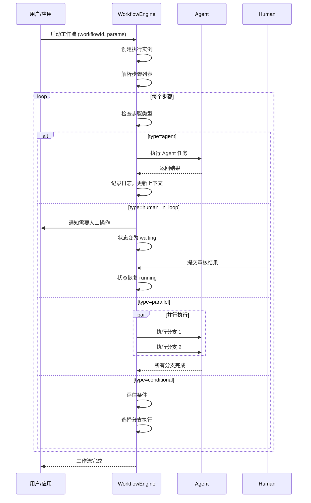

# PRD 04 — 工作流 / Workflow

---

## 中文版

### 1. 功能概述

**工作流**是 Manta 平台的任务编排引擎，让用户定义可重用的任务流程。工作流可以被智能体应用绑定，实现复杂的自动化任务。

核心理念：工作流是独立的"任务剧本"，可以被多个应用复用。

### 2. 核心概念

```
┌─────────────────────────────────────────────────────────────┐
│                    工作流 (Workflow)                           │
│                                                              │
│   ┌──────────────┐  ┌──────────────┐  ┌──────────────┐      │
│   │  工作流定义    │  │  工作流执行    │  │  步骤类型     │      │
│   │ WorkflowDef  │  │ Execution    │  │ Step Types   │      │
│   └──────┬───────┘  └──────┬───────┘  └──────┬───────┘      │
│          │                 │                 │               │
│   ┌──────┴───────┐  ┌──────┴───────┐  ┌──────┴───────┐      │
│   │ 步骤列表      │  │ 执行状态      │  │ agent        │      │
│   │ 条件分支      │  │ 步骤日志      │  │ human_in_loop│      │
│   │ 循环控制      │  │ 上下文传递    │  │ parallel     │      │
│   └──────────────┘  └──────────────┘  │ conditional  │      │
│                                        │ loop         │      │
│                                        └──────────────┘      │
└─────────────────────────────────────────────────────────────┘
```

### 3. 工作流定义

#### 3.1 数据结构（基于现有 types.ts）

```typescript
// 工作流定义
interface WorkflowDef {
  id: string
  name: string
  description?: string
  version?: string
  steps: WorkflowStep[]
}

// 工作流步骤
interface WorkflowStep {
  id: string
  type: WorkflowStepType  // 'agent' | 'human_in_loop' | 'parallel' | 'conditional' | 'loop'
  name: string
  agentName?: string      // type=agent 时指定 Agent
  next?: string           // 下一步 ID
  actions?: Record<string, string>  // human_in_loop 时的操作选项
  notify?: boolean | { mac?: boolean; webhook?: boolean }
  branches?: WorkflowStep[]  // parallel 类型的子分支
}

// 步骤类型
type WorkflowStepType =
  | 'agent'           // Agent 执行
  | 'human_in_loop'   // 人工审核
  | 'parallel'        // 并行执行
  | 'conditional'     // 条件分支
  | 'loop'            // 循环
```

#### 3.2 步骤类型详解

| 步骤类型 | 说明 | 使用场景 |
|---------|------|---------|
| **agent** | 调用指定 Agent 执行任务 | 文档处理、代码生成、数据分析 |
| **human_in_loop** | 暂停等待人工操作 | 审核确认、决策选择、内容审批 |
| **parallel** | 并行执行多个子步骤 | 批量处理、多任务同时执行 |
| **conditional** | 根据条件选择分支 | 流程判断、状态路由 |
| **loop** | 循环执行直到条件满足 | 迭代优化、批量处理 |

### 4. 工作流执行

#### 4.1 执行状态（基于现有 types.ts）

```typescript
// 单步执行状态
type StepStatus =
  | 'pending'        // 待执行
  | 'running'        // 执行中
  | 'waiting'        // 等待人工操作（human_in_loop）
  | 'done'           // 完成
  | 'failed'         // 失败
  | 'skipped'        // 已跳过

// 工作流执行实例整体状态
type WorkflowExecutionStatus =
  | 'running'
  | 'waiting'        // 暂停在 human_in_loop 步骤
  | 'done'
  | 'failed'

// 单步执行日志
interface StepLog {
  stepId: string
  stepName: string
  status: StepStatus
  agentName?: string
  startedAt?: string
  completedAt?: string
  error?: string
  actions?: Record<string, string>
}

// 工作流执行实例
interface WorkflowExecution {
  taskId: string
  workflowId: string
  status: WorkflowExecutionStatus
  currentStepId?: string
  steps: StepLog[]
  context: Record<string, unknown>
  createdAt: string
  updatedAt: string
}
```

#### 4.2 执行流程



### 5. 工作流编辑器

#### 5.1 可视化编辑器

```
┌──────────────────────────────────────────────────────────┐
│  工作流编辑器 — 简历筛选流程                    [保存] [运行] │
├──────────────────────────────────────────────────────────┤
│                                                          │
│   ┌─────────┐     ┌─────────┐     ┌─────────┐          │
│   │  开始    │────▶│ 解析简历 │────▶│ 筛选条件 │          │
│   │         │     │ (agent) │     │(condit.)│          │
│   └─────────┘     └─────────┘     └────┬────┘          │
│                                        │                │
│                          ┌─────────────┴─────────────┐  │
│                          │                           │  │
│                          ▼                           ▼  │
│                   ┌─────────┐                 ┌─────────┐│
│                   │ 人工审核 │                 │ 自动通过 ││
│                   │(human)  │                 │         ││
│                   └────┬────┘                 └────┬────┘│
│                        │                           │    │
│                        └─────────────┬─────────────┘    │
│                                      ▼                  │
│                               ┌─────────┐              │
│                               │  结束    │              │
│                               └─────────┘              │
└──────────────────────────────────────────────────────────┘
```

#### 5.2 工作流列表页 `/workflow`

```
┌──────────────────────────────────────────────────────────┐
│  工作流管理                                  [+ 新建工作流] │
├──────────────────────────────────────────────────────────┤
│  ┌──────────────────────┐ ┌──────────────────────┐      │
│  │ 📋 简历筛选流程        │ │ 📊 数据分析流程       │      │
│  │ 5 步骤 · 2 Agent     │ │ 8 步骤 · 3 Agent     │      │
│  │ 最后运行: 2h前        │ │ 最后运行: 1d前        │      │
│  │ 成功率: 95%          │ │ 成功率: 88%          │      │
│  │                      │ │                      │      │
│  │ [编辑] [运行] [删除]  │ │ [编辑] [运行] [删除]  │      │
│  └──────────────────────┘ └──────────────────────┘      │
└──────────────────────────────────────────────────────────┘
```

### 6. 与智能体应用的集成

工作流可以被智能体应用绑定：

```typescript
// 在 AppConfig 中绑定工作流
interface AppConfig {
  // ... 其他字段
  workflowId?: string  // 绑定的工作流 ID
}
```

**集成方式**：
1. **手动触发**：用户在应用工作空间中手动启动工作流
2. **自动触发**：通过 Automation 定时触发
3. **对话触发**：用户在对话中通过指令触发

### 7. API 设计

| 方法 | 路径 | 描述 |
|------|------|------|
| `GET` | `/api/workflow` | 获取工作流列表 |
| `POST` | `/api/workflow` | 创建工作流 |
| `GET` | `/api/workflow/:id` | 获取工作流详情 |
| `PUT` | `/api/workflow/:id` | 更新工作流 |
| `DELETE` | `/api/workflow/:id` | 删除工作流 |
| `POST` | `/api/workflow/:id/run` | 启动工作流执行 |
| `GET` | `/api/workflow/:id/executions` | 获取执行历史 |
| `GET` | `/api/workflow/executions/:execId` | 获取执行详情 |
| `POST` | `/api/workflow/executions/:execId/approve` | 审批 human_in_loop 步骤 |

### 8. 异常处理

| 场景 | 处理方式 |
|------|---------|
| Agent 不存在 | 步骤标记失败，工作流暂停 |
| Agent 执行超时 | 自动重试或标记失败 |
| 人工审核超时 | 发送提醒通知 |
| 步骤失败 | 支持从失败步骤重试 |
| 循环次数过多 | 设置最大循环次数保护 |

---

## English Version

### 1. Feature Overview

**Workflow** is the task orchestration engine of Manta platform, allowing users to define reusable task flows that can be bound to agent apps.

### 2. Core Concepts

- **WorkflowDef**: Workflow definition with steps
- **WorkflowStep**: Individual step with type (agent/human_in_loop/parallel/conditional/loop)
- **WorkflowExecution**: Runtime instance with status tracking

### 3. Step Types

| Type | Description |
|------|-------------|
| agent | Execute task via specified Agent |
| human_in_loop | Pause for human review/approval |
| parallel | Execute multiple sub-steps in parallel |
| conditional | Branch based on conditions |
| loop | Repeat until condition met |

### 4. Execution Flow

WorkflowEngine parses steps, executes them sequentially/parallelly, handles human-in-the-loop pauses, and tracks execution status.

### 5. API Design

9 endpoints for workflow CRUD, execution management, and human-in-the-loop approval.

---

## 变更记录 / Changelog

| 日期 | 版本 | 变更说明 |
|------|------|---------|
| 2026-06-14 | v1.0 | 初始版本，基于现有 types.ts 定义工作流系统 |

---

> 上一篇：[PRD 03 — 知识库](./03-knowledge-base.md)
> 下一篇：[PRD 05 — 智能体应用](./05-agent-app.md)
