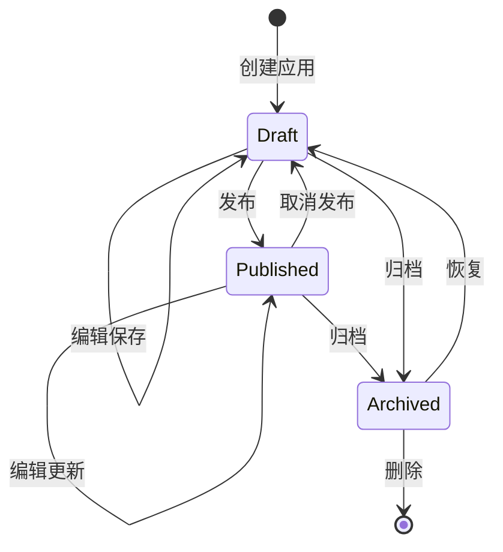

# PRD 05 — 智能体应用 / Agent Application

---

## 中文版

### 1. 功能概述

**智能体应用 (Agent App)** 是 Manta 平台的核心产品形态。每个智能体应用都是一个独立的产品，绑定知识库、工具、工作流，运行在自己的工作空间中。

核心理念：**Agent as Application** — 每个 Agent 都是一个产品。

### 2. 核心概念

```
┌─────────────────────────────────────────────────────────────┐
│                    智能体应用 (Agent App)                      │
│                                                              │
│   ┌──────────────┐  ┌──────────────┐  ┌──────────────┐      │
│   │   Agent      │  │   知识库      │  │    工作流     │      │
│   │  配置绑定    │  │  RAG 绑定    │  │  流程绑定    │      │
│   └──────┬───────┘  └──────┬───────┘  └──────┬───────┘      │
│          │                 │                 │               │
│          └─────────────────┼─────────────────┘               │
│                            │                                 │
│                            ▼                                 │
│                   ┌──────────────┐                           │
│                   │   工作空间    │                           │
│                   │  Workspace   │                           │
│                   └──────────────┘                           │
└─────────────────────────────────────────────────────────────┘
```

### 3. 应用配置（基于现有 types.ts）

```typescript
// 应用状态
type AppStatus = 'draft' | 'published' | 'archived'

// Agent 参数覆盖
interface AgentOverride {
  systemPrompt?: string
  temperature?: number
  maxTokens?: number
  model?: string
}

// RAG 知识库绑定
interface RagBinding {
  knowledgeBaseId: string
  topK: number
  similarityThreshold: number
  hybridSearchEnabled: boolean
  vectorWeight: number
}

// 自动化任务
interface Automation {
  id: string
  type: 'cron' | 'webhook' | 'manual'
  name: string
  description?: string
  enabled: boolean
  cronExpression?: string
  timezone?: string
  webhookUrl?: string
  webhookSecret?: string
  templateMessage?: string
  createdAt: string
  updatedAt: string
  lastTriggeredAt?: string
}

// 应用配置
interface AppConfig {
  id: string
  name: string
  description: string
  icon: string
  tags: string[]
  status: AppStatus

  // Agent 绑定
  agentId: string
  agentOverride: AgentOverride

  // 知识库绑定
  ragBinding: RagBinding | null

  // 工作流绑定
  workflowId?: string

  // 启用的工具
  enabledTools: string[]

  // 自动化
  automations: Automation[]

  // 时间戳
  createdAt: string
  updatedAt: string
  publishedAt: string | null

  // 版本号（乐观锁）
  version: number
}
```

### 4. 应用生命周期



### 5. 应用搭建器

#### 5.1 页面结构

```
┌──────────────────────────────────────────────────────────────────┐
│  ← 返回应用   应用搭建器    简历筛选 Agent    [草稿]  [保存] [发布] │
├────────┬─────────────────────────────────────────────────────────┤
│  📋 基础 │                                                       │
│  🤖 Agent│    ┌─────────────────────────────────────────────┐    │
│  📚 知识库│    │                                             │    │
│  🔄 工作流│    │          分步配置区域                        │    │
│  🛠️ 工具  │    │          (当前选中 Tab 内容)                  │    │
│  ⚡ 自动化│    │                                             │    │
│  👁️ 预览  │    └─────────────────────────────────────────────┘    │
│         │                                                       │
│         │    右侧实时预览面板(可选折叠)                            │
└────────┴─────────────────────────────────────────────────────────┘
```

#### 5.2 配置区详解

| Tab | 配置项 | 说明 |
|-----|--------|------|
| **基础** | 名称、描述、图标、标签 | 应用基本信息 |
| **Agent** | Agent 选择、System Prompt、Temperature、Model | Agent 配置覆盖 |
| **知识库** | Provider 选择、知识库绑定、检索参数 | RAG 配置 |
| **工作流** | 工作流选择、参数配置 | 工作流绑定 |
| **工具** | 工具列表多选 | 启用/禁用工具 |
| **自动化** | Cron/Webhook/Manual 配置 | 定时/触发任务 |
| **预览** | 实时预览配置效果 | 验证配置 |

### 6. 应用管理

#### 6.1 应用列表页 `/apps`

```
┌──────────────────────────────────────────────────────────┐
│  应用管理                                    [+ 创建应用]  │
├──────────────────────────────────────────────────────────┤
│  ┌── 搜索应用 ────────┐  ┌── 状态筛选 ▼ ──┐  ┌ 排序 ▼ ─┐│
│  └─────────────────────┘  └────────────────┘  └─────────┘│
│                                                          │
│  ┌──────────────┐ ┌──────────────┐ ┌──────────────┐     │
│  │ 📄 简历筛选   │ │ 📋 JD生成器   │ │ 💬 客服助手   │     │
│  │ Agent        │ │ Agent        │ │ Agent        │     │
│  │ 已发布  🟢   │ │ 草稿    🟡   │ │ 已发布  🟢   │     │
│  │ 最后编辑 2h前 │ │ 最后编辑 1d前 │ │ 最后编辑 5d前 │     │
│  │              │ │              │ │              │     │
│  │ [打开] [···] │ │ [打开] [···] │ │ [打开] [···] │     │
│  └──────────────┘ └──────────────┘ └──────────────┘     │
└──────────────────────────────────────────────────────────┘
```

#### 6.2 应用详情页 `/apps/[id]`

```
┌──────────────────────────────────────────────────────────┐
│  ← 返回   简历筛选 Agent                    [编辑] [···]  │
├──────────────────────────────────────────────────────────┤
│  ┌─────────────┐ ┌─────────────┐ ┌─────────────┐        │
│  │ 📊 概览      │ │ 💬 工作空间  │ │ 📚 知识库    │        │
│  ├─────────────┤ ├─────────────┤ ├─────────────┤        │
│  │ 🔄 工作流    │ │ 🛠️ 工具      │ │ 📋 自动化    │        │
│  └─────────────┘ └─────────────┘ └─────────────┘        │
│                                                          │
│  ┌────────────────────────────────────────────────────┐  │
│  │  概览信息                                          │  │
│  │  名称: 简历筛选 Agent                               │  │
│  │  状态: 🟢 已发布                                     │  │
│  │  Agent: resume-screener (openclaw)                 │  │
│  │  知识库: 简历模板库 (120 文档)                       │  │
│  │  工作流: 简历筛选流程 (5 步骤)                       │  │
│  │  工具: web_search, file_read                       │  │
│  │  创建时间: 2026-06-01                              │  │
│  └────────────────────────────────────────────────────┘  │
└──────────────────────────────────────────────────────────┘
```

### 7. API 设计

| 方法 | 路径 | 描述 |
|------|------|------|
| `GET` | `/api/apps` | 获取应用列表 |
| `POST` | `/api/apps` | 创建新应用 |
| `GET` | `/api/apps/:id` | 获取应用详情 |
| `PUT` | `/api/apps/:id` | 更新应用配置 |
| `DELETE` | `/api/apps/:id` | 删除应用 |
| `POST` | `/api/apps/:id/clone` | 复制应用 |
| `PATCH` | `/api/apps/:id/status` | 更改应用状态 |

### 8. 异常处理

| 场景 | 处理方式 |
|------|---------|
| Agent ID 不存在 | 返回 400 + 错误提示 |
| 删除已发布的应用 | 二次确认弹窗 |
| 应用名称重复 | 允许重复（不同 ID 区分） |
| 存储空间不足 | 返回 507 |
| 并发编辑冲突 | 基于 version 字段做乐观锁 |

---

## English Version

### 1. Feature Overview

**Agent App** is the core product form of Manta platform. Each agent app is an independent product binding knowledge base, tools, and workflow, running in its own workspace.

### 2. Core Concepts

- **Agent Binding**: Agent configuration with override parameters
- **RAG Binding**: Knowledge base connection with search parameters
- **Workflow Binding**: Workflow definition binding
- **Tools**: Enabled tool list
- **Automation**: Cron/Webhook/Manual triggers

### 3. App Configuration

Based on existing `AppConfig` type in `src/core/types.ts` with fields for agent override, RAG binding, workflow binding, enabled tools, and automations.

### 4. App Lifecycle

Draft → Published → Archived with restore and delete capabilities.

### 5. App Builder

7-tab configuration interface: Basics, Agent, Knowledge, Workflow, Tools, Automation, Preview.

### 6. API Design

7 endpoints for app CRUD, clone, and status management.

---

## 变更记录 / Changelog

| 日期 | 版本 | 变更说明 |
|------|------|---------|
| 2026-06-14 | v1.0 | 初始版本，基于现有 AppConfig 定义智能体应用 |

---

> 上一篇：[PRD 04 — 工作流](./04-workflow.md)
> 下一篇：[PRD 06 — 评估系统](./06-evaluation.md)
