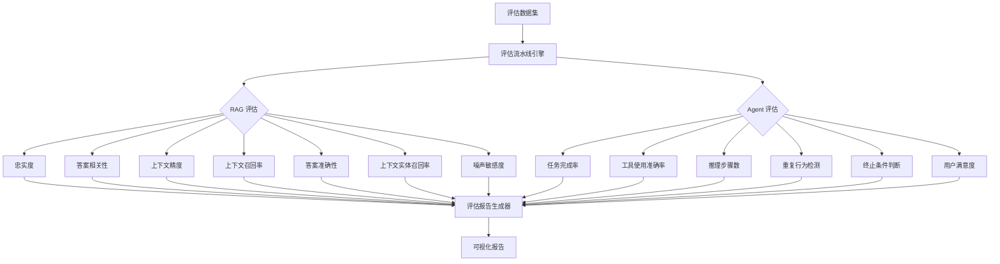
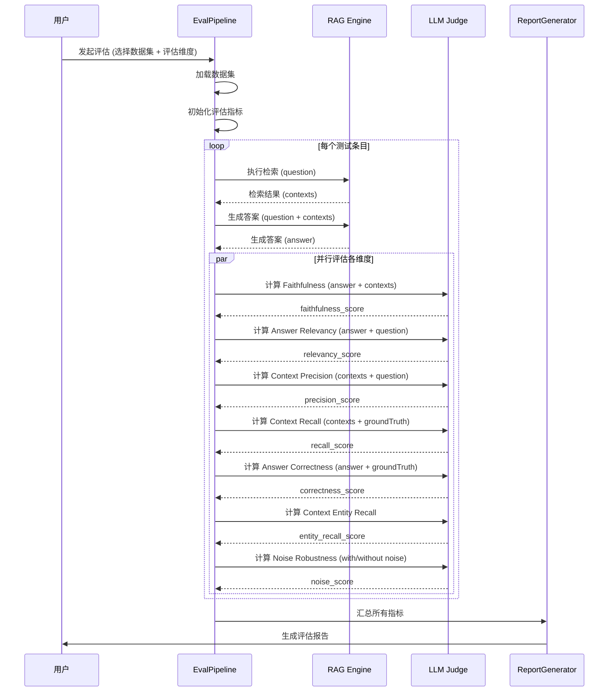
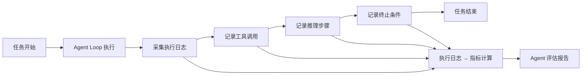
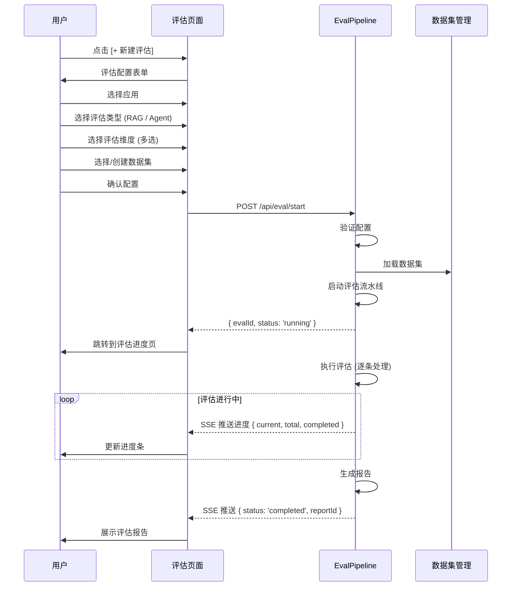

# PRD 05 — 评估流水线 / Evaluation Pipeline

---

## 中文版

### 1. 功能概述

评估流水线提供**生产级的自动化测评能力**，让用户能够量化衡量智能体应用的质量。评估分为两大类：

- **RAG 评估**：基于 RAGAs 框架，7 大核心维度
- **Agent 评估**：6 大维度衡量 Agent 行为质量

### 2. 评估架构



### 3. RAGAs 评估体系详解

#### 3.1 核心评估维度

| 维度 | 英文名 | 定义 | 评估方式 | 理想值 |
|------|--------|------|---------|--------|
| **忠实度** | Faithfulness | 生成答案是否完全基于检索到的上下文，无编造 | LLM 将答案分解为原子声明，逐一核实 | > 0.90 |
| **答案相关性** | Answer Relevancy | 答案是否紧扣问题，不跑题 | LLM 逆向生成问题，对比相似度 | > 0.85 |
| **上下文精度** | Context Precision | 检索结果中相关文档的排名是否靠前 | 计算相关文档在检索列表中的位置 | > 0.80 |
| **上下文召回率** | Context Recall | 相关文档是否被检索到（不漏检） | 对比 ground truth 与检索结果的覆盖率 | > 0.85 |
| **答案准确性** | Answer Correctness | 答案的事实准确性 | 基于 ground truth 的 TP/FP/FN 计算 | > 0.85 |
| **上下文实体召回率** | Context Entity Recall | 关键实体是否在检索结果中出现 | 实体级别的召回率计算 | > 0.80 |
| **噪声敏感度** | Noise Robustness | 引入噪声文档后答案质量的下降程度 | 对比有无噪声文档的答案质量差异 | < 0.15 (越低越好) |

#### 3.2 评估数据集结构

```typescript
interface RagEvalDataset {
  id: string;
  name: string;
  description: string;
  entries: RagEvalEntry[];
  createdAt: string;
}

interface RagEvalEntry {
  id: string;
  question: string;              // 测试问题
  groundTruth: string;           // 标准答案
  referenceContexts?: string[];  // 期望的参考上下文
  noiseDocuments?: string[];     // 噪声文档（用于噪声敏感度测试）
  metadata?: Record<string, unknown>;
}
```

#### 3.3 评估流水线执行



### 4. Agent 评估体系详解

#### 4.1 六大评估维度

| 维度 | 英文名 | 定义 | 评估方式 | 理想值 |
|------|--------|------|---------|--------|
| **任务完成率** | Task Completion Rate | Agent 是否成功完成给定任务 | 对比预期结果与执行结果 | > 85% |
| **工具使用准确率** | Tool Call Accuracy | 工具调用的正确性（选择+参数） | 对比期望工具调用与实际调用 | > 90% |
| **推理步骤数** | Reasoning Steps | 完成任务所需的推理步骤 | 统计 Agent Loop 的 turn 数 | < 期望步数 |
| **重复行为检测** | Loop Detection | Agent 是否陷入重复无意义循环 | 指纹比对 + 语义相似度分析 | 0 次循环 |
| **终止条件判断** | Termination Judgment | Agent 是否正确判断任务完成 | 分析 stop reason 是否正确 | > 90% |
| **用户满意度** | User Satisfaction | 用户对 Agent 表现的评价 | 显式评分 + 隐式行为分析 | > 4.0/5.0 |

#### 4.2 Agent 评估数据采集



#### 4.3 Agent 评估数据结构

```typescript
interface AgentEvalDataset {
  id: string;
  name: string;
  description: string;
  entries: AgentEvalEntry[];
}

interface AgentEvalEntry {
  id: string;
  task: string;                       // 任务描述
  expectedResult: string;             // 期望结果
  expectedToolCalls?: ExpectedToolCall[];  // 期望的工具调用序列
  maxExpectedSteps?: number;          // 期望的最大推理步数
  context: Record<string, unknown>;   // 任务初始上下文
}

interface ExpectedToolCall {
  toolName: string;
  params?: Record<string, unknown>;
}
```

### 5. 评估中心页面

#### 5.1 评估列表页 `/evaluation`

```
┌──────────────────────────────────────────────────────────┐
│  评估中心                                     [+ 新建评估]  │
├──────────────────────────────────────────────────────────┤
│  ┌── 筛选应用 ▼ ──┐  ┌── 评估类型 ▼ ──┐  ┌── 状态 ▼ ──┐ │
│  └────────────────┘  └───────────────┘  └─────────────┘ │
│                                                          │
│  ┌────────────────────────────────────────────────────┐  │
│  │ 📊 RAG 评估 #001                    ✅ 已完成       │  │
│  │ 应用: 简历筛选 Agent                                │  │
│  │ 维度: 忠实度, 答案相关性, 上下文精度, 上下文召回率     │  │
│  │ 数据集: 简历筛选测试集 v2 (50条)                     │  │
│  │ 综合得分: 86.5/100                                  │  │
│  │ 执行时间: 2026-06-12 15:30 · 耗时 12min 30s          │  │
│  │ [查看报告] [重新评估] [删除]                         │  │
│  └────────────────────────────────────────────────────┘  │
│                                                          │
│  ┌────────────────────────────────────────────────────┐  │
│  │ 🤖 Agent 评估 #001                  ⏳ 执行中...    │  │
│  │ 应用: 简历筛选 Agent                                │  │
│  │ 维度: 任务完成率, 工具准确率, 推理步骤               │  │
│  │ 进度: 12/30 完成                                   │  │
│  │ [████████░░░░░░░░░░] 40%                            │  │
│  └────────────────────────────────────────────────────┘  │
└──────────────────────────────────────────────────────────┘
```

#### 5.2 评估报告页 `/evaluation/[id]`

```
┌──────────────────────────────────────────────────────────┐
│  ← 返回    评估报告 #001                                    │
├──────────────────────────────────────────────────────────┤
│  ┌─ 综合得分 ──────────────────────────────────────────┐  │
│  │                                                      │  │
│  │         ┌──────────────┐                             │  │
│  │         │    86.5      │   综合评分                   │  │
│  │         │   / 100      │                             │  │
│  │         └──────────────┘                             │  │
│  │                                                      │  │
│  │  忠实度: 92%  ████████████░░░░░░                     │  │
│  │  相关性: 88%  ███████████░░░░░░░                     │  │
│  │  精度:   78%  █████████░░░░░░░░░                     │  │
│  │  召回率: 85%  ███████████░░░░░░░                     │  │
│  │  准确性: 91%  ████████████░░░░░░                     │  │
│  │  实体召回:82% ██████████░░░░░░░░                     │  │
│  │  噪声敏感:0.12████░░░░░░░░░░░░░░ (越低越好)           │  │
│  │                                                      │  │
│  └─────────────────────────────────────────────────────┘  │
│                                                          │
│  ┌─ 详细结果 ──────────────────────────────────────────┐  │
│  │  问题 #1: "候选人需要几年工作经验？"                    │  │
│  │  期望答案: "至少3年"  生成答案: "需要3年以上经验"        │  │
│  │  忠实度: 1.0  |  相关性: 0.95  |  准确性: 1.0        │  │
│  │  ───────────────────────────────────────────────     │  │
│  │  问题 #2: "如何评价项目经验？"                          │  │
│  │  期望答案: "重点看项目规模和角色"                        │  │
│  │  生成答案: "应该关注项目的大小和候选人的职责"             │  │
│  │  忠实度: 0.9  |  相关性: 0.85  |  准确性: 0.8        │  │
│  │  ───────────────────────────────────────────────     │  │
│  │  ...更多结果                                          │  │
│  └─────────────────────────────────────────────────────┘  │
└──────────────────────────────────────────────────────────┘
```

### 6. 创建评估流程



### 7. 数据集管理

#### 7.1 数据集列表 `/evaluation/datasets`

支持数据集的 CRUD 操作：
- 手动创建（逐条添加问答对）
- JSON/CSV 导入
- 从对话历史自动生成
- 数据集版本管理

#### 7.2 数据集格式

```json
{
  "id": "ds-001",
  "name": "简历筛选测试集 v2",
  "type": "rag",
  "version": 2,
  "entries": [
    {
      "id": "entry-001",
      "question": "候选人需要几年工作经验？",
      "groundTruth": "至少3年相关领域工作经验",
      "referenceContexts": [
        "根据JD要求，候选人需具备3年以上前端开发经验..."
      ]
    }
  ]
}
```

### 8. API 设计

| 方法 | 路径 | 描述 |
|------|------|------|
| `GET` | `/api/eval` | 获取评估列表 |
| `POST` | `/api/eval/start` | 启动新评估 |
| `GET` | `/api/eval/:id` | 获取评估详情/报告 |
| `GET` | `/api/eval/:id/stream` | SSE 评估进度 |
| `POST` | `/api/eval/:id/cancel` | 取消正在执行的评估 |
| `DELETE` | `/api/eval/:id` | 删除评估记录 |
| `GET` | `/api/eval/datasets` | 获取数据集列表 |
| `POST` | `/api/eval/datasets` | 创建数据集 |
| `GET` | `/api/eval/datasets/:id` | 获取数据集详情 |
| `PUT` | `/api/eval/datasets/:id` | 更新数据集 |
| `DELETE` | `/api/eval/datasets/:id` | 删除数据集 |
| `POST` | `/api/eval/datasets/import` | 导入数据集 |

### 9. 异常处理

| 场景 | 处理 |
|------|------|
| LLM Judge 调用失败 | 单条失败不终止整体评估，标记该条为 failed |
| 数据集为空 | 阻止启动评估，提示"数据集为空" |
| 评估耗时过长 (>1h) | 允许取消，已完成的条目保留结果 |
| RAGAs 框架未安装 | 提示安装命令 + 文档链接 |
| Ground truth 缺失 | 跳过需要 ground truth 的维度（Accuracy, Context Recall） |
| 并发评估 | 限制同时最多 1 个评估任务（防止 LLM API 过载） |

---

## English Version

### 1. Feature Overview

The Evaluation Pipeline provides **production-grade automated evaluation** enabling users to quantitatively measure the quality of their agent applications. Evaluation is divided into two categories:

- **RAG Evaluation**: Based on RAGAs framework, 7 core dimensions
- **Agent Evaluation**: 6 dimensions measuring agent behavior quality

### 2. RAGAs Evaluation System

#### 2.1 Core Dimensions

| Dimension | Definition | Method | Target |
|-----------|------------|--------|--------|
| Faithfulness | Is answer grounded in retrieved context? | Decompose answer into atomic claims, verify each | > 0.90 |
| Answer Relevancy | Does answer address the question? | Reverse-generate questions, compare similarity | > 0.85 |
| Context Precision | Are relevant docs ranked high? | Position of relevant docs in retrieval list | > 0.80 |
| Context Recall | Are all relevant docs retrieved? | Coverage of ground truth in retrieval results | > 0.85 |
| Answer Correctness | Factual accuracy of answer | TP/FP/FN calculation against ground truth | > 0.85 |
| Context Entity Recall | Are key entities in results? | Entity-level recall calculation | > 0.80 |
| Noise Robustness | Quality degradation with noise docs | Compare answer quality with/without noise | < 0.15 (lower is better) |

#### 2.2 Evaluation Pipeline Flow

Load dataset → For each entry: retrieve → generate → judge all dimensions in parallel → aggregate → generate report.

### 3. Agent Evaluation System

#### 3.1 Six Dimensions

| Dimension | Definition | Method | Target |
|-----------|------------|--------|--------|
| Task Completion Rate | Did agent complete the task? | Compare expected vs actual result | > 85% |
| Tool Call Accuracy | Correct tool selection + parameters | Compare expected vs actual tool calls | > 90% |
| Reasoning Steps | Steps needed to complete task | Count agent loop turns | < expected |
| Loop Detection | Did agent fall into loops? | Fingerprint + semantic similarity | 0 loops |
| Termination Judgment | Correct stop reason? | Analyze stop_reason correctness | > 90% |
| User Satisfaction | User rating of agent performance | Explicit rating + implicit signals | > 4.0/5.0 |

### 4. Pages

- **Evaluation List** `/evaluation`: Grid of evaluations with status, scores, app name, dimensions, progress
- **Evaluation Report** `/evaluation/[id]`: Radar/summary scores, per-dimension bar charts, per-entry drilldown
- **Dataset Management** `/evaluation/datasets`: CRUD + JSON/CSV import for evaluation datasets

### 5. Error Handling

- LLM Judge failure → skip single entry, continue pipeline
- Empty dataset → block evaluation start
- Timeout (>1h) → allow cancellation, preserve completed entries
- RAGAs not installed → install instructions + doc link
- Missing ground truth → skip dimensions requiring it
- Concurrent evaluations → limit to 1 at a time (prevent API overload)

---

## 变更记录 / Changelog

| 日期 | 版本 | 变更说明 |
|------|------|---------|
| 2026-06-12 | v1.0 | 初始版本 |

---

> 上一篇：[PRD 04 — RAG 知识库](./04-rag-knowledge.md)
> 下一篇：[PRD 06 — 数据模型与 API 设计](./06-data-model.md)
