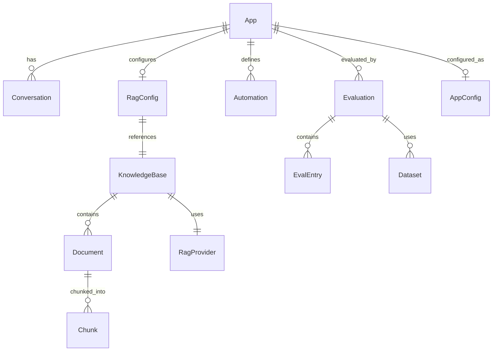

# PRD 06 — 数据模型与 API 设计 / Data Model & API Design

---

## 中文版

### 1. 数据模型总览



### 2. 核心实体

#### 2.1 应用 (App)

```typescript
interface App {
  id: string;                      // UUID v4
  name: string;                    // 2-30 字符
  description: string;             // 可选描述
  icon: string;                    // emoji 或图标标识，默认 "🤖"
  tags: string[];                  // 自由标签
  status: 'draft' | 'published' | 'archived';
  
  // Agent 配置
  agentId: string;                 // Agent 注册表 ID
  agentOverride: {
    systemPrompt?: string;         // 覆盖 system prompt
    temperature?: number;          // 0-2
    maxTokens?: number;            // 最大 token 数
    model?: string;                // 覆盖模型
  };
  
  // 知识库绑定
  ragBinding: {
    knowledgeBaseId: string;       // 关联知识库 ID
    topK: number;                  // 检索 TopK，默认 5
    similarityThreshold: number;   // 相似度阈值，默认 0.7
    hybridSearchEnabled: boolean;  // 混合检索开关，默认 false
    vectorWeight: number;          // 混合检索向量权重，默认 0.7
  } | null;
  
  // 工具
  enabledTools: string[];          // 启用的工具 ID 列表
  
  // 自动化
  automations: Automation[];
  
  // 时间戳
  createdAt: string;               // ISO 8601
  updatedAt: string;
  publishedAt: string | null;
  
  // 版本与审计
  version: number;                 // 乐观锁版本号
}

interface Automation {
  id: string;
  type: 'cron' | 'webhook' | 'manual';
  name: string;
  description?: string;
  enabled: boolean;
  
  // 按类型区分配置
  cronExpression?: string;         // 仅 type=cron
  timezone?: string;               // 时区，默认 "Asia/Shanghai"
  webhookUrl?: string;             // 仅 type=webhook
  webhookSecret?: string;          // webhook 签名密钥
  templateMessage?: string;        // 触发消息模板
  
  createdAt: string;
  updatedAt: string;
  lastTriggeredAt?: string;
}
```

#### 2.2 知识库 (KnowledgeBase)

```typescript
interface KnowledgeBase {
  id: string;                      // UUID v4
  name: string;                    // 知识库名称
  description?: string;
  
  // Provider
  providerId: string;              // RagProvider 注册 ID
  providerConfig: RagProviderConfig;
  
  // 处理配置
  defaultChunkStrategy: 'fixed' | 'semantic' | 'recursive';
  defaultChunkSize: number;        // 默认 512
  defaultOverlap: number;          // 默认 128
  embeddingModel: string;          // 如 "text-embedding-3-small"
  embeddingDimension: number;      // 如 1536
  
  // 统计
  documentCount: number;
  chunkCount: number;
  totalSizeBytes: number;
  
  // 状态
  status: 'active' | 'indexing' | 'error';
  health: HealthStatus;
  
  createdAt: string;
  updatedAt: string;
}

interface RagProviderConfig {
  provider: string;                // "sqlite-vec" | "milvus" | "chroma" | "bm25" | "llm-compiler"
  
  // SQLiteVec
  dbPath?: string;
  
  // Milvus
  milvusHost?: string;
  milvusPort?: number;
  collectionName?: string;
  
  // ChromaDB
  chromaUrl?: string;
  chromaCollectionName?: string;
  
  // BM25
  bm25DbPath?: string;
  
  // LLM Compiler
  llmCompilerModel?: string;
}
```

#### 2.3 文档 (Document)

```typescript
interface KbDocument {
  id: string;                      // UUID v4
  knowledgeBaseId: string;         // 所属知识库
  originalName: string;            // 原始文件名
  storedPath: string;              // 存储路径
  mimeType: string;                // 如 "application/pdf"
  sizeBytes: number;
  
  // 处理状态
  status: 'pending' | 'parsing' | 'chunking' | 'embedding' | 'indexed' | 'failed';
  errorMessage?: string;           // 失败原因
  
  // 统计
  chunkCount: number;              // 分块数
  parsedLength: number;            // 解析后文本长度
  
  // 时间戳
  createdAt: string;
  updatedAt: string;
  indexedAt?: string;
}

interface Chunk {
  id: string;
  documentId: string;
  index: number;                   // 块序号
  content: string;                 // 文本内容
  startOffset: number;             // 原文偏移量
  endOffset: number;
  tokenCount: number;              // token 估算数
  metadata: Record<string, unknown>;
}
```

#### 2.4 对话 (Conversation)

```typescript
interface Conversation {
  id: string;                      // UUID v4
  appId: string;                   // 所属应用
  title: string;                   // 对话标题（从首条消息自动生成）
  
  messages: ConversationMessage[];
  
  // 执行上下文
  context: {
    taskId?: string;               // 关联的任务 ID
    agentState?: string;           // Agent 状态快照
    tokensUsed: number;            // 总 token 消耗
  };
  
  createdAt: string;
  updatedAt: string;
}

interface ConversationMessage {
  id: string;
  role: 'user' | 'assistant' | 'system' | 'tool';
  content: string;
  toolCalls?: ToolCall[];
  toolResults?: ToolResult[];
  timestamp: string;
}
```

#### 2.5 评估 (Evaluation)

```typescript
interface Evaluation {
  id: string;                      // UUID v4
  appId: string;                   // 被评估的应用
  type: 'rag' | 'agent';          // 评估类型
  
  // 配置
  datasetId: string;               // 使用的数据集
  dimensions: string[];            // 评估维度列表
  config: Record<string, unknown>; // 额外评估配置
  
  // 状态
  status: 'pending' | 'running' | 'completed' | 'failed' | 'cancelled';
  
  // 结果
  scores: {
    overall: number;               // 综合得分 (0-100)
    dimensions: Record<string, number>; // 各维度得分
  } | null;
  
  entries: EvalEntry[];            // 逐条评估结果
  
  // 统计
  totalEntries: number;
  completedEntries: number;
  failedEntries: number;
  durationMs: number | null;
  
  createdAt: string;
  completedAt: string | null;
}

interface EvalEntry {
  id: string;
  index: number;
  question: string;
  expectedAnswer?: string;
  actualAnswer?: string;
  
  // 各维度得分
  scores: Record<string, number>;
  
  status: 'pending' | 'running' | 'completed' | 'failed';
  errorMessage?: string;
}

interface Dataset {
  id: string;
  name: string;
  type: 'rag' | 'agent';
  description?: string;
  entryCount: number;
  entries: DatasetEntry[];
  version: number;
  createdAt: string;
  updatedAt: string;
}

interface DatasetEntry {
  id: string;
  question: string;
  groundTruth?: string;
  referenceContexts?: string[];
  expectedToolCalls?: Array<{ toolName: string; params?: Record<string, unknown> }>;
  maxExpectedSteps?: number;
}
```

### 3. 存储目录结构

```
~/.manta-data/
├── apps/                              # 应用数据根目录 (新增)
│   └── {app-id}/
│       ├── app.json                   # 应用配置 (App 接口 JSON)
│       ├── conversations/             # 对话数据
│       │   └── {conv-id}.json
│       ├── knowledge/                 # 知识库本地数据
│       │   ├── kb.json                # 知识库配置
│       │   ├── documents/             # 原始文档
│       │   │   └── {doc-id}.{ext}
│       │   ├── chunks/                # 分块缓存
│       │   │   └── {doc-id}.json
│       │   └── index/                 # 向量索引 (SQLiteVec)
│       │       └── vectors.db
│       ├── evaluations/               # 评估结果
│       │   └── {eval-id}.json
│       ├── datasets/                  # 评估数据集
│       │   └── {ds-id}.json
│       └── logs/                      # 应用级日志
│           └── {date}.log
├── rag/                               # 共享 RAG 配置 (新增)
│   ├── providers.json                 # Provider 注册配置
│   └── shared-kbs/                    # 跨应用共享知识库
│       └── {kb-id}/                   # 结构同 app-level knowledge/
├── tasks/                             # 现有任务数据 (不变)
├── conversations/                     # 现有全局对话数据 (不变)
└── config/                            # 现有全局配置 (不变)
```

### 4. 完整 API 清单

#### 4.1 应用 API `/api/apps`

| 方法 | 路径 | 描述 | 查询参数 |
|------|------|------|---------|
| `GET` | `/api/apps` | 获取应用列表 | `search`, `status`, `sort`, `page`, `limit` |
| `POST` | `/api/apps` | 创建新应用 | - |
| `GET` | `/api/apps/:id` | 获取应用详情 | - |
| `PUT` | `/api/apps/:id` | 更新应用配置 | - |
| `DELETE` | `/api/apps/:id` | 删除应用 | - |
| `POST` | `/api/apps/:id/clone` | 复制应用 | `name` (可选新名称) |
| `PATCH` | `/api/apps/:id/status` | 更改应用状态 | `status` (draft/published/archived) |

#### 4.2 知识库 API `/api/rag`

| 方法 | 路径 | 描述 |
|------|------|------|
| `GET` | `/api/rag/knowledge-bases` | 获取知识库列表 |
| `POST` | `/api/rag/knowledge-bases` | 创建知识库 |
| `GET` | `/api/rag/knowledge-bases/:id` | 获取知识库详情 |
| `PUT` | `/api/rag/knowledge-bases/:id` | 更新知识库配置 |
| `DELETE` | `/api/rag/knowledge-bases/:id` | 删除知识库 |
| `GET` | `/api/rag/knowledge-bases/:id/documents` | 获取文档列表 |
| `POST` | `/api/rag/knowledge-bases/:id/documents` | 上传文档 (multipart) |
| `DELETE` | `/api/rag/knowledge-bases/:id/documents/:docId` | 删除文档 |
| `POST` | `/api/rag/knowledge-bases/:id/documents/:docId/process` | 处理文档 (解析→分块→向量化) |
| `GET` | `/api/rag/knowledge-bases/:id/documents/:docId/chunks` | 获取文档分块预览 |
| `POST` | `/api/rag/knowledge-bases/:id/search` | 检索测试 |
| `GET` | `/api/rag/providers` | 获取可用 Provider 列表 |
| `GET` | `/api/rag/providers/:id/health` | Provider 健康检查 |

#### 4.3 评估 API `/api/eval`

| 方法 | 路径 | 描述 |
|------|------|------|
| `GET` | `/api/eval` | 获取评估列表 |
| `POST` | `/api/eval/start` | 启动新评估 |
| `GET` | `/api/eval/:id` | 获取评估详情/报告 |
| `GET` | `/api/eval/:id/stream` | SSE 评估进度流 |
| `POST` | `/api/eval/:id/cancel` | 取消评估 |
| `DELETE` | `/api/eval/:id` | 删除评估记录 |
| `GET` | `/api/eval/datasets` | 获取数据集列表 |
| `POST` | `/api/eval/datasets` | 创建数据集 |
| `GET` | `/api/eval/datasets/:id` | 获取数据集详情 |
| `PUT` | `/api/eval/datasets/:id` | 更新数据集 |
| `DELETE` | `/api/eval/datasets/:id` | 删除数据集 |
| `POST` | `/api/eval/datasets/import` | 导入数据集 (JSON/CSV) |
| `GET` | `/api/eval/datasets/:id/export` | 导出数据集 |

#### 4.4 应用对话 API `/api/apps/:appId/conversations`

| 方法 | 路径 | 描述 |
|------|------|------|
| `GET` | `/api/apps/:appId/conversations` | 获取应用对话列表 |
| `POST` | `/api/apps/:appId/conversations` | 创建新对话 |
| `GET` | `/api/apps/:appId/conversations/:convId` | 获取对话详情 |
| `DELETE` | `/api/apps/:appId/conversations/:convId` | 删除对话 |
| `POST` | `/api/apps/:appId/conversations/:convId/stream` | 流式发送消息 |

### 5. 通用响应格式

```typescript
// 成功响应
interface ApiResponse<T> {
  success: true;
  data: T;
  meta?: {
    total?: number;
    page?: number;
    limit?: number;
  };
}

// 错误响应
interface ApiError {
  success: false;
  error: {
    code: string;          // 错误码
    message: string;       // 用户可读消息
    details?: unknown;     // 详细信息
  };
}
```

**错误码规范**：

| 错误码 | HTTP 状态 | 说明 |
|--------|----------|------|
| `APP_NOT_FOUND` | 404 | 应用不存在 |
| `KB_NOT_FOUND` | 404 | 知识库不存在 |
| `DOC_NOT_FOUND` | 404 | 文档不存在 |
| `EVAL_NOT_FOUND` | 404 | 评估记录不存在 |
| `INVALID_CONFIG` | 400 | 配置参数无效 |
| `UNSUPPORTED_FORMAT` | 400 | 不支持的文件格式 |
| `PROVIDER_UNAVAILABLE` | 503 | RAG Provider 不可用 |
| `EMBEDDING_FAILED` | 500 | 向量化失败 |
| `STORAGE_FULL` | 507 | 存储空间不足 |
| `CONCURRENT_CONFLICT` | 409 | 并发编辑冲突 |
| `EVAL_ALREADY_RUNNING` | 409 | 已有评估任务在运行 |

---

## English Version

### 1. Data Model Overview

Core entities: App, KnowledgeBase, Document, Chunk, Conversation, Evaluation, Dataset. Apps have conversations, bind to knowledge bases, define automations, and are evaluated through evaluation pipelines.

### 2. Core Entities

See TypeScript interfaces above for detailed field definitions covering:
- **App**: id, name, status, agent override config, rag binding, enabled tools, automations
- **KnowledgeBase**: provider config, chunking defaults, embedding settings, statistics
- **KbDocument**: upload metadata, processing status, chunk stats
- **Chunk**: content, offsets, token counts
- **Conversation**: messages, execution context, token usage
- **Evaluation**: type, dataset, dimensions, scores, per-entry results
- **Dataset**: entries with questions, ground truths, expected tool calls

### 3. Storage Directory Structure

Per-app isolation under `~/.manta-data/apps/{app-id}/` with subdirectories for conversations, knowledge (documents + chunks + index), evaluations, datasets, and logs.

### 4. Full API Reference

- **Apps**: CRUD + clone + status management (7 endpoints)
- **RAG/Knowledge**: KB CRUD + document upload/process + chunk preview + search test + provider health (13 endpoints)
- **Evaluation**: Eval CRUD + SSE progress stream + dataset CRUD + import/export (12 endpoints)
- **App Conversations**: Per-app conversation CRUD + streaming chat (5 endpoints)

### 5. Response Format & Error Codes

Standard `ApiResponse<T>` / `ApiError` envelope with 11 error codes covering 404, 400, 409, 500, 503, 507 scenarios.

---

## 变更记录 / Changelog

| 日期 | 版本 | 变更说明 |
|------|------|---------|
| 2026-06-12 | v1.0 | 初始版本 |

---

> 上一篇：[PRD 05 — 评估流水线](./05-evaluation.md)
> 下一篇：[PRD 07 — UI 规范与实施路线图](./07-ui-spec-and-roadmap.md)
