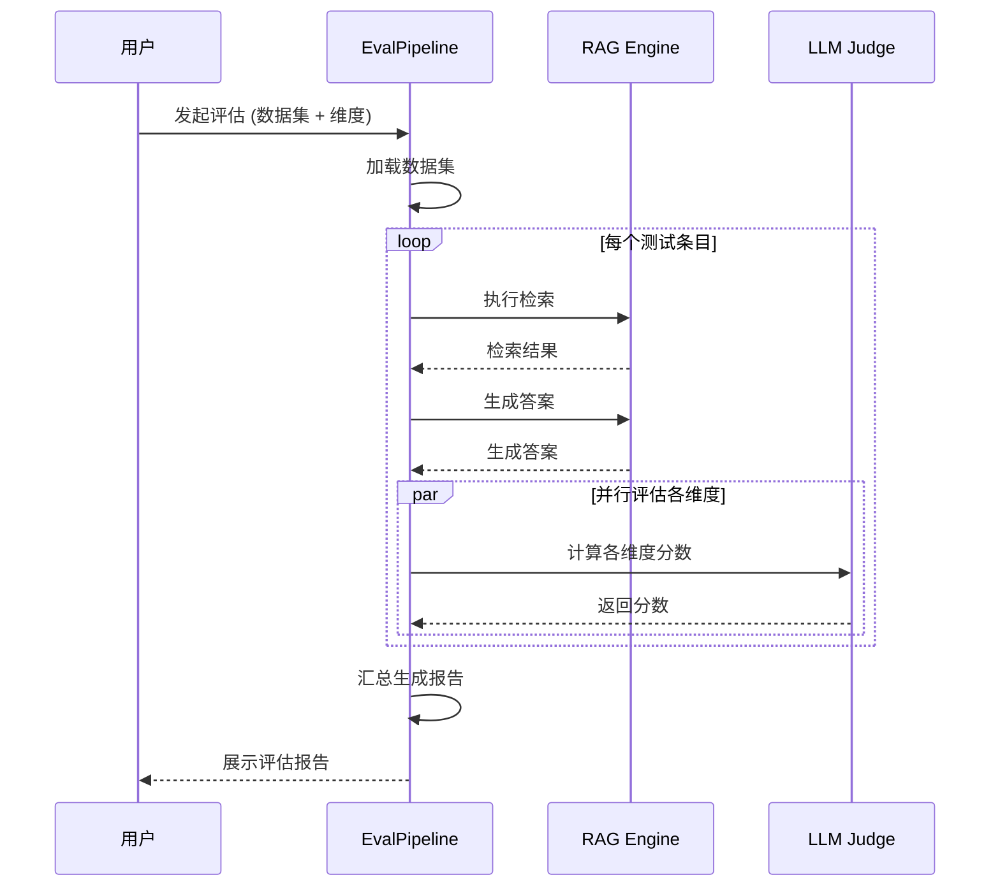

# PRD 06 — 评估系统 / Evaluation System

---

## 中文版

### 1. 功能概述

评估系统提供**生产级的自动化测评能力**，让用户能够量化衡量智能体应用的质量。评估分为两大类：

- **RAG 评估**：基于 RAGAs 框架，7 大核心维度
- **Agent 评估**：6 大维度衡量 Agent 行为质量

### 2. RAGAs 评估体系

#### 2.1 核心评估维度

| 维度 | 英文名 | 定义 | 理想值 |
|------|--------|------|--------|
| **忠实度** | Faithfulness | 生成答案是否完全基于检索到的上下文 | > 0.90 |
| **答案相关性** | Answer Relevancy | 答案是否紧扣问题 | > 0.85 |
| **上下文精度** | Context Precision | 检索结果中相关文档的排名 | > 0.80 |
| **上下文召回率** | Context Recall | 相关文档是否被检索到 | > 0.85 |
| **答案准确性** | Answer Correctness | 答案的事实准确性 | > 0.85 |
| **上下文实体召回率** | Context Entity Recall | 关键实体是否在结果中 | > 0.80 |
| **噪声敏感度** | Noise Robustness | 引入噪声后答案质量下降 | < 0.15 |

#### 2.2 评估数据集结构

```typescript
interface RagEvalDataset {
  id: string
  name: string
  description: string
  entries: RagEvalEntry[]
  createdAt: string
}

interface RagEvalEntry {
  id: string
  question: string
  groundTruth: string
  referenceContexts?: string[]
  noiseDocuments?: string[]
  metadata?: Record<string, unknown>
}
```

### 3. Agent 评估体系

#### 3.1 六大评估维度

| 维度 | 英文名 | 定义 | 理想值 |
|------|--------|------|--------|
| **任务完成率** | Task Completion Rate | Agent 是否完成任务 | > 85% |
| **工具使用准确率** | Tool Call Accuracy | 工具调用正确性 | > 90% |
| **推理步骤数** | Reasoning Steps | 完成任务所需步骤 | < 期望步数 |
| **重复行为检测** | Loop Detection | 是否陷入重复循环 | 0 次 |
| **终止条件判断** | Termination Judgment | 是否正确判断完成 | > 90% |
| **用户满意度** | User Satisfaction | 用户评价 | > 4.0/5.0 |

#### 3.2 Agent 评估数据结构

```typescript
interface AgentEvalDataset {
  id: string
  name: string
  description: string
  entries: AgentEvalEntry[]
}

interface AgentEvalEntry {
  id: string
  task: string
  expectedResult: string
  expectedToolCalls?: ExpectedToolCall[]
  maxExpectedSteps?: number
  context: Record<string, unknown>
}
```

### 4. 评估流水线

#### 4.1 执行流程



### 5. 评估中心页面

#### 5.1 评估列表页 `/evaluation`

```
┌──────────────────────────────────────────────────────────┐
│  评估中心                                     [+ 新建评估]  │
├──────────────────────────────────────────────────────────┤
│  ┌── 筛选应用 ▼ ──┐  ┌── 评估类型 ▼ ──┐  ┌── 状态 ▼ ──┐ │
│  └────────────────┘  └───────────────┘  └─────────────┘ │
│                                                          │
│  ┌────────────────────────────────────────────────────┐  │
│  │ 📊 RAG 评估 #001                    ✅ 已完成       │  │
│  │ 应用: 简历筛选 Agent                                │  │
│  │ 综合得分: 86.5/100                                  │  │
│  │ [查看报告] [重新评估] [删除]                         │  │
│  └────────────────────────────────────────────────────┘  │
└──────────────────────────────────────────────────────────┘
```

#### 5.2 评估报告页 `/evaluation/[id]`

```
┌──────────────────────────────────────────────────────────┐
│  ← 返回    评估报告 #001                                    │
├──────────────────────────────────────────────────────────┤
│  ┌─ 综合得分 ──────────────────────────────────────────┐  │
│  │         ┌──────────────┐                             │  │
│  │         │    86.5      │   综合评分                   │  │
│  │         │   / 100      │                             │  │
│  │         └──────────────┘                             │  │
│  │                                                      │  │
│  │  忠实度: 92%  ████████████░░░░░░                     │  │
│  │  相关性: 88%  ███████████░░░░░░░                     │  │
│  │  精度:   78%  █████████░░░░░░░░░                     │  │
│  │  召回率: 85%  ███████████░░░░░░░                     │  │
│  └─────────────────────────────────────────────────────┘  │
└──────────────────────────────────────────────────────────┘
```

### 6. API 设计

| 方法 | 路径 | 描述 |
|------|------|------|
| `GET` | `/api/eval` | 获取评估列表 |
| `POST` | `/api/eval/start` | 启动新评估 |
| `GET` | `/api/eval/:id` | 获取评估详情/报告 |
| `GET` | `/api/eval/:id/stream` | SSE 评估进度 |
| `POST` | `/api/eval/:id/cancel` | 取消评估 |
| `DELETE` | `/api/eval/:id` | 删除评估记录 |
| `GET` | `/api/eval/datasets` | 获取数据集列表 |
| `POST` | `/api/eval/datasets` | 创建数据集 |
| `GET` | `/api/eval/datasets/:id` | 获取数据集详情 |
| `PUT` | `/api/eval/datasets/:id` | 更新数据集 |
| `DELETE` | `/api/eval/datasets/:id` | 删除数据集 |
| `POST` | `/api/eval/datasets/import` | 导入数据集 |

### 7. 异常处理

| 场景 | 处理 |
|------|------|
| LLM Judge 调用失败 | 单条失败不终止整体评估 |
| 数据集为空 | 阻止启动评估 |
| 评估耗时过长 (>1h) | 允许取消，保留已完成结果 |
| Ground truth 缺失 | 跳过需要 ground truth 的维度 |
| 并发评估 | 限制同时最多 1 个评估任务 |

---

## English Version

### 1. Feature Overview

The Evaluation System provides production-grade automated evaluation with RAGAs 7-dimension RAG evaluation and 6-dimension Agent evaluation.

### 2. RAGAs Evaluation

7 core dimensions: Faithfulness, Answer Relevancy, Context Precision, Context Recall, Answer Correctness, Context Entity Recall, Noise Robustness.

### 3. Agent Evaluation

6 dimensions: Task Completion Rate, Tool Call Accuracy, Reasoning Steps, Loop Detection, Termination Judgment, User Satisfaction.

### 4. API Design

12 endpoints for evaluation CRUD, SSE progress, dataset management, and import/export.

---

## 变更记录 / Changelog

| 日期 | 版本 | 变更说明 |
|------|------|---------|
| 2026-06-14 | v2.0 | 重命名：从"评估流水线"改为"评估系统"，简化描述 |
| 2026-06-12 | v1.0 | 初始版本 |

---

> 上一篇：[PRD 05 — 智能体应用](./05-agent-app.md)
> 下一篇：[PRD 07 — 记忆系统](./07-memory-system.md)
