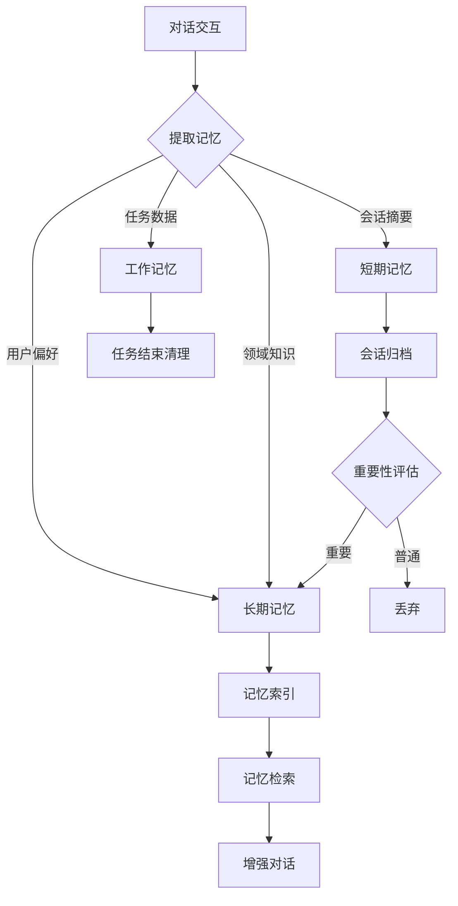

# PRD 07 — 记忆系统 / Memory System

---

## 中文版

### 1. 功能概述

**记忆系统**为智能体应用提供跨对话的知识记忆能力，让 Agent 能够"记住"用户偏好、历史交互和领域知识。

核心理念：记忆是智能体应用的"大脑"，让它越用越聪明。

### 2. 记忆类型

```
┌─────────────────────────────────────────────────────────────┐
│                    记忆系统 (Memory System)                    │
│                                                              │
│   ┌──────────────┐  ┌──────────────┐  ┌──────────────┐      │
│   │  短期记忆     │  │  长期记忆     │  │  工作记忆     │      │
│   │ Short-term   │  │  Long-term   │  │  Working     │      │
│   └──────┬───────┘  └──────┬───────┘  └──────┬───────┘      │
│          │                 │                 │               │
│   ┌──────┴───────┐  ┌──────┴───────┐  ┌──────┴───────┐      │
│   │ 当前会话摘要  │  │ 用户偏好     │  │ 当前任务上下文│      │
│   │ 最近交互历史  │  │ 领域知识     │  │ 临时计算结果  │      │
│   │ 情感状态     │  │ 行为模式     │  │ 检索结果缓存  │      │
│   └──────────────┘  └──────────────┘  └──────────────┘      │
└─────────────────────────────────────────────────────────────┘
```

| 记忆类型 | 生命周期 | 存储位置 | 说明 |
|---------|---------|---------|------|
| **短期记忆** | 会话级 | 内存 | 当前会话的上下文摘要，会话结束后归档 |
| **长期记忆** | 持久化 | 文件系统 | 跨对话的知识片段、用户偏好 |
| **工作记忆** | 任务级 | 内存 | 当前任务的临时数据，任务结束后清理 |

### 3. 记忆数据结构

```typescript
// 记忆条目
interface MemoryEntry {
  id: string
  appId: string                   // 所属应用
  type: 'short-term' | 'long-term' | 'working'
  category: string                // 分类：preference, knowledge, behavior, context
  content: string                 // 记忆内容
  embedding?: number[]            // 向量化（用于检索）
  metadata: {
    source: string                // 来源：conversation, manual, auto
    conversationId?: string       // 来源会话 ID
    importance: number            // 重要性 (0-1)
    accessCount: number           // 访问次数
    lastAccessedAt?: string       // 最后访问时间
  }
  createdAt: string
  updatedAt: string
  expiresAt?: string              // 过期时间（短期记忆）
}

// 记忆检索结果
interface MemorySearchResult {
  entry: MemoryEntry
  score: number                   // 相关性分数
  context: string                 // 匹配的上下文片段
}
```

### 4. 记忆生命周期



### 5. 记忆提取

#### 5.1 自动提取

在对话过程中，系统自动识别和提取记忆：

| 提取类型 | 触发条件 | 示例 |
|---------|---------|------|
| **用户偏好** | 用户表达喜好/厌恶 | "我喜欢简洁的回答" |
| **领域知识** | 用户分享专业知识 | "React 19 的新特性是..." |
| **行为模式** | 重复行为检测 | "用户总是在周一生成周报" |
| **重要事实** | 关键信息识别 | "我的项目截止日期是 6 月 30 日" |

#### 5.2 手动提取

用户可以手动创建记忆：

```
┌──────────────────────────────────────────────────────────┐
│  添加记忆                                                  │
├──────────────────────────────────────────────────────────┤
│  分类: [用户偏好 ▼]                                        │
│                                                          │
│  内容:                                                     │
│  ┌─────────────────────────────────────────────────────┐ │
│  │ 用户偏好简洁的回答，不需要过多解释                     │ │
│  └─────────────────────────────────────────────────────┘ │
│                                                          │
│  重要性: [高 ▼]                                           │
│                                                          │
│  [取消]  [保存]                                           │
└──────────────────────────────────────────────────────────┘
```

### 6. 记忆检索

#### 6.1 检索策略

```typescript
interface MemorySearchOptions {
  query: string                   // 检索查询
  type?: 'short-term' | 'long-term' | 'working'
  category?: string               // 分类过滤
  topK?: number                   // 返回数量
  minImportance?: number          // 最小重要性
  timeRange?: {
    start?: string
    end?: string
  }
}

// 检索接口
interface IMemoryStore {
  // 存储记忆
  save(entry: Omit<MemoryEntry, 'id' | 'createdAt' | 'updatedAt'>): Promise<MemoryEntry>
  
  // 检索记忆
  search(options: MemorySearchOptions): Promise<MemorySearchResult[]>
  
  // 获取记忆
  get(id: string): Promise<MemoryEntry | null>
  
  // 更新记忆
  update(id: string, patch: Partial<MemoryEntry>): Promise<MemoryEntry>
  
  // 删除记忆
  delete(id: string): Promise<void>
  
  // 清理过期记忆
  cleanup(): Promise<number>
}
```

#### 6.2 检索流程

```
用户输入 → 提取关键词 → 向量检索 + 关键词匹配 → 排序 → 返回相关记忆
    │          │              │                    │         │
    │          │              │                    │         └── 注入到 LLM 上下文
    │          │              │                    └── 按相关性+重要性+时效性排序
    │          │              └── 混合检索（向量 + BM25）
    │          └── 实体识别、关键词提取
    └── 当前对话内容
```

### 7. 记忆管理界面

#### 7.1 记忆列表 `/apps/[id]/memory`

```
┌──────────────────────────────────────────────────────────┐
│  记忆管理 — 简历筛选 Agent                  [+ 添加记忆]    │
├──────────────────────────────────────────────────────────┤
│  ┌── 搜索记忆... ──────────────────┐  ┌ 分类筛选 ▼ ─┐    │
│  └─────────────────────────────────┘  └─────────────┘    │
│                                                          │
│  ┌─ 用户偏好 ──────────────────────────────────────────┐ │
│  │ 💡 偏好简洁回答                        重要性: 高    │ │
│  │    "用户喜欢简洁的回答，不需要过多解释"               │ │
│  │    来源: 自动提取 · 2026-06-10                      │ │
│  │    [编辑] [删除]                                    │ │
│  ├────────────────────────────────────────────────────┤ │
│  │ 💡 周一生成周报                        重要性: 中    │ │
│  │    "用户习惯在周一上午生成周报"                       │ │
│  │    来源: 行为检测 · 2026-06-08                      │ │
│  │    [编辑] [删除]                                    │ │
│  └────────────────────────────────────────────────────┘ │
│                                                          │
│  ┌─ 领域知识 ──────────────────────────────────────────┐ │
│  │ 📚 React 19 新特性                      重要性: 中    │ │
│  │    "React 19 引入了 Server Components..."            │ │
│  │    来源: 对话提取 · 2026-06-12                      │ │
│  │    [编辑] [删除]                                    │ │
│  └────────────────────────────────────────────────────┘ │
└──────────────────────────────────────────────────────────┘
```

### 8. 与对话的集成

在对话过程中，记忆系统自动工作：

```typescript
// 对话流程中的记忆使用
async function chatWithMemory(appId: string, message: string) {
  // 1. 检索相关记忆
  const memories = await memoryStore.search({
    query: message,
    topK: 5,
    minImportance: 0.3
  })
  
  // 2. 注入到上下文
  const context = buildContext(message, memories)
  
  // 3. 调用 LLM
  const response = await llm.chat(context)
  
  // 4. 提取新记忆
  const newMemories = await extractMemories(message, response)
  for (const memory of newMemories) {
    await memoryStore.save(memory)
  }
  
  return response
}
```

### 9. API 设计

| 方法 | 路径 | 描述 |
|------|------|------|
| `GET` | `/api/apps/:appId/memory` | 获取记忆列表 |
| `POST` | `/api/apps/:appId/memory` | 创建记忆 |
| `GET` | `/api/apps/:appId/memory/:id` | 获取记忆详情 |
| `PUT` | `/api/apps/:appId/memory/:id` | 更新记忆 |
| `DELETE` | `/api/apps/:appId/memory/:id` | 删除记忆 |
| `POST` | `/api/apps/:appId/memory/search` | 检索记忆 |
| `POST` | `/api/apps/:appId/memory/cleanup` | 清理过期记忆 |

### 10. 异常处理

| 场景 | 处理方式 |
|------|---------|
| 记忆过多 | 自动清理低重要性、长期未访问的记忆 |
| 记忆冲突 | 新记忆覆盖旧记忆（同分类） |
| 检索超时 | 降级为无记忆模式 |
| 存储空间不足 | 提示用户清理或导出记忆 |

---

## English Version

### 1. Feature Overview

**Memory System** provides cross-conversation knowledge memory for agent apps, enabling agents to "remember" user preferences, historical interactions, and domain knowledge.

### 2. Memory Types

| Type | Lifecycle | Storage | Description |
|------|-----------|---------|-------------|
| Short-term | Session | Memory | Current session context summary |
| Long-term | Persistent | File system | Cross-conversation knowledge |
| Working | Task | Memory | Temporary task data |

### 3. Memory Data Structure

MemoryEntry with id, appId, type, category, content, embedding, metadata (source, importance, accessCount), and timestamps.

### 4. Memory Lifecycle

Automatic extraction from conversations → Storage → Indexing → Retrieval → Context injection → Enhanced dialogue.

### 5. Memory Management

7 endpoints for memory CRUD, search, and cleanup.

---

## 变更记录 / Changelog

| 日期 | 版本 | 变更说明 |
|------|------|---------|
| 2026-06-14 | v1.0 | 初始版本，定义记忆系统核心功能 |

---

> 上一篇：[PRD 06 — 评估系统](./06-evaluation.md)
> 下一篇：[PRD 08 — 数据模型](./08-data-model.md)
