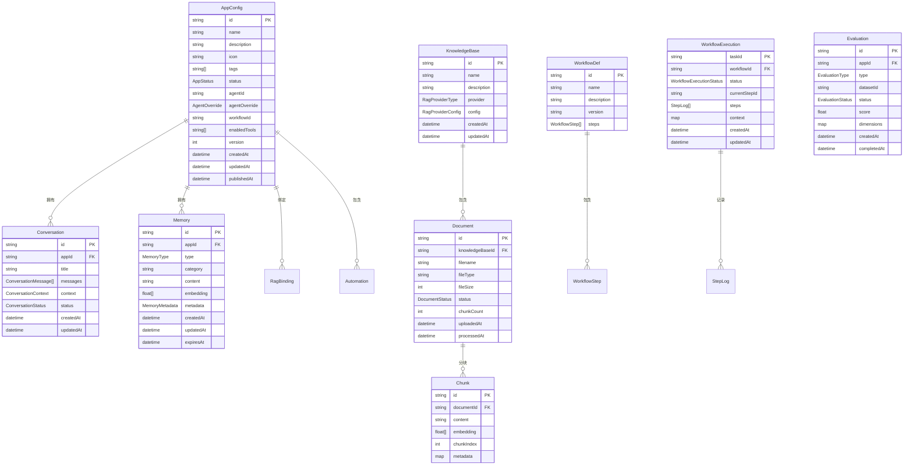

# PRD 08 — 数据模型 / Data Model

---

## 中文版

### 1. 功能概述

数据模型定义 Manta 平台的核心数据结构、存储方案和 API 规范。本文档是技术实现的**基础规范**，确保各模块数据一致性。

### 2. 核心实体关系



### 3. 数据结构详细定义

#### 3.1 应用配置 (AppConfig)

基于 `src/core/types.ts` 中已定义的类型：

```typescript
// 应用状态
type AppStatus = 'draft' | 'published' | 'archived'

// Agent 参数覆盖
interface AgentOverride {
  systemPrompt?: string
  temperature?: number
  maxTokens?: number
  model?: string
}

// RAG 知识库绑定
interface RagBinding {
  knowledgeBaseId: string
  topK: number
  similarityThreshold: number
  hybridSearchEnabled: boolean
  vectorWeight: number
}

// 自动化任务
interface Automation {
  id: string
  type: 'cron' | 'webhook' | 'manual'
  name: string
  description?: string
  enabled: boolean
  cronExpression?: string
  timezone?: string
  webhookUrl?: string
  webhookSecret?: string
  templateMessage?: string
  createdAt: string
  updatedAt: string
  lastTriggeredAt?: string
}

// 应用配置
interface AppConfig {
  id: string
  name: string
  description: string
  icon: string
  tags: string[]
  status: AppStatus

  // Agent 绑定
  agentId: string
  agentOverride: AgentOverride

  // 知识库绑定
  ragBinding: RagBinding | null

  // 工作流绑定
  workflowId?: string

  // 启用的工具
  enabledTools: string[]

  // 自动化
  automations: Automation[]

  // 时间戳
  createdAt: string
  updatedAt: string
  publishedAt: string | null

  // 版本号（乐观锁）
  version: number
}
```

#### 3.2 知识库相关

```typescript
// RAG Provider 类型
type RagProviderType = 'sqlite-vec' | 'chroma' | 'bm25' | 'milvus'

// RAG Provider 配置
interface RagProviderConfig {
  // SQLite-vec 配置
  sqlitePath?: string
  
  // ChromaDB 配置
  chromaUrl?: string
  chromaCollection?: string
  
  // Milvus 配置
  milvusUrl?: string
  milvusCollection?: string
  
  // 通用配置
  embeddingModel?: string
  embeddingDimensions?: number
}

// 知识库
interface KnowledgeBase {
  id: string
  name: string
  description: string
  provider: RagProviderType
  config: RagProviderConfig
  createdAt: string
  updatedAt: string
}

// 文档状态
type DocumentStatus = 'uploading' | 'processing' | 'indexed' | 'failed'

// 文档
interface Document {
  id: string
  knowledgeBaseId: string
  filename: string
  fileType: string
  fileSize: number
  status: DocumentStatus
  chunkCount: number
  uploadedAt: string
  processedAt?: string
  error?: string
}

// 分块
interface Chunk {
  id: string
  documentId: string
  content: string
  embedding?: number[]
  chunkIndex: number
  metadata: Record<string, unknown>
}
```

#### 3.3 工作流相关

基于 `src/core/types.ts` 中已定义的类型：

```typescript
// 工作流步骤类型
type WorkflowStepType =
  | 'agent'
  | 'human_in_loop'
  | 'parallel'
  | 'conditional'
  | 'loop'

// 工作流步骤
interface WorkflowStep {
  id: string
  type: WorkflowStepType
  name: string
  agentName?: string
  next?: string
  actions?: Record<string, string>
  notify?: boolean | { mac?: boolean; webhook?: boolean }
  branches?: WorkflowStep[]
}

// 工作流定义
interface WorkflowDef {
  id: string
  name: string
  description?: string
  version?: string
  steps: WorkflowStep[]
}

// 步骤状态
type StepStatus =
  | 'pending'
  | 'running'
  | 'waiting'
  | 'done'
  | 'failed'
  | 'skipped'

// 工作流执行状态
type WorkflowExecutionStatus =
  | 'running'
  | 'waiting'
  | 'done'
  | 'failed'

// 步骤日志
interface StepLog {
  stepId: string
  stepName: string
  status: StepStatus
  agentName?: string
  startedAt?: string
  completedAt?: string
  error?: string
  actions?: Record<string, string>
}

// 工作流执行实例
interface WorkflowExecution {
  taskId: string
  workflowId: string
  status: WorkflowExecutionStatus
  currentStepId?: string
  steps: StepLog[]
  context: Record<string, unknown>
  createdAt: string
  updatedAt: string
}
```

#### 3.4 对话相关

```typescript
// 对话状态
type ConversationStatus = 'active' | 'archived' | 'deleted'

// 对话消息
interface ConversationMessage {
  id: string
  role: 'user' | 'assistant' | 'system' | 'tool'
  content: string
  toolCalls?: ToolCall[]
  toolResults?: ToolResult[]
  timestamp: string
  metadata?: Record<string, unknown>
}

// 对话上下文
interface ConversationContext {
  workDir?: string
  envVars?: Record<string, string>
  files?: string[]
  tokensUsed: number
}

// 对话
interface Conversation {
  id: string
  appId: string
  title: string
  messages: ConversationMessage[]
  context: ConversationContext
  status: ConversationStatus
  createdAt: string
  updatedAt: string
}
```

#### 3.5 记忆相关

```typescript
// 记忆类型
type MemoryType = 'short-term' | 'long-term' | 'working'

// 记忆元数据
interface MemoryMetadata {
  source: 'conversation' | 'manual' | 'auto'
  conversationId?: string
  importance: number
  accessCount: number
  lastAccessedAt?: string
}

// 记忆条目
interface MemoryEntry {
  id: string
  appId: string
  type: MemoryType
  category: string
  content: string
  embedding?: number[]
  metadata: MemoryMetadata
  createdAt: string
  updatedAt: string
  expiresAt?: string
}
```

#### 3.6 评估相关

```typescript
// 评估类型
type EvaluationType = 'rag' | 'agent'

// 评估状态
type EvaluationStatus = 'pending' | 'running' | 'completed' | 'failed'

// 评估维度分数
interface DimensionScore {
  score: number
  details?: Record<string, unknown>
}

// 评估记录
interface Evaluation {
  id: string
  appId: string
  type: EvaluationType
  datasetId: string
  status: EvaluationStatus
  score: number
  dimensions: Record<string, DimensionScore>
  createdAt: string
  completedAt?: string
  error?: string
}
```

### 4. 存储目录结构

```
~/.manta-data/
├── apps/                          # 应用数据根目录
│   └── {app-id}/                  # 单个应用空间
│       ├── app.json               # 应用配置
│       ├── conversations/         # 对话数据
│       │   ├── {conv-id}.json
│       │   └── ...
│       ├── knowledge/             # 知识库数据
│       │   ├── kb.json            # 知识库配置
│       │   ├── documents/         # 原始文档
│       │   │   ├── {doc-id}.pdf
│       │   │   └── ...
│       │   ├── chunks/            # 分块数据
│       │   │   ├── {chunk-id}.json
│       │   │   └── ...
│       │   └── index/             # 向量索引
│       │       ├── sqlite-vec.db
│       │       └── ...
│       ├── workflows/             # 工作流数据
│       │   ├── {workflow-id}.json
│       │   └── executions/        # 执行历史
│       │       ├── {exec-id}.json
│       │       └── ...
│       ├── memory/                # 记忆数据
│       │   ├── short-term.json
│       │   ├── long-term.json
│       │   └── working.json
│       ├── evaluations/           # 评估结果
│       │   ├── {eval-id}.json
│       │   └── datasets/          # 评估数据集
│       │       ├── {dataset-id}.json
│       │       └── ...
│       ├── tools/                 # 工具配置
│       │   └── enabled.json
│       └── logs/                  # 应用级日志
│           ├── {date}.log
│           └── ...
├── rag/                           # 共享 RAG 配置
│   ├── providers.json             # Provider 配置
│   └── models.json                # Embedding 模型配置
├── agents/                        # Agent 注册表
│   ├── registry.json
│   └── definitions/               # Agent 定义文件
│       ├── {agent-name}/
│       │   ├── SOUL.md
│       │   └── config.json
│       └── ...
├── workflows/                     # 全局工作流定义
│   ├── {workflow-id}.json
│   └── ...
└── config/                        # 全局配置
    ├── settings.json
    └── themes/
```

### 5. API 设计规范

#### 5.1 RESTful API 规范

所有 API 遵循 RESTful 设计原则：

| 方法 | 路径模式 | 描述 | 示例 |
|------|---------|------|------|
| `GET` | `/api/{resource}` | 获取列表 | `GET /api/apps` |
| `POST` | `/api/{resource}` | 创建资源 | `POST /api/apps` |
| `GET` | `/api/{resource}/:id` | 获取详情 | `GET /api/apps/123` |
| `PUT` | `/api/{resource}/:id` | 更新资源 | `PUT /api/apps/123` |
| `DELETE` | `/api/{resource}/:id` | 删除资源 | `DELETE /api/apps/123` |

#### 5.2 响应格式

```typescript
// 成功响应
interface ApiResponse<T> {
  success: true
  data: T
  message?: string
}

// 错误响应
interface ApiError {
  success: false
  error: {
    code: string
    message: string
    details?: Record<string, unknown>
  }
}

// 分页响应
interface PaginatedResponse<T> {
  success: true
  data: T[]
  pagination: {
    page: number
    pageSize: number
    total: number
    totalPages: number
  }
}
```

#### 5.3 错误码规范

| 错误码 | HTTP 状态码 | 描述 |
|--------|------------|------|
| `VALIDATION_ERROR` | 400 | 请求参数验证失败 |
| `NOT_FOUND` | 404 | 资源不存在 |
| `CONFLICT` | 409 | 资源冲突（如版本冲突） |
| `UNPROCESSABLE_ENTITY` | 422 | 业务逻辑错误 |
| `INTERNAL_ERROR` | 500 | 服务器内部错误 |
| `SERVICE_UNAVAILABLE` | 503 | 服务不可用 |

#### 5.4 API 路由规划

**应用管理**
| 方法 | 路径 | 描述 |
|------|------|------|
| `GET` | `/api/apps` | 获取应用列表 |
| `POST` | `/api/apps` | 创建新应用 |
| `GET` | `/api/apps/:id` | 获取应用详情 |
| `PUT` | `/api/apps/:id` | 更新应用配置 |
| `DELETE` | `/api/apps/:id` | 删除应用 |
| `POST` | `/api/apps/:id/clone` | 复制应用 |
| `PATCH` | `/api/apps/:id/status` | 更改应用状态 |

**知识库管理**
| 方法 | 路径 | 描述 |
|------|------|------|
| `GET` | `/api/rag/knowledge-bases` | 获取知识库列表 |
| `POST` | `/api/rag/knowledge-bases` | 创建知识库 |
| `GET` | `/api/rag/knowledge-bases/:id` | 获取知识库详情 |
| `PUT` | `/api/rag/knowledge-bases/:id` | 更新知识库配置 |
| `DELETE` | `/api/rag/knowledge-bases/:id` | 删除知识库 |
| `GET` | `/api/rag/knowledge-bases/:id/documents` | 获取文档列表 |
| `POST` | `/api/rag/knowledge-bases/:id/documents` | 上传文档 |
| `DELETE` | `/api/rag/knowledge-bases/:id/documents/:docId` | 删除文档 |
| `POST` | `/api/rag/knowledge-bases/:id/documents/:docId/process` | 处理文档 |
| `POST` | `/api/rag/knowledge-bases/:id/search` | 检索测试 |
| `GET` | `/api/rag/providers` | 获取可用 Provider 列表 |

**工作流管理**
| 方法 | 路径 | 描述 |
|------|------|------|
| `GET` | `/api/workflow` | 获取工作流列表 |
| `POST` | `/api/workflow` | 创建工作流 |
| `GET` | `/api/workflow/:id` | 获取工作流详情 |
| `PUT` | `/api/workflow/:id` | 更新工作流 |
| `DELETE` | `/api/workflow/:id` | 删除工作流 |
| `POST` | `/api/workflow/:id/run` | 启动工作流执行 |
| `GET` | `/api/workflow/:id/executions` | 获取执行历史 |
| `GET` | `/api/workflow/executions/:execId` | 获取执行详情 |
| `POST` | `/api/workflow/executions/:execId/approve` | 审批 human_in_loop 步骤 |

**对话管理**
| 方法 | 路径 | 描述 |
|------|------|------|
| `GET` | `/api/apps/:appId/conversations` | 获取会话列表 |
| `POST` | `/api/apps/:appId/conversations` | 创建新会话 |
| `GET` | `/api/apps/:appId/conversations/:convId` | 获取会话详情 |
| `DELETE` | `/api/apps/:appId/conversations/:convId` | 删除会话 |
| `POST` | `/api/apps/:appId/conversations/:convId/messages` | 发送消息 |
| `GET` | `/api/apps/:appId/conversations/:convId/stream` | SSE 流式响应 |
| `GET` | `/api/apps/:appId/context` | 获取当前上下文 |
| `PUT` | `/api/apps/:appId/context` | 更新上下文 |

**记忆管理**
| 方法 | 路径 | 描述 |
|------|------|------|
| `GET` | `/api/apps/:appId/memory` | 获取记忆列表 |
| `POST` | `/api/apps/:appId/memory` | 创建记忆 |
| `GET` | `/api/apps/:appId/memory/:id` | 获取记忆详情 |
| `PUT` | `/api/apps/:appId/memory/:id` | 更新记忆 |
| `DELETE` | `/api/apps/:appId/memory/:id` | 删除记忆 |
| `POST` | `/api/apps/:appId/memory/search` | 检索记忆 |
| `POST` | `/api/apps/:appId/memory/cleanup` | 清理过期记忆 |

**评估管理**
| 方法 | 路径 | 描述 |
|------|------|------|
| `GET` | `/api/eval` | 获取评估列表 |
| `POST` | `/api/eval/start` | 启动新评估 |
| `GET` | `/api/eval/:id` | 获取评估详情/报告 |
| `GET` | `/api/eval/:id/stream` | SSE 评估进度 |
| `POST` | `/api/eval/:id/cancel` | 取消评估 |
| `DELETE` | `/api/eval/:id` | 删除评估记录 |
| `GET` | `/api/eval/datasets` | 获取数据集列表 |
| `POST` | `/api/eval/datasets` | 创建数据集 |
| `GET` | `/api/eval/datasets/:id` | 获取数据集详情 |
| `PUT` | `/api/eval/datasets/:id` | 更新数据集 |
| `DELETE` | `/api/eval/datasets/:id` | 删除数据集 |
| `POST` | `/api/eval/datasets/import` | 导入数据集 |

### 6. 数据迁移策略

#### 6.1 版本兼容性

- **向前兼容**：新版本代码能读取旧版本数据
- **向后兼容**：旧版本代码能读取新版本数据（有限）
- **版本字段**：所有数据文件包含 `version` 字段

#### 6.2 迁移流程

```typescript
interface Migration {
  version: string
  description: string
  up: (data: any) => Promise<any>
  down: (data: any) => Promise<any>
}

// 迁移管理器
class MigrationManager {
  async migrate(fromVersion: string, toVersion: string): Promise<void>
  async rollback(toVersion: string): Promise<void>
  async getCurrentVersion(): Promise<string>
}
```

### 7. 性能优化

#### 7.1 索引策略

| 实体 | 索引字段 | 用途 |
|------|---------|------|
| AppConfig | `status`, `updatedAt` | 应用列表查询 |
| Document | `knowledgeBaseId`, `status` | 文档状态查询 |
| Conversation | `appId`, `status` | 会话列表查询 |
| Memory | `appId`, `type`, `category` | 记忆检索 |
| WorkflowExecution | `workflowId`, `status` | 执行历史查询 |

#### 7.2 缓存策略

| 数据类型 | 缓存位置 | 过期时间 | 更新策略 |
|---------|---------|---------|---------|
| 应用配置 | 内存 | 5 分钟 | 写入时失效 |
| Agent 注册表 | 内存 | 10 分钟 | 定时刷新 |
| 知识库统计 | 内存 | 1 分钟 | 写入时失效 |
| 工作流定义 | 内存 | 5 分钟 | 写入时失效 |

### 8. 数据安全

#### 8.1 敏感数据处理

| 数据类型 | 处理方式 |
|---------|---------|
| API Key | 加密存储，仅在运行时解密 |
| 用户对话 | 本地存储，不上传云端 |
| 知识库文档 | 本地存储，可选加密 |
| 记忆数据 | 本地存储，可选加密 |

#### 8.2 访问控制

- **文件权限**：`~/.manta-data/` 目录权限 700
- **API 认证**：v1 阶段无认证（本地单用户）
- **数据隔离**：每个应用独立目录，互不干扰

---

## English Version

### 1. Feature Overview

Data Model defines the core data structures, storage schemes, and API specifications for the Manta platform. This document serves as the **foundational specification** for technical implementation.

### 2. Core Entity Relationships

Key entities: AppConfig, KnowledgeBase, Document, Chunk, WorkflowDef, WorkflowExecution, Conversation, Memory, Evaluation.

### 3. Storage Directory Structure

```
~/.manta-data/
├── apps/{app-id}/
│   ├── app.json
│   ├── conversations/
│   ├── knowledge/
│   ├── workflows/
│   ├── memory/
│   ├── evaluations/
│   └── logs/
├── rag/
├── agents/
├── workflows/
└── config/
```

### 4. API Design Specifications

RESTful API with consistent response format:
- `ApiResponse<T>` for success
- `ApiError` for errors
- `PaginatedResponse<T>` for lists

### 5. API Routes

Total: 60+ endpoints across 6 modules:
- App Management (7 endpoints)
- Knowledge Base (11 endpoints)
- Workflow (9 endpoints)
- Conversations (8 endpoints)
- Memory (7 endpoints)
- Evaluation (12 endpoints)

### 6. Performance Optimization

Indexing strategy for key fields, caching for frequently accessed data.

### 7. Data Security

Sensitive data encryption, local storage, file permissions, and data isolation.

---

## 变更记录 / Changelog

| 日期 | 版本 | 变更说明 |
|------|------|---------|
| 2026-06-14 | v1.0 | 初始版本，定义核心数据模型和 API 规范 |

---

> 上一篇：[PRD 07 — 记忆系统](./07-memory-system.md)
> 下一篇：[PRD 09 — UI 规范](./09-ui-spec.md)