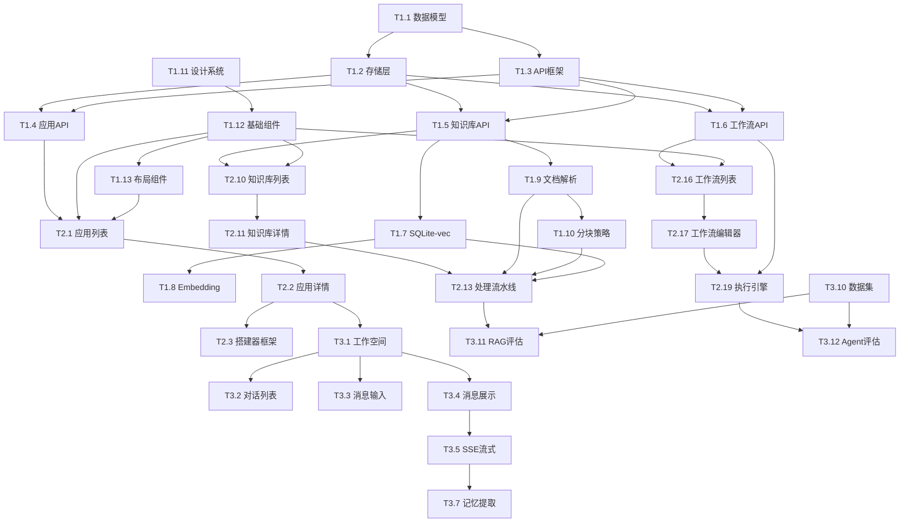

# PRD 10 — 开发任务 / Development Tasks

---

## 中文版

### 1. 功能概述

本文档将 Manta 平台的开发工作分解为**可执行的任务单元**，按优先级和依赖关系组织，确保开发过程有序推进。

### 2. 开发阶段规划

#### 2.1 整体时间线

```
Phase 1: 基础架构 (4周)
    ├── Week 1-2: 核心数据层 + API 框架
    ├── Week 3: 存储系统 + 认证框架
    └── Week 4: 基础 UI 组件库

Phase 2: 核心功能 (6周)
    ├── Week 5-6: 应用管理 + 搭建器
    ├── Week 7-8: 知识库引擎
    ├── Week 9-10: 工作流引擎

Phase 3: 高级功能 (4周)
    ├── Week 11-12: 对话系统 + 记忆系统
    ├── Week 13: 评估系统
    └── Week 14: 集成测试 + 优化

Phase 4: 打磨发布 (2周)
    ├── Week 15: 性能优化 + 错误处理
    └── Week 16: 文档 + 发布准备
```

### 3. 任务分解

#### 3.1 Phase 1: 基础架构 (4周)

**Week 1-2: 核心数据层 + API 框架**

| 任务 ID | 任务名称 | 优先级 | 预计工时 | 依赖 | 描述 |
|---------|---------|--------|---------|------|------|
| T1.1 | 数据模型定义 | P0 | 2天 | - | 基于 PRD 08 定义 TypeScript 接口 |
| T1.2 | 文件系统存储层 | P0 | 3天 | T1.1 | 实现 JSON 文件读写、目录管理 |
| T1.3 | API 路由框架 | P0 | 2天 | T1.1 | Next.js Route Handlers + 错误处理 |
| T1.4 | 应用管理 API | P0 | 3天 | T1.2, T1.3 | 实现 `/api/apps` CRUD 接口 |
| T1.5 | 知识库管理 API | P0 | 3天 | T1.2, T1.3 | 实现 `/api/rag` 接口 |
| T1.6 | 工作流管理 API | P0 | 3天 | T1.2, T1.3 | 实现 `/api/workflow` 接口 |

**Week 3: 存储系统 + 认证框架**

| 任务 ID | 任务名称 | 优先级 | 预计工时 | 依赖 | 描述 |
|---------|---------|--------|---------|------|------|
| T1.7 | SQLite-vec 集成 | P0 | 3天 | T1.5 | 实现 SQLiteVecProvider |
| T1.8 | Embedding 服务 | P0 | 2天 | T1.7 | 集成 OpenAI/Ollama Embedding API |
| T1.9 | 文档解析器 | P1 | 2天 | T1.5 | PDF、DOCX、MD、XLSX 解析 |
| T1.10 | 分块策略 | P1 | 2天 | T1.9 | 固定大小、语义、递归分块 |

**Week 4: 基础 UI 组件库**

| 任务 ID | 任务名称 | 优先级 | 预计工时 | 依赖 | 描述 |
|---------|---------|--------|---------|------|------|
| T1.11 | 设计系统实现 | P0 | 3天 | - | Tailwind 主题 + CSS 变量 |
| T1.12 | 基础组件开发 | P0 | 4天 | T1.11 | Button, Input, Modal, Toast 等 |
| T1.13 | 布局组件开发 | P0 | 2天 | T1.12 | AppShell, Sidebar, Header 等 |
| T1.14 | Zustand Store 框架 | P0 | 1天 | - | 状态管理架构 |

#### 3.2 Phase 2: 核心功能 (6周)

**Week 5-6: 应用管理 + 搭建器**

| 任务 ID | 任务名称 | 优先级 | 预计工时 | 依赖 | 描述 |
|---------|---------|--------|---------|------|------|
| T2.1 | 应用列表页 | P0 | 2天 | T1.12, T1.13, T1.4 | 实现 `/apps` 页面 |
| T2.2 | 应用详情页 | P0 | 2天 | T2.1 | 实现 `/apps/[id]` 页面 |
| T2.3 | 应用搭建器框架 | P0 | 3天 | T2.2 | 7 Tab 布局 + 路由 |
| T2.4 | 基础信息配置 | P0 | 1天 | T2.3 | 名称、描述、图标、标签 |
| T2.5 | Agent 配置 | P0 | 2天 | T2.3 | Agent 选择 + 参数覆盖 |
| T2.6 | 知识库绑定 | P0 | 2天 | T2.3, T1.5 | RAG 绑定配置 |
| T2.7 | 工作流绑定 | P0 | 2天 | T2.3, T1.6 | 工作流选择配置 |
| T2.8 | 工具配置 | P1 | 1天 | T2.3 | 工具启用/禁用 |
| T2.9 | 自动化配置 | P1 | 2天 | T2.3 | Cron/Webhook 配置 |

**Week 7-8: 知识库引擎**

| 任务 ID | 任务名称 | 优先级 | 预计工时 | 依赖 | 描述 |
|---------|---------|--------|---------|------|------|
| T2.10 | 知识库列表页 | P0 | 2天 | T1.12, T1.5 | 实现 `/rag` 页面 |
| T2.11 | 知识库详情页 | P0 | 2天 | T2.10 | 实现 `/rag/[id]` 页面 |
| T2.12 | 文档上传组件 | P0 | 2天 | T2.11 | 拖拽上传 + 进度显示 |
| T2.13 | 文档处理流水线 | P0 | 3天 | T1.9, T1.10, T1.7 | 解析→分块→向量化→索引 |
| T2.14 | 分块预览界面 | P1 | 2天 | T2.13 | 分块结果预览 + 参数调整 |
| T2.15 | 检索测试界面 | P0 | 2天 | T2.13 | 查询输入 + 结果展示 |

**Week 9-10: 工作流引擎**

| 任务 ID | 任务名称 | 优先级 | 预计工时 | 依赖 | 描述 |
|---------|---------|--------|---------|------|------|
| T2.16 | 工作流列表页 | P0 | 2天 | T1.12, T1.6 | 实现 `/workflow` 页面 |
| T2.17 | 工作流编辑器 | P0 | 5天 | T2.16 | 可视化画布 + 节点拖拽 |
| T2.18 | 步骤配置面板 | P0 | 3天 | T2.17 | Agent/Human/Parallel/Conditional/Loop 配置 |
| T2.19 | 工作流执行引擎 | P0 | 4天 | T1.6 | 步骤执行 + 状态追踪 |
| T2.20 | 执行历史页面 | P1 | 2天 | T2.19 | 执行记录 + 日志查看 |
| T2.21 | Human-in-the-loop | P0 | 2天 | T2.19 | 审批节点 + 通知机制 |

#### 3.3 Phase 3: 高级功能 (4周)

**Week 11-12: 对话系统 + 记忆系统**

| 任务 ID | 任务名称 | 优先级 | 预计工时 | 依赖 | 描述 |
|---------|---------|--------|---------|------|------|
| T3.1 | 工作空间页面 | P0 | 3天 | T2.2 | 实现 `/apps/[id]/workspace` |
| T3.2 | 对话列表组件 | P0 | 2天 | T3.1 | 会话列表 + 搜索筛选 |
| T3.3 | 消息输入组件 | P0 | 2天 | T3.1 | 输入框 + 快捷键 + 文件上传 |
| T3.4 | 消息展示组件 | P0 | 3天 | T3.1 | 气泡 + 工具调用 + 知识引用 |
| T3.5 | SSE 流式响应 | P0 | 2天 | T3.4 | 流式消息 + 打字机效果 |
| T3.6 | 记忆管理页面 | P1 | 2天 | T3.1 | 实现 `/apps/[id]/memory` |
| T3.7 | 记忆提取引擎 | P1 | 3天 | T3.5 | 自动提取 + 手动创建 |
| T3.8 | 记忆检索集成 | P1 | 2天 | T3.7 | 对话中检索相关记忆 |

**Week 13: 评估系统**

| 任务 ID | 任务名称 | 优先级 | 预计工时 | 依赖 | 描述 |
|---------|---------|--------|---------|------|------|
| T3.9 | 评估中心页面 | P1 | 2天 | T1.12 | 实现 `/evaluation` 页面 |
| T3.10 | 数据集管理 | P1 | 2天 | T3.9 | 创建/导入/编辑数据集 |
| T3.11 | RAG 评估引擎 | P1 | 3天 | T2.13, T3.10 | RAGAs 7 维度评估 |
| T3.12 | Agent 评估引擎 | P2 | 3天 | T2.19, T3.10 | 6 维度 Agent 评估 |
| T3.13 | 评估报告页面 | P1 | 2天 | T3.11 | 可视化报告 + 维度分析 |

**Week 14: 集成测试 + 优化**

| 任务 ID | 任务名称 | 优先级 | 预计工时 | 依赖 | 描述 |
|---------|---------|--------|---------|------|------|
| T3.14 | 端到端测试 | P0 | 3天 | 所有功能 | 核心流程自动化测试 |
| T3.15 | 性能测试 | P1 | 2天 | T3.14 | 关键路径性能基准 |
| T3.16 | 错误处理完善 | P0 | 2天 | T3.14 | 全局错误边界 + 用户友好提示 |

#### 3.4 Phase 4: 打磨发布 (2周)

**Week 15: 性能优化 + 错误处理**

| 任务 ID | 任务名称 | 优先级 | 预计工时 | 依赖 | 描述 |
|---------|---------|--------|---------|------|------|
| T4.1 | 前端性能优化 | P0 | 3天 | T3.14 | 懒加载、虚拟滚动、代码分割 |
| T4.2 | 后端性能优化 | P0 | 2天 | T3.15 | 缓存策略、数据库索引 |
| T4.3 | 用户体验优化 | P0 | 2天 | T4.1 | 骨架屏、加载状态、动画 |

**Week 16: 文档 + 发布准备**

| 任务 ID | 任务名称 | 优先级 | 预计工时 | 依赖 | 描述 |
|---------|---------|--------|---------|------|------|
| T4.4 | 用户文档 | P0 | 3天 | 所有功能 | 使用指南、API 文档 |
| T4.5 | 开发者文档 | P1 | 2天 | T4.4 | 架构文档、贡献指南 |
| T4.6 | 发布准备 | P0 | 2天 | T4.4 | 版本号、更新日志、打包 |

### 4. 任务依赖关系图



### 5. 里程碑定义

| 里程碑 | 时间 | 交付物 | 验收标准 |
|--------|------|--------|---------|
| **M1: 基础架构** | Week 4 | API 框架 + 存储层 + UI 组件库 | API 可调用，组件可渲染 |
| **M2: 应用管理** | Week 6 | 应用 CRUD + 搭建器 | 创建/编辑/删除应用 |
| **M3: 知识库** | Week 8 | 知识库引擎 + 检索 | 上传文档、检索测试 |
| **M4: 工作流** | Week 10 | 工作流编辑器 + 执行 | 创建/运行工作流 |
| **M5: 对话系统** | Week 12 | 工作空间 + 记忆 | 对话交互、记忆检索 |
| **M6: 评估系统** | Week 13 | 评估引擎 + 报告 | RAG/Agent 评估 |
| **M7: 发布** | Week 16 | 完整产品 | 所有功能可用 |

### 6. 风险评估

| 风险 | 概率 | 影响 | 缓解措施 |
|------|------|------|---------|
| **SQLite-vec 性能** | 中 | 高 | 提前性能测试，准备 ChromaDB 备选 |
| **Embedding API 成本** | 高 | 中 | 支持本地 Ollama，设置缓存 |
| **工作流编辑器复杂度** | 高 | 高 | 分阶段实现，先支持串行/并行 |
| **记忆系统效果** | 中 | 中 | 先实现基础功能，后续迭代优化 |
| **评估系统准确性** | 中 | 中 | 使用成熟 RAGAs 框架，人工校验 |

### 7. 技术债务管理

#### 7.1 已知技术债务

| 债务 | 来源 | 影响 | 计划解决 |
|------|------|------|---------|
| **类型定义不完整** | 现有 types.ts | 需要扩展 | Phase 1 Week 1 |
| **无测试覆盖** | 现有代码 | 质量风险 | Phase 3 Week 14 |
| **无错误处理** | 现有代码 | 用户体验差 | Phase 1 Week 1 |
| **无缓存机制** | 现有代码 | 性能问题 | Phase 4 Week 15 |

#### 7.2 技术债务优先级

| 优先级 | 债务 | 处理方式 |
|--------|------|---------|
| **P0** | 类型定义不完整 | 立即修复 |
| **P0** | 无错误处理 | 立即修复 |
| **P1** | 无测试覆盖 | Phase 3 补充 |
| **P2** | 无缓存机制 | Phase 4 优化 |

### 8. 资源需求

#### 8.1 人力资源

| 角色 | 人数 | 职责 |
|------|------|------|
| **前端工程师** | 2 | UI 组件、页面开发 |
| **后端工程师** | 2 | API、存储、引擎开发 |
| **AI 工程师** | 1 | RAG、Embedding、评估 |
| **产品/设计** | 1 | UI/UX 设计、需求澄清 |

#### 8.2 基础设施

| 资源 | 用途 | 规格 |
|------|------|------|
| **开发环境** | 本地开发 | Node.js 18+, pnpm |
| **测试环境** | 集成测试 | Docker, SQLite |
| **CI/CD** | 自动化构建 | GitHub Actions |
| **文档** | 用户/开发者文档 | VitePress |

### 9. 质量保障

#### 9.1 代码质量

| 标准 | 工具 | 阈值 |
|------|------|------|
| **类型安全** | TypeScript | 严格模式，0 errors |
| **代码风格** | ESLint + Prettier | 0 warnings |
| **测试覆盖** | Jest/Vitest | > 80% |
| **性能基准** | Lighthouse | Performance > 90 |

#### 9.2 测试策略

| 测试类型 | 覆盖范围 | 工具 |
|---------|---------|------|
| **单元测试** | 工具函数、服务层 | Jest/Vitest |
| **集成测试** | API 端点、数据库 | Supertest |
| **组件测试** | React 组件 | Testing Library |
| **端到端测试** | 核心流程 | Playwright |

---

## English Version

### 1. Feature Overview

This document breaks down the Manta platform development into **executable task units**, organized by priority and dependencies.

### 2. Development Phases

**Phase 1: Infrastructure (4 weeks)**
- Core data layer + API framework
- Storage systems + authentication
- Basic UI component library

**Phase 2: Core Features (6 weeks)**
- App management + builder
- Knowledge base engine
- Workflow engine

**Phase 3: Advanced Features (4 weeks)**
- Dialogue system + memory system
- Evaluation system
- Integration testing + optimization

**Phase 4: Polish & Release (2 weeks)**
- Performance optimization + error handling
- Documentation + release preparation

### 3. Task Breakdown

Total: 50+ tasks across 4 phases, 16 weeks

**Key Milestones**:
- M1 (Week 4): Infrastructure complete
- M2 (Week 6): App management functional
- M3 (Week 8): Knowledge base working
- M4 (Week 10): Workflow engine ready
- M5 (Week 12): Dialogue system complete
- M6 (Week 13): Evaluation system ready
- M7 (Week 16): Product launch

### 4. Risk Assessment

| Risk | Probability | Impact | Mitigation |
|------|-------------|--------|------------|
| SQLite-vec performance | Medium | High | Early testing, ChromaDB fallback |
| Embedding API cost | High | Medium | Local Ollama support, caching |
| Workflow editor complexity | High | High | Phased implementation |
| Memory system effectiveness | Medium | Medium | Basic first, iterate later |
| Evaluation accuracy | Medium | Medium | Use RAGAs framework, manual validation |

### 5. Resource Requirements

- 2 Frontend Engineers
- 2 Backend Engineers
- 1 AI Engineer
- 1 Product/Design

### 6. Quality Assurance

- TypeScript strict mode
- ESLint + Prettier
- Test coverage > 80%
- Lighthouse Performance > 90

---

## 变更记录 / Changelog

| 日期 | 版本 | 变更说明 |
|------|------|---------|
| 2026-06-14 | v1.0 | 初始版本，定义开发任务分解和里程碑 |

---

> 上一篇：[PRD 09 — UI 规范](./09-ui-spec.md)
> 完成：PRD 文档系列完成