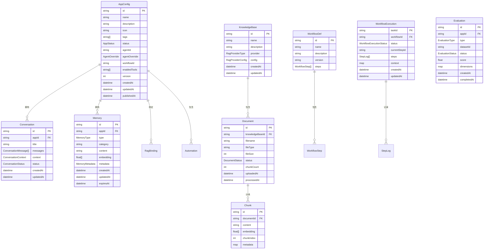

# 数据模型技术方案 / Data Model Technical Design

## 1. 概述

数据模型定义Manta平台的**核心数据结构、存储方案和API规范**。本文档是技术实现的基础规范，确保各模块数据一致性。

### 1.1 设计目标
- **一致性**：统一的数据结构和接口规范
- **可扩展性**：支持未来功能扩展
- **性能优化**：合理的索引和缓存策略
- **数据安全**：敏感数据加密和访问控制

### 1.2 核心实体
- **AppConfig**：应用配置
- **KnowledgeBase**：知识库
- **Document/Chunk**：文档和分块
- **WorkflowDef/WorkflowExecution**：工作流定义和执行
- **Conversation**：对话
- **Memory**：记忆
- **Evaluation**：评估

---

## 2. 核心实体关系

### 2.1 实体关系图



---

## 3. 数据结构详细定义

### 3.1 应用配置 (AppConfig)

```typescript
// 应用状态
type AppStatus = 'draft' | 'published' | 'archived'

// Agent 参数覆盖
interface AgentOverride {
  systemPrompt?: string
  temperature?: number
  maxTokens?: number
  model?: string
}

// RAG 知识库绑定
interface RagBinding {
  knowledgeBaseId: string
  topK: number
  similarityThreshold: number
  hybridSearchEnabled: boolean
  vectorWeight: number
}

// 自动化任务
interface Automation {
  id: string
  type: 'cron' | 'webhook' | 'manual'
  name: string
  description?: string
  enabled: boolean
  cronExpression?: string
  timezone?: string
  webhookUrl?: string
  webhookSecret?: string
  templateMessage?: string
  createdAt: string
  updatedAt: string
  lastTriggeredAt?: string
}

// 应用配置
interface AppConfig {
  id: string
  name: string
  description: string
  icon: string
  tags: string[]
  status: AppStatus

  // 基础 Agent 配置（以 Manta AI 为基础）
  agentOverride: AgentOverride

  // 知识库绑定
  ragBinding: RagBinding | null

  // 工作流绑定
  workflowId?: string

  // 启用的工具
  enabledTools: string[]

  // 自动化
  automations: Automation[]

  // 时间戳
  createdAt: string
  updatedAt: string
  publishedAt: string | null

  // 版本号（乐观锁）
  version: number
}
```

### 3.2 知识库相关

```typescript
// RAG Provider 类型
type RagProviderType = 'sqlite-vec' | 'chroma' | 'bm25' | 'milvus'

// RAG Provider 配置
interface RagProviderConfig {
  // SQLite-vec 配置
  sqlitePath?: string
  
  // ChromaDB 配置
  chromaUrl?: string
  chromaCollection?: string
  
  // Milvus 配置
  milvusUrl?: string
  milvusCollection?: string
  
  // 通用配置
  embeddingModel?: string
  embeddingDimensions?: number
}

// 知识库
interface KnowledgeBase {
  id: string
  name: string
  description: string
  provider: RagProviderType
  config: RagProviderConfig
  createdAt: string
  updatedAt: string
}

// 文档状态
type DocumentStatus = 'uploading' | 'processing' | 'indexed' | 'failed'

// 文档
interface Document {
  id: string
  knowledgeBaseId: string
  filename: string
  fileType: string
  fileSize: number
  status: DocumentStatus
  chunkCount: number
  uploadedAt: string
  processedAt?: string
  error?: string
}

// 分块
interface Chunk {
  id: string
  documentId: string
  content: string
  embedding?: number[]
  chunkIndex: number
  metadata: Record<string, unknown>
}
```

### 3.3 工作流相关

```typescript
// 工作流步骤类型
type WorkflowStepType =
  | 'agent'
  | 'human_in_loop'
  | 'parallel'
  | 'conditional'
  | 'loop'

// 工作流步骤
interface WorkflowStep {
  id: string
  type: WorkflowStepType
  name: string
  agentName?: string
  next?: string
  actions?: Record<string, string>
  notify?: boolean | { mac?: boolean; webhook?: boolean }
  branches?: WorkflowStep[]
}

// 工作流定义
interface WorkflowDef {
  id: string
  name: string
  description?: string
  version?: string
  steps: WorkflowStep[]
}

// 步骤状态
type StepStatus =
  | 'pending'
  | 'running'
  | 'waiting'
  | 'done'
  | 'failed'
  | 'skipped'

// 工作流执行状态
type WorkflowExecutionStatus =
  | 'running'
  | 'waiting'
  | 'done'
  | 'failed'

// 步骤日志
interface StepLog {
  stepId: string
  stepName: string
  status: StepStatus
  agentName?: string
  startedAt?: string
  completedAt?: string
  error?: string
  actions?: Record<string, string>
}

// 工作流执行实例
interface WorkflowExecution {
  taskId: string
  workflowId: string
  status: WorkflowExecutionStatus
  currentStepId?: string
  steps: StepLog[]
  context: Record<string, unknown>
  createdAt: string
  updatedAt: string
}
```

### 3.4 对话相关

```typescript
// 对话状态
type ConversationStatus = 'active' | 'archived' | 'deleted'

// 对话消息
interface ConversationMessage {
  id: string
  role: 'user' | 'assistant' | 'system' | 'tool'
  content: string
  toolCalls?: ToolCall[]
  toolResults?: ToolResult[]
  timestamp: string
  metadata?: Record<string, unknown>
}

// 对话上下文
interface ConversationContext {
  workDir?: string
  envVars?: Record<string, string>
  files?: string[]
  tokensUsed: number
}

// 对话
interface Conversation {
  id: string
  appId: string
  title: string
  messages: ConversationMessage[]
  context: ConversationContext
  status: ConversationStatus
  createdAt: string
  updatedAt: string
}
```

### 3.5 记忆相关

```typescript
// 记忆类型
type MemoryType = 'short-term' | 'long-term' | 'working'

// 记忆元数据
interface MemoryMetadata {
  source: 'conversation' | 'manual' | 'auto'
  conversationId?: string
  importance: number
  accessCount: number
  lastAccessedAt?: string
}

// 记忆条目
interface MemoryEntry {
  id: string
  appId: string
  type: MemoryType
  category: string
  content: string
  embedding?: number[]
  metadata: MemoryMetadata
  createdAt: string
  updatedAt: string
  expiresAt?: string
}
```

### 3.6 评估相关

```typescript
// 评估类型
type EvaluationType = 'rag' | 'agent'

// 评估状态
type EvaluationStatus = 'pending' | 'running' | 'completed' | 'failed'

// 评估维度分数
interface DimensionScore {
  score: number
  details?: Record<string, unknown>
}

// 评估记录
interface Evaluation {
  id: string
  appId: string
  type: EvaluationType
  datasetId: string
  status: EvaluationStatus
  score: number
  dimensions: Record<string, DimensionScore>
  createdAt: string
  completedAt?: string
  error?: string
}
```

### 3.7 工作空间相关

```typescript
// 工作空间配置
interface WorkspaceConfig {
  id: string
  name: string
  description?: string
  agentAppIds: string[]
  knowledgeBaseIds: string[]
  workflowIds: string[]
  createdAt: string
  updatedAt: string
}

// Manta AI 配置（默认通用智能体）
interface MantaAIConfig {
  id: 'manta-ai'
  name: 'Manta AI'
  description: '默认通用智能体'
  capabilities: ['conversation', 'qa', 'basic-tasks']
  isBuiltIn: true
}

// @提及配置
interface AtMention {
  agentAppId: string
  agentAppName: string
  startIndex: number
  endIndex: number
}

// 对话（更新：添加工作空间关联）
interface Conversation {
  id: string
  workspaceId: string
  agentAppIds: string[]
  agentAppId?: string
  title: string
  messages: ConversationMessage[]
  context: ConversationContext
  status: ConversationStatus
  createdAt: string
  updatedAt: string
}
```

---

## 4. 存储目录结构

### 4.1 目录布局

```typescript
// 存储目录结构
const STORAGE_STRUCTURE = {
  root: '~/.manta-data',
  apps: {
    path: 'apps/{app-id}',
    files: {
      config: 'app.json',
      conversations: 'conversations/',
      knowledge: 'knowledge/',
      workflows: 'workflows/',
      memory: 'memory/',
      evaluations: 'evaluations/',
      tools: 'tools/',
      logs: 'logs/'
    }
  },
  workspaces: {
    path: 'workspaces/{workspace-id}',
    files: {
      config: 'workspace.json',
      conversations: 'conversations/',
      agentApps: 'agent-apps/',
      knowledgeBases: 'knowledge-bases/',
      workflows: 'workflows/'
    }
  },
  shared: {
    rag: 'rag/',
    agents: 'agents/',
    workflows: 'workflows/',
    config: 'config/'
  }
}
```

### 4.2 文件组织

```typescript
// 文件组织管理器
class StorageManager {
  private basePath: string
  
  constructor(basePath: string = '~/.manta-data') {
    this.basePath = basePath
  }
  
  // 获取应用目录
  getAppPath(appId: string): string {
    return path.join(this.basePath, 'apps', appId)
  }
  
  // 获取对话文件路径
  getConversationPath(appId: string, conversationId: string): string {
    return path.join(this.getAppPath(appId), 'conversations', `${conversationId}.json`)
  }
  
  // 获取知识库路径
  getKnowledgeBasePath(appId: string, kbId: string): string {
    return path.join(this.getAppPath(appId), 'knowledge', kbId)
  }
  
  // 获取文档路径
  getDocumentPath(appId: string, kbId: string, docId: string): string {
    return path.join(this.getKnowledgeBasePath(appId, kbId), 'documents', docId)
  }
  
  // 获取向量索引路径
  getVectorIndexPath(appId: string, kbId: string): string {
    return path.join(this.getKnowledgeBasePath(appId, kbId), 'index', 'sqlite-vec.db')
  }
  
  // 获取工作流路径
  getWorkflowPath(appId: string, workflowId: string): string {
    return path.join(this.getAppPath(appId), 'workflows', `${workflowId}.json`)
  }
  
  // 获取执行历史路径
  getExecutionPath(appId: string, workflowId: string, execId: string): string {
    return path.join(this.getAppPath(appId), 'workflows', workflowId, 'executions', `${execId}.json`)
  }
  
  // 获取记忆路径
  getMemoryPath(appId: string): string {
    return path.join(this.getAppPath(appId), 'memory')
  }
  
  // 获取评估路径
  getEvaluationPath(appId: string, evalId: string): string {
    return path.join(this.getAppPath(appId), 'evaluations', `${evalId}.json`)
  }
  
  // 获取数据集路径
  getDatasetPath(appId: string, datasetId: string): string {
    return path.join(this.getAppPath(appId), 'evaluations', 'datasets', `${datasetId}.json`)
  }
  
  // 获取日志路径
  getLogPath(appId: string, date: string): string {
    return path.join(this.getAppPath(appId), 'logs', `${date}.log`)
  }
  
  // 获取Agent定义路径
  getAgentPath(agentName: string): string {
    return path.join(this.basePath, 'agents', 'definitions', agentName)
  }
  
  // 获取全局配置路径
  getGlobalConfigPath(): string {
    return path.join(this.basePath, 'config', 'settings.json')
  }
  
  // 获取工作空间目录
  getWorkspacePath(workspaceId: string): string {
    return path.join(this.basePath, 'workspaces', workspaceId)
  }
  
  // 获取工作空间配置路径
  getWorkspaceConfigPath(workspaceId: string): string {
    return path.join(this.getWorkspacePath(workspaceId), 'workspace.json')
  }
  
  // 获取工作空间对话路径
  getWorkspaceConversationPath(workspaceId: string, conversationId: string): string {
    return path.join(this.getWorkspacePath(workspaceId), 'conversations', `${conversationId}.json`)
  }
  
  // 获取工作空间智能体应用路径
  getWorkspaceAgentAppsPath(workspaceId: string): string {
    return path.join(this.getWorkspacePath(workspaceId), 'agent-apps')
  }
  
  // 获取工作空间知识库路径
  getWorkspaceKnowledgeBasesPath(workspaceId: string): string {
    return path.join(this.getWorkspacePath(workspaceId), 'knowledge-bases')
  }
  
  // 获取工作空间工作流路径
  getWorkspaceWorkflowsPath(workspaceId: string): string {
    return path.join(this.getWorkspacePath(workspaceId), 'workflows')
  }
}
```

---

## 5. API 设计规范

### 5.1 RESTful API 规范

```typescript
// API 设计规范
const API_SPEC = {
  // 基础URL
  baseUrl: '/api',
  
  // 响应格式
  responseFormat: {
    success: {
      success: true,
      data: 'T',
      message?: 'string'
    },
    error: {
      success: false,
      error: {
        code: 'string',
        message: 'string',
        details?: 'Record<string, unknown>'
      }
    },
    paginated: {
      success: true,
      data: 'T[]',
      pagination: {
        page: 'number',
        pageSize: 'number',
        total: 'number',
        totalPages: 'number'
      }
    }
  },
  
  // HTTP方法规范
  methods: {
    GET: '获取资源列表或详情',
    POST: '创建新资源',
    PUT: '更新资源（完整替换）',
    PATCH: '部分更新资源',
    DELETE: '删除资源'
  },
  
  // 状态码规范
  statusCodes: {
    200: '成功',
    201: '创建成功',
    204: '删除成功（无内容）',
    400: '请求参数错误',
    401: '未授权',
    403: '禁止访问',
    404: '资源不存在',
    409: '资源冲突',
    422: '业务逻辑错误',
    500: '服务器内部错误',
    503: '服务不可用'
  }
}
```

### 5.2 错误码规范

```typescript
// 错误码定义
enum ErrorCode {
  // 验证错误
  VALIDATION_ERROR = 'VALIDATION_ERROR',
  INVALID_INPUT = 'INVALID_INPUT',
  MISSING_FIELD = 'MISSING_FIELD',
  
  // 资源错误
  NOT_FOUND = 'NOT_FOUND',
  ALREADY_EXISTS = 'ALREADY_EXISTS',
  CONFLICT = 'CONFLICT',
  
  // 业务逻辑错误
  INVALID_STATE = 'INVALID_STATE',
  OPERATION_FAILED = 'OPERATION_FAILED',
  PERMISSION_DENIED = 'PERMISSION_DENIED',
  
  // 系统错误
  INTERNAL_ERROR = 'INTERNAL_ERROR',
  SERVICE_UNAVAILABLE = 'SERVICE_UNAVAILABLE',
  TIMEOUT = 'TIMEOUT',
  
  // 存储错误
  STORAGE_ERROR = 'STORAGE_ERROR',
  DISK_FULL = 'DISK_FULL',
  
  // 网络错误
  NETWORK_ERROR = 'NETWORK_ERROR',
  API_ERROR = 'API_ERROR'
}

// 错误响应
interface ErrorResponse {
  success: false
  error: {
    code: ErrorCode
    message: string
    details?: Record<string, unknown>
    timestamp: string
    requestId?: string
  }
}
```

### 5.3 API 路由规划

```typescript
// API 路由定义
const API_ROUTES = {
  // 应用管理
  apps: {
    list: 'GET /api/apps',
    create: 'POST /api/apps',
    get: 'GET /api/apps/:id',
    update: 'PUT /api/apps/:id',
    delete: 'DELETE /api/apps/:id',
    clone: 'POST /api/apps/:id/clone',
    status: 'PATCH /api/apps/:id/status'
  },
  
  // 知识库管理
  knowledgeBases: {
    list: 'GET /api/rag/knowledge-bases',
    create: 'POST /api/rag/knowledge-bases',
    get: 'GET /api/rag/knowledge-bases/:id',
    update: 'PUT /api/rag/knowledge-bases/:id',
    delete: 'DELETE /api/rag/knowledge-bases/:id',
    documents: {
      list: 'GET /api/rag/knowledge-bases/:id/documents',
      upload: 'POST /api/rag/knowledge-bases/:id/documents',
      delete: 'DELETE /api/rag/knowledge-bases/:id/documents/:docId',
      process: 'POST /api/rag/knowledge-bases/:id/documents/:docId/process'
    },
    search: 'POST /api/rag/knowledge-bases/:id/search',
    providers: 'GET /api/rag/providers'
  },
  
  // 工作流管理
  workflows: {
    list: 'GET /api/workflow',
    create: 'POST /api/workflow',
    get: 'GET /api/workflow/:id',
    update: 'PUT /api/workflow/:id',
    delete: 'DELETE /api/workflow/:id',
    run: 'POST /api/workflow/:id/run',
    executions: {
      list: 'GET /api/workflow/:id/executions',
      get: 'GET /api/workflow/executions/:execId',
      approve: 'POST /api/workflow/executions/:execId/approve'
    }
  },
  
  // 对话管理
  conversations: {
    list: 'GET /api/apps/:appId/conversations',
    create: 'POST /api/apps/:appId/conversations',
    get: 'GET /api/apps/:appId/conversations/:convId',
    delete: 'DELETE /api/apps/:appId/conversations/:convId',
    messages: {
      send: 'POST /api/apps/:appId/conversations/:convId/messages',
      stream: 'GET /api/apps/:appId/conversations/:convId/stream'
    },
    context: {
      get: 'GET /api/apps/:appId/context',
      update: 'PUT /api/apps/:appId/context'
    }
  },
  
  // 记忆管理
  memory: {
    list: 'GET /api/apps/:appId/memory',
    create: 'POST /api/apps/:appId/memory',
    get: 'GET /api/apps/:appId/memory/:id',
    update: 'PUT /api/apps/:appId/memory/:id',
    delete: 'DELETE /api/apps/:appId/memory/:id',
    search: 'POST /api/apps/:appId/memory/search',
    cleanup: 'POST /api/apps/:appId/memory/cleanup'
  },
  
  // 评估管理
  evaluations: {
    list: 'GET /api/eval',
    start: 'POST /api/eval/start',
    get: 'GET /api/eval/:id',
    stream: 'GET /api/eval/:id/stream',
    cancel: 'POST /api/eval/:id/cancel',
    delete: 'DELETE /api/eval/:id',
    datasets: {
      list: 'GET /api/eval/datasets',
      create: 'POST /api/eval/datasets',
      get: 'GET /api/eval/datasets/:id',
      update: 'PUT /api/eval/datasets/:id',
      delete: 'DELETE /api/eval/datasets/:id',
      import: 'POST /api/eval/datasets/import'
    }
  }
}
```

---

## 6. 数据迁移策略

### 6.1 版本兼容性

```typescript
// 版本管理
interface VersionInfo {
  version: string
  releaseDate: string
  changes: string[]
  compatibility: {
    forward: boolean  // 向前兼容
    backward: boolean // 向后兼容
  }
}

// 数据版本管理器
class DataVersionManager {
  private versions: VersionInfo[] = []
  
  async checkCompatibility(currentVersion: string, targetVersion: string): Promise<CompatibilityResult> {
    const current = this.getVersion(currentVersion)
    const target = this.getVersion(targetVersion)
    
    if (!current || !target) {
      return { compatible: false, reason: '版本不存在' }
    }
    
    // 检查版本跳跃
    const versionGap = this.calculateVersionGap(currentVersion, targetVersion)
    if (versionGap > 2) {
      return { compatible: false, reason: '版本跳跃过大，需要逐步升级' }
    }
    
    return { compatible: true }
  }
  
  async migrate(fromVersion: string, toVersion: string): Promise<MigrationResult> {
    const migrations = this.getMigrationPath(fromVersion, toVersion)
    
    let currentData = await this.loadData()
    
    for (const migration of migrations) {
      try {
        currentData = await migration.up(currentData)
        await this.saveData(currentData)
        await this.updateVersion(migration.version)
      } catch (error) {
        return {
          success: false,
          error: `迁移失败: ${migration.version} - ${error.message}`,
          rollbackRequired: true
        }
      }
    }
    
    return { success: true, newVersion: toVersion }
  }
}
```

### 6.2 迁移脚本

```typescript
// 迁移定义
interface Migration {
  version: string
  description: string
  up: (data: any) => Promise<any>
  down: (data: any) => Promise<any>
  validate?: (data: any) => boolean
}

// 示例迁移
const migrations: Migration[] = [
  {
    version: '1.0.0',
    description: '初始版本',
    up: async (data) => {
      // 初始数据结构
      return data
    },
    down: async (data) => {
      return data
    }
  },
  {
    version: '1.1.0',
    description: '添加记忆系统支持',
    up: async (data) => {
      // 为每个应用添加记忆目录
      for (const app of data.apps) {
        if (!app.memory) {
          app.memory = {
            shortTerm: [],
            longTerm: [],
            working: []
          }
        }
      }
      return data
    },
    down: async (data) => {
      // 移除记忆数据
      for (const app of data.apps) {
        delete app.memory
      }
      return data
    }
  },
  {
    version: '1.2.0',
    description: '添加评估系统支持',
    up: async (data) => {
      // 为每个应用添加评估目录
      for (const app of data.apps) {
        if (!app.evaluations) {
          app.evaluations = []
        }
        if (!app.datasets) {
          app.datasets = []
        }
      }
      return data
    },
    down: async (data) => {
      // 移除评估数据
      for (const app of data.apps) {
        delete app.evaluations
        delete app.datasets
      }
      return data
    }
  }
]
```

---

## 7. 性能优化

### 7.1 索引策略

```typescript
// 索引定义
interface IndexDefinition {
  entity: string
  fields: string[]
  unique?: boolean
  type?: 'btree' | 'hash' | 'gin' | 'gist'
}

const INDEX_DEFINITIONS: IndexDefinition[] = [
  // 应用索引
  { entity: 'AppConfig', fields: ['status', 'updatedAt'] },
  { entity: 'AppConfig', fields: ['agentId'] },
  { entity: 'AppConfig', fields: ['workflowId'] },
  
  // 知识库索引
  { entity: 'KnowledgeBase', fields: ['provider'] },
  
  // 文档索引
  { entity: 'Document', fields: ['knowledgeBaseId', 'status'] },
  { entity: 'Document', fields: ['status'] },
  
  // 分块索引
  { entity: 'Chunk', fields: ['documentId'] },
  { entity: 'Chunk', fields: ['chunkIndex'] },
  
  // 工作流索引
  { entity: 'WorkflowDef', fields: ['name'] },
  
  // 执行索引
  { entity: 'WorkflowExecution', fields: ['workflowId', 'status'] },
  { entity: 'WorkflowExecution', fields: ['status'] },
  
  // 对话索引
  { entity: 'Conversation', fields: ['appId', 'status'] },
  { entity: 'Conversation', fields: ['updatedAt'] },
  
  // 记忆索引
  { entity: 'Memory', fields: ['appId', 'type', 'category'] },
  { entity: 'Memory', fields: ['appId', 'expiresAt'] },
  { entity: 'Memory', fields: ['metadata.importance'] },
  
  // 评估索引
  { entity: 'Evaluation', fields: ['appId', 'type'] },
  { entity: 'Evaluation', fields: ['status'] },
  { entity: 'Evaluation', fields: ['createdAt'] }
]
```

### 7.2 缓存策略

```typescript
// 缓存配置
interface CacheConfig {
  key: string
  ttl: number  // 生存时间（秒）
  maxSize: number
  strategy: 'lru' | 'lfu' | 'fifo'
}

const CACHE_CONFIGS: CacheConfig[] = [
  // 应用配置缓存
  {
    key: 'app_config',
    ttl: 300,  // 5分钟
    maxSize: 1000,
    strategy: 'lru'
  },
  
  // Agent注册表缓存
  {
    key: 'agent_registry',
    ttl: 600,  // 10分钟
    maxSize: 100,
    strategy: 'lru'
  },
  
  // 知识库统计缓存
  {
    key: 'kb_stats',
    ttl: 60,  // 1分钟
    maxSize: 500,
    strategy: 'lru'
  },
  
  // 工作流定义缓存
  {
    key: 'workflow_def',
    ttl: 300,  // 5分钟
    maxSize: 200,
    strategy: 'lru'
  },
  
  // 记忆检索缓存
  {
    key: 'memory_search',
    ttl: 30,  // 30秒
    maxSize: 1000,
    strategy: 'lru'
  }
]

// 缓存管理器
class CacheManager {
  private caches: Map<string, LRUCache<string, any>> = new Map()
  
  constructor() {
    this.initializeCaches()
  }
  
  private initializeCaches(): void {
    for (const config of CACHE_CONFIGS) {
      this.caches.set(config.key, new LRUCache({
        max: config.maxSize,
        ttl: config.ttl * 1000  // 转换为毫秒
      }))
    }
  }
  
  async get<T>(cacheKey: string, key: string): Promise<T | undefined> {
    const cache = this.caches.get(cacheKey)
    return cache?.get(key)
  }
  
  async set<T>(cacheKey: string, key: string, value: T): Promise<void> {
    const cache = this.caches.get(cacheKey)
    cache?.set(key, value)
  }
  
  async invalidate(cacheKey: string, key?: string): Promise<void> {
    const cache = this.caches.get(cacheKey)
    if (key) {
      cache?.delete(key)
    } else {
      cache?.clear()
    }
  }
  
  async invalidateAll(): Promise<void> {
    for (const cache of this.caches.values()) {
      cache.clear()
    }
  }
}
```

---

## 8. 数据安全

### 8.1 敏感数据处理

```typescript
// 敏感数据类型
enum SensitiveDataType {
  API_KEY = 'api_key',
  USER_DATA = 'user_data',
  KNOWLEDGE_BASE = 'knowledge_base',
  MEMORY = 'memory'
}

// 数据加密器
class DataEncryptor {
  private algorithm = 'aes-256-gcm'
  private key: Buffer
  
  constructor(secretKey: string) {
    this.key = crypto.scryptSync(secretKey, 'salt', 32)
  }
  
  async encrypt(data: string): Promise<EncryptedData> {
    const iv = crypto.randomBytes(16)
    const cipher = crypto.createCipher(this.algorithm, this.key)
    
    let encrypted = cipher.update(data, 'utf8', 'hex')
    encrypted += cipher.final('hex')
    
    const authTag = cipher.getAuthTag()
    
    return {
      encrypted,
      iv: iv.toString('hex'),
      authTag: authTag.toString('hex'),
      algorithm: this.algorithm
    }
  }
  
  async decrypt(encryptedData: EncryptedData): Promise<string> {
    const decipher = crypto.createDecipher(
      encryptedData.algorithm,
      this.key
    )
    
    decipher.setAuthTag(Buffer.from(encryptedData.authTag, 'hex'))
    
    let decrypted = decipher.update(encryptedData.encrypted, 'hex', 'utf8')
    decrypted += decipher.final('utf8')
    
    return decrypted
  }
}

// 敏感数据管理器
class SensitiveDataManager {
  private encryptor: DataEncryptor
  
  constructor(secretKey: string) {
    this.encryptor = new DataEncryptor(secretKey)
  }
  
  async storeSensitiveData(type: SensitiveDataType, data: any): Promise<void> {
    const encrypted = await this.encryptor.encrypt(JSON.stringify(data))
    await this.saveEncryptedData(type, encrypted)
  }
  
  async retrieveSensitiveData<T>(type: SensitiveDataType): Promise<T | null> {
    const encrypted = await this.loadEncryptedData(type)
    if (!encrypted) return null
    
    const decrypted = await this.encryptor.decrypt(encrypted)
    return JSON.parse(decrypted)
  }
}
```

### 8.2 访问控制

```typescript
// 访问控制管理器
class AccessControlManager {
  private permissions: Map<string, Permission[]> = new Map()
  
  async checkAccess(userId: string, resource: string, action: string): Promise<boolean> {
    const userPermissions = this.permissions.get(userId) || []
    
    return userPermissions.some(permission => {
      return this.matchResource(permission.resource, resource) &&
             permission.actions.includes(action)
    })
  }
  
  private matchResource(pattern: string, resource: string): boolean {
    // 支持通配符匹配
    const regex = new RegExp(pattern.replace(/\*/g, '.*'))
    return regex.test(resource)
  }
  
  async grantPermission(userId: string, permission: Permission): Promise<void> {
    const userPermissions = this.permissions.get(userId) || []
    userPermissions.push(permission)
    this.permissions.set(userId, userPermissions)
  }
  
  async revokePermission(userId: string, resource: string): Promise<void> {
    const userPermissions = this.permissions.get(userId) || []
    const filtered = userPermissions.filter(p => p.resource !== resource)
    this.permissions.set(userId, filtered)
  }
}

// 权限定义
interface Permission {
  resource: string
  actions: string[]
  conditions?: Record<string, any>
}
```

---

## 9. 实现计划

### 9.1 第一阶段：基础数据模型（2周）
1. 定义核心数据结构
2. 实现存储目录管理
3. 实现基础CRUD操作
4. 完成数据验证

### 9.2 第二阶段：API规范（2周）
1. 实现RESTful API框架
2. 定义统一响应格式
3. 实现错误处理机制
4. 完成API文档生成

### 9.3 第三阶段：性能与安全（1周）
1. 实现索引策略
2. 添加缓存机制
3. 实现数据加密
4. 完善访问控制

---

## 变更记录

| 日期 | 版本 | 变更说明 |
|------|------|---------|
| 2026-06-14 | v1.0 | 初始版本，基于PRD 08创建 |
| 2026-06-14 | v1.1 | 添加工作空间数据模型，更新 AppConfig 接口，添加工作空间存储路径 |

---

> 上一篇：[07-memory-system.md](./07-memory-system.md)
> 下一篇：[09-ui-spec.md](./09-ui-spec.md)