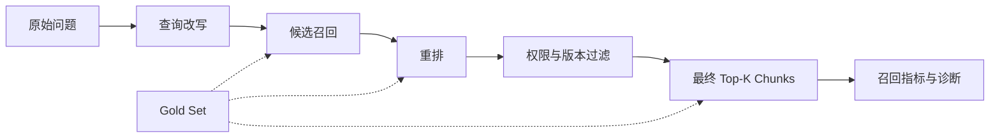
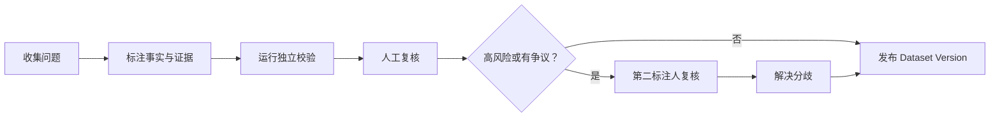

# RAG 召回测评详细设计

> 状态：Draft
> 日期：2026-07-22
> 范围：只定义 Retrieval Evaluation，不包含回答正确性、Faithfulness、Citation 和 LLM Judge
> 主要参考：[AIGC Camp：RAG 评估 Evaluation](https://aigccamp.com/rag/evaluation)

## 1. 文档目的

本文重新定义 Manta 的召回测评方法。

这次设计不从“怎样让现有任务跑通”开始，而从三个更基础的问题开始：

1. 什么叫召回正确？
2. 用什么样的 Gold Set 才能稳定判断召回是否变好？
3. 当指标变化时，怎样判断问题来自候选召回、重排、切分、版本过滤还是权限过滤？

Gold Set 指人工确认过问题、标准证据和预期行为的固定评测集。没有可信的 Gold Set，Recall、MRR 和 nDCG 只是在对不稳定标签做精确计算。

本文替代此前方案中与召回测评方法有关的内容。策略构建失败、Qdrant collection 清理和任务重试属于实施可靠性问题，应在测评定义稳定后处理。

## 2. 设计结论

Manta 的召回测评应采用下面的核心模型：

- Gold Set 先于策略调参建立。
- Gold 标注绑定稳定的来源证据，不绑定会随 chunking 改变的 Chunk ID。
- 同时评估“相关文档是否出现”和“回答所需证据是否完整出现”。
- 在 `K=1/3/5/10` 多个位置计算指标，不能只看策略当前的一个 `topK`。
- 候选召回和 reranker 分开保存、分开评分。
- no-answer、旧版本文档、权限文档和近似干扰文档必须成为正式测试样本。
- 每条 Case 保留完整 Trace，并按业务 Slice 聚合。
- 不输出一个综合总分。不同指标对应不同错误类型。
- 比较策略时固定数据集和源语料，允许 chunking、embedding、hybrid、reranker 等候选变量不同。

## 3. 测评边界

### 3.1 本文评什么

本文只评从用户问题到检索上下文的过程：



需要测量：

- 候选召回是否找到相关来源。
- 重排是否把正确证据推到前面。
- 最终 Top-K 是否覆盖回答所需的全部证据。
- 返回上下文是否包含过多无关或重复内容。
- 是否召回旧版本、禁止访问或明确错误的来源。
- 延迟和结果数量是否满足上下文预算。

### 3.2 本文不评什么

以下内容不属于召回测评：

- 最终答案是否正确。
- 答案是否忠实于上下文。
- 引用是否正确。
- 生成模型是否拒答。
- Prompt 和生成模型质量。

这些指标需要使用同一份 Retrieval Trace，但应在独立的 Generation Evaluation 中计算。

## 4. 召回测评需要回答的问题

一份有效报告必须能回答下面的问题，而不只是展示几个百分比：

| 问题 | 对应判断 |
|---|---|
| 正确来源有没有进入候选集 | Candidate Doc Recall |
| 回答所需证据有没有进入最终上下文 | Evidence Recall |
| 多跳问题的证据是否全部覆盖 | Complete Evidence Hit |
| 第一个有效证据排在第几位 | MRR |
| 高价值来源是否排得更靠前 | nDCG |
| Top-K 中有多少内容真正提供新证据 | New Evidence Precision |
| 是否重复召回同一段内容 | Redundancy Rate |
| 是否召回旧版本或禁止来源 | Forbidden Hit Rate |
| no-answer 问题是否被错误判为有证据 | False Support Rate |
| 改动影响了哪些具体问题和业务切片 | Paired Case Delta / Slice Delta |

## 5. 当前 Manta 设计缺口

当前实现可以保存 Query、`documentId + quote`，并计算 Recall、MRR、nDCG 和零结果率，但还不能形成可信的召回实验。

| 当前设计 | 问题 |
|---|---|
| 每条 Query 至少一个 `relevantSources` | 无法表达 no-answer 和权限拒绝案例 |
| UI 每次只添加一个相关文档和一个 quote | 无法表达 multi-hop 和替代证据 |
| `textOverlaps()` 用字符串窗口判断命中 | 容易受空白、OCR、重新切分和短字符串影响 |
| Recall 只按相关文档去重 | 文档出现但答案片段没有出现时仍可能误判 |
| nDCG 对每个相关 Chunk 累加收益 | 同一文档重复 Chunk 会使结果超过 1 |
| 只按策略 `topK` 计算一次 | 看不到证据在 Rank 3、5、10 的风险变化 |
| `zeroResultRate` 只判断结果为空 | 返回十条噪声仍被当作非零成功 |
| 没有 Slice、Risk 和 Case Family | 平均分会掩盖高风险问题与重复改写问题 |
| 没有旧版本和禁止来源标签 | 无法识别“忠实引用了错误政策”的召回失败 |
| 只保存最终结果 | 无法区分候选召回失败和 reranker 排序失败 |

因此第一项工作应是重新定义 Dataset、Gold Evidence 和 Scorer，而不是先修改任务执行器。

## 6. 评测基本单位

### 6.1 Case

Case 是一个可独立判定的用户问题。每个 Case 只代表一种明确的信息需求。

同一业务意图的不同说法应创建成多个 Case，并通过 `familyId` 归组。例如：

- “离职后多久必须行权？”
- “员工离职的 vested options 行权窗口？”
- “离职期权 90 天这个规定在哪里？”

这样既能测 query 表达变化，又能避免三个改写在总体平均中把一个业务意图放大三倍。

### 6.2 Source Document

Source Document 是稳定的原始来源版本，例如一份 PDF、Markdown 或网页快照。

Gold 标注必须绑定：

- `documentId`
- `sourceSha256`
- `sourceVersion`
- 规范化文本哈希或 PDF 页定位

只绑定文件名不够。相同文件名的 2023 和 2025 政策必须被视为不同来源版本。

### 6.3 Evidence Anchor

Evidence Anchor 是能够支持一个必要事实的最小充分原文范围。它不等于 Chunk。

一个 Anchor 可以用以下方式定位：

- 规范化文本的 `startOffset/endOffset`
- PDF 的 `page + text offsets`
- 表格的 `page + tableId + row/column`
- 原文 quote 和 quote hash 作为校验信息

Chunk 由被测策略生成，可能随切分参数变化。Anchor 属于 Gold Set，必须保持独立。

### 6.4 Evidence Group

Evidence Group 表示回答一个必要事实时可以接受的一个或多个替代证据。

- Group 内的 Anchors 是 OR：命中任意一个即可覆盖该事实。
- 所有 `required=true` 的 Groups 是 AND：必须全部覆盖，才算多跳问题完整召回。

例子：回答“2025 年采购合同超过多少需要法务复核，何时生效？”至少需要两个 Group：

1. 阈值是 50 万。
2. 2025 新政策的生效时间或版本信息。

只召回阈值，不能算完整命中。

## 7. Gold Set 构造

### 7.1 先标注，再调参数

Gold Set 必须在调整 chunk size、embedding、hybrid 权重或 reranker 之前冻结一个版本。

如果先看候选策略结果再改标签，测评会逐渐变成对当前策略的适配，而不是独立判断。

### 7.2 Case 来源优先级

推荐按以下顺序收集问题：

1. 真实用户日志中的高频问题。
2. 已知失败和线上事故。
3. 领域专家提供的高风险问题。
4. 文档中新旧版本、相似概念和容易混淆的事实。
5. Synthetic Q&A，仅用于冷启动和补覆盖。

Synthetic Q&A 指由模型根据文档生成的问题。它通常表达完整、没有错别字、直接复用原文词汇，因此不能作为主要来源。

高风险 Case 不允许只由模型生成并自动发布，必须有人确认问题、证据和预期行为。

### 7.3 初始规模

参考文档建议先建立 30 到 100 条高质量问题。Manta 第一版建议准备约 60 条，但 Slice 可以重叠：

| Slice | 最低建议数量 | 重点 |
|---|---:|---|
| `exact-identifier` | 10 | API 名、错误码、版本号、政策编号 |
| `exact-number` | 10 | 金额、时间、比例、阈值 |
| `date-sensitive` | 10 | 新版覆盖旧版、有效期 |
| `multi-hop` | 10 | 两个以上 Evidence Groups |
| `no-answer` | 10 | 知识库没有答案 |
| `permission` | 5 | 文档存在但当前主体无权访问 |
| `table-pdf` | 10 | 表格、PDF、跨页文本 |
| `abbreviation-typo` | 10 | 缩写、省略、拼写错误 |
| `near-duplicate` | 10 | 高相似干扰文档、旧政策、相似接口 |

这里的数量不是相加关系。一条 Case 可以同时属于 `exact-number`、`date-sensitive` 和 `near-duplicate`。

### 7.4 数据来源比例

第一版可以使用下面的启发式分布：

- 真实日志和人工改写：约 40%。
- 历史失败与已知事故：约 25%。
- 专家设计的高风险问题：约 25%。
- Synthetic 扩展：不超过 10%。

该比例不是固定标准。上线后应持续提高真实日志和事故 Case 的占比。

### 7.5 问题质量要求

每条问题发布前必须满足：

- 问题能够从指定语料版本中明确判断是否可回答。
- 预期答案摘要和证据一致。
- 证据不是仅仅主题相关，而是能支持必要事实。
- 如果有多个等价来源，全部作为替代 Anchor 标出。
- 如果有旧版或容易混淆的来源，标为 Forbidden Source。
- 如果是权限 Case，记录测试主体和允许访问范围。
- 问题不能泄漏原文中独特、非自然的长字符串，除非 Slice 本身就是 exact identifier。

## 8. Dataset 与 Case 数据模型

### 8.1 Dataset Version

```ts
interface RetrievalEvalDatasetVersion {
  id: string
  datasetId: string
  version: number
  name: string
  status: 'draft' | 'in_review' | 'published' | 'retired'
  knowledgeBaseId: string
  corpusManifest: {
    sourceManifestHash: string
    documents: Array<{
      documentId: string
      sourceSha256: string
      sourceVersion?: string
    }>
  }
  caseIds: string[]
  metricSpecVersion: string
  createdAt: string
  publishedAt?: string
}
```

发布后的版本不可修改。修改问题、证据、Slice 或语料绑定时创建新版本。

### 8.2 Case

```ts
type ExpectedRetrievalBehavior = 'answerable' | 'no_answer' | 'deny'

interface RetrievalEvalCase {
  id: string
  familyId: string
  question: string
  source: 'production_log' | 'incident' | 'expert' | 'synthetic'
  split: 'dev' | 'regression' | 'challenge'
  risk: 'normal' | 'high' | 'critical'
  expectedBehavior: ExpectedRetrievalBehavior
  expectedAnswerSummary?: string
  requiredFacts: Array<{
    id: string
    description: string
  }>
  evidenceGroups: EvidenceGroup[]
  relevanceJudgments: SourceRelevanceJudgment[]
  forbiddenSources: ForbiddenSource[]
  slices: string[]
  principal?: RetrievalPrincipalFixture
}
```

`expectedAnswerSummary` 只帮助标注人确认 Gold Evidence 是否充分，不参与召回分数。

### 8.3 Evidence Group 与 Anchor

```ts
interface EvidenceGroup {
  id: string
  factIds: string[]
  required: boolean
  alternatives: EvidenceAnchor[]
}

interface EvidenceAnchor {
  id: string
  documentId: string
  sourceSha256: string
  sourceVersion?: string
  locator:
    | { kind: 'text'; startOffset: number; endOffset: number }
    | { kind: 'pdf'; page: number; startOffset?: number; endOffset?: number }
    | { kind: 'table'; page?: number; tableId: string; row?: number; column?: number }
  quote: string
  quoteHash: string
}
```

### 8.4 Source Relevance

```ts
interface SourceRelevanceJudgment {
  documentId: string
  sourceSha256: string
  grade: 0 | 1 | 2 | 3
  reason: string
}
```

等级定义：

| Grade | 含义 | 是否计入主要 Recall |
|---:|---|---|
| 3 | 直接包含决定性答案证据 | 是 |
| 2 | 回答所必需的支持信息或 multi-hop 一环 | 是 |
| 1 | 主题相关，但不足以回答 | 否 |
| 0 | 无关 | 否 |

### 8.5 Forbidden Source

```ts
interface ForbiddenSource {
  documentId: string
  sourceSha256?: string
  reason: 'outdated' | 'unauthorized' | 'known_wrong' | 'confuser'
}
```

Forbidden Source 不使用负 nDCG gain。它单独形成错误指标，避免一个安全问题被其他高分抵消。

### 8.6 完整 Case 示例

```json
{
  "id": "purchase-policy-2025-threshold",
  "familyId": "purchase-policy-threshold",
  "question": "采购合同超过多少需要法务复核？",
  "source": "incident",
  "split": "regression",
  "risk": "critical",
  "expectedBehavior": "answerable",
  "expectedAnswerSummary": "2025 版政策规定超过 50 万需要法务复核。",
  "requiredFacts": [
    { "id": "threshold", "description": "复核阈值是 50 万" },
    { "id": "version", "description": "应使用 2025 生效版本" }
  ],
  "evidenceGroups": [
    {
      "id": "threshold-evidence",
      "factIds": ["threshold"],
      "required": true,
      "alternatives": [
        {
          "id": "policy-2025-threshold",
          "documentId": "purchase_policy_2025",
          "sourceSha256": "<sha256>",
          "sourceVersion": "2025",
          "locator": { "kind": "text", "startOffset": 420, "endOffset": 458 },
          "quote": "采购合同金额超过 50 万元时，必须提交法务复核。",
          "quoteHash": "<quote-hash>"
        }
      ]
    },
    {
      "id": "version-evidence",
      "factIds": ["version"],
      "required": true,
      "alternatives": [
        {
          "id": "policy-2025-effective-date",
          "documentId": "purchase_policy_2025",
          "sourceSha256": "<sha256>",
          "sourceVersion": "2025",
          "locator": { "kind": "text", "startOffset": 80, "endOffset": 110 },
          "quote": "本政策自 2025 年 1 月 1 日起生效。",
          "quoteHash": "<quote-hash>"
        }
      ]
    }
  ],
  "relevanceJudgments": [
    { "documentId": "purchase_policy_2025", "sourceSha256": "<sha256>", "grade": 3, "reason": "包含当前有效阈值与生效版本" },
    { "documentId": "purchase_policy_2023", "sourceSha256": "<old-sha256>", "grade": 0, "reason": "已失效，正式评测中不视为相关来源" }
  ],
  "forbiddenSources": [
    { "documentId": "purchase_policy_2023", "sourceSha256": "<old-sha256>", "reason": "outdated" }
  ],
  "slices": ["policy", "exact-number", "date-sensitive", "near-duplicate"]
}
```

## 9. 数据集拆分与治理

### 9.1 Split

| Split | 用途 | 是否允许调参时查看 |
|---|---|---|
| `dev` | 开发和快速诊断 | 是 |
| `regression` | 固定回归门禁 | 可以看结果，不应为单条 Case 定向调参 |
| `challenge` | 防止对固定评测集过拟合 | 默认隐藏详细标签 |

可以从 `regression` 中维护一个 10 到 20 条的 `smoke` 子集，用于快速检查，但 smoke 不是新的标注类型。

### 9.2 审核流程



独立校验至少检查：

- Anchor 是否能在绑定的 source hash 中定位。
- 所有 required facts 是否至少有一个 Evidence Group。
- Group 是否至少有一个有效 Alternative。
- no-answer 和 deny Case 是否没有 required Evidence Group。
- Forbidden Source 是否真实存在于绑定语料或权限范围中。
- `familyId`、Slice 和 Split 是否有效。

### 9.3 变更规则

下面任何变化都必须产生新 Dataset Version：

- 修改问题文本。
- 增删 Evidence Anchor。
- 修改 source hash 或 source version。
- 修改 expected behavior。
- 修改 risk、split 或 Slice。
- 修改 metric spec version。

## 10. 实验设计

### 10.1 固定项与可变项

一次有效的策略比较必须固定：

- Dataset Version。
- Source Corpus Manifest。
- Case 集合和 K Grid。
- 权限主体与过滤条件。
- Metric Spec Version。
- 运行环境和超时规则。

允许变化的候选策略包括：

- Parser。
- Chunk size、overlap 和 semantic chunking。
- Embedding model。
- Dense、BM25、Hybrid 和融合参数。
- Query rewrite。
- Reranker。
- Threshold。

不同策略的 index hash 本来就会不同。比较条件应要求源文档版本一致，而不是要求索引或 Chunk 一致。

### 10.2 单变量与组合实验

默认使用单变量实验。例如只调整 chunk size，其他设置与 Baseline 相同。

如果一次改变多个变量，Run 必须显式记录全部差异，报告不能把收益归因到其中某一个变量。

### 10.3 K Grid

每条 Query 一次取回 `maxK=10`，然后从同一结果列表计算：

- K=1
- K=3
- K=5
- K=10

如果产品实际上下文只使用 Top-5，Top-10 仍用于判断证据是完全漏召回，还是只排得不够靠前。

不能为每个 K 重新运行检索，因为非确定性、缓存和延迟会使结果不再是同一次实验。

### 10.4 候选召回与重排分离

使用 reranker 的策略必须保留两个序列：

1. `candidateResults`：Dense/BM25/Hybrid 产生的 Top-N。
2. `finalResults`：reranker 处理后的 Top-K。

两组结果使用相同 Gold 标注评分。

- Candidate Recall 低：问题在召回器、切分、embedding、query rewrite 或过滤。
- Candidate Recall 高但 Final Recall 低：reranker 把正确证据排掉了。
- 两者 Recall 都高但 MRR 低：相关证据存在，但位置不稳定。

### 10.5 相似度分数

不把平均向量相似度作为质量指标。

相似度分数跨 Query、跨 embedding 模型和跨归一化方式通常不可直接比较。它只保存在 Trace 中，用于同一 Query 的诊断和 threshold 校准。

## 11. Retrieval Trace

每条 Case 必须保存下面的信息：

```ts
interface RetrievalEvalTrace {
  runId: string
  caseId: string
  familyId: string
  datasetVersionId: string
  sourceManifestHash: string
  metricSpecVersion: string
  question: string
  rewrittenQueries: string[]
  principal?: RetrievalPrincipalFixture
  filters?: unknown
  strategySnapshot: {
    parser: unknown
    chunker: unknown
    embedding: unknown
    sparse?: unknown
    fusion?: unknown
    reranker?: unknown
    threshold?: number
  }
  candidateResults: RetrievedChunkTrace[]
  finalResults: RetrievedChunkTrace[]
  metricsByK: Record<string, RetrievalCaseMetrics>
  latency: {
    rewriteMs?: number
    candidateMs: number
    rerankMs?: number
    totalMs: number
  }
  status: 'scored' | 'infra_failed' | 'invalid_gold'
  error?: { code: string; message: string }
}
```

每个 Retrieved Chunk 至少保存：

- Rank。
- Chunk ID。
- Document ID、source hash 和 source version。
- Chunk text hash。
- 原文定位信息。
- Dense、sparse、fusion 和 rerank score。
- 命中的 Evidence Anchor 和 Evidence Group。
- 是否首次覆盖新证据。
- 是否命中 Forbidden Source。

基础设施失败不计为 Recall=0。它使用 `infra_failed` 状态单独统计。

## 12. Gold 匹配算法

### 12.1 匹配顺序

一个 Retrieved Chunk 是否命中 Evidence Anchor，按以下顺序判断：

1. `documentId` 必须相同。
2. `sourceSha256` 必须相同。
3. 根据 locator 计算原文范围覆盖。
4. quote hash 或规范化 quote 用于检测定位数据是否失效。

不能只用文档 ID。旧版文档和新版文档可能共享逻辑 ID，但 source hash 不同。

### 12.2 文本范围覆盖

对于文本 Anchor：

```text
anchorCoverage = intersection(chunkRange, anchorRange) / length(anchorRange)
```

默认 `anchorCoverage >= 0.8` 才算命中。阈值必须写入 `metricSpecVersion`，不能在历史 Run 上静默修改。

Anchor 应标注为“最小充分证据”，避免一段过长的 Anchor 因为只差无关句子而被判定失败。

### 12.3 PDF 与表格

- PDF Anchor 至少要求页码相同，并验证规范化 quote。
- 表格 Anchor 必须保留表头、行列定位或转换后的结构路径。
- 只召回单元格数值但丢失对应列名时，不应算完整证据。

### 12.4 Evidence Group 覆盖

- 一个 Chunk 命中 Group 内任意 Anchor，该 Group 被覆盖。
- 同一 Group 被多个 Chunk 命中，只计一次 Recall。
- 重复 Chunk 仍会增加冗余率。
- 所有 required Groups 都被覆盖时，Case 才算 Complete Evidence Hit。

### 12.5 Legacy 匹配

当前 `textOverlaps()` 可以作为旧数据迁移期间的 `legacy_text_match`，但结果必须带 `matchConfidence=legacy`。

Legacy Match 不应进入正式回归 Gate，因为它无法稳定比较不同 chunking 策略。

## 13. 指标定义

### 13.1 指标命名规则

报告中禁止使用没有粒度的单独 `Recall@K`。

必须明确是：

- `DocRecall@K`
- `EvidenceRecall@K`
- `CandidateDocRecall@N`
- `FinalEvidenceRecall@K`

否则文档出现但答案片段未出现时，团队会对“Recall 成功”产生不同解释。

### 13.2 Doc Hit@K

```text
DocHit@K = 1，当 Top-K Chunks 中至少出现一个 grade >= 2 的 Source Document
         = 0，其他情况
```

适合单事实问题的快速判断，但不能说明 multi-hop 是否完整。

### 13.3 Doc Recall@K

```text
DocRecall@K = Top-K 中出现的唯一相关文档数 / Gold 相关文档总数
```

相关文档指 grade 为 2 或 3 的来源。相同文档的多个 Chunk 只计一次。

### 13.4 Evidence Recall@K

```text
EvidenceRecall@K = Top-K 覆盖的 required Evidence Groups 数 / required Groups 总数
```

这是 Manta 的主要召回覆盖指标。它直接回答：生成答案所需的信息是否进入上下文。

### 13.5 Complete Evidence Hit@K

```text
CompleteEvidenceHit@K = 1，当全部 required Evidence Groups 都在 Top-K 被覆盖
                      = 0，其他情况
```

对 multi-hop Case，Evidence Recall=0.5 说明只找到了部分信息；Complete Hit=0 表示仍不能安全回答。

### 13.6 MRR@K

```text
MRR@K = 1 / 第一个 grade >= 2 的文档首次出现的 Rank
```

没有命中时为 0。

MRR 只看第一个有效来源。它适合判断“证据是否足够靠前”，但不能替代 Evidence Recall 和 Complete Hit。

### 13.7 nDCG@K

对每个来源使用 relevance grade：

```text
gain(grade) = 2^grade - 1
DCG@K = Σ gain_i / log2(rank_i + 1)
nDCG@K = DCG@K / IDCG@K
```

计算规则：

- 同一 Source Document 只在第一次出现时获得 gain。
- 同一文档后续重复 Chunk 的 gain 为 0。
- IDCG 使用 Gold 文档 grade 从高到低生成理想排序。
- Grade 1 可以提供较低排序收益，但不计入主要 Recall。
- Forbidden Source 的 gain 固定为 0，并另行统计错误率。

这样 nDCG 始终位于 `[0, 1]`，重复相关 Chunk 不会把分数推高。

### 13.8 New Evidence Precision@K

```text
NewEvidencePrecision@K = Top-K 中首次覆盖新 Evidence Group 的 Rank 数 / 实际返回数
```

它衡量有限上下文预算中有多少 Chunk 带来了新证据。

同一 Anchor 的重复 Chunk不计作新证据，因此该指标会惩罚重复召回。

### 13.9 Evidence Chunk Precision@K

```text
EvidenceChunkPrecision@K = Top-K 中命中任意 Evidence Anchor 的 Chunk 数 / 实际返回数
```

该指标反映上下文噪声，但需要与 New Evidence Precision 一起看。多个重复 Chunk 都可能相关，却没有新增信息。

### 13.10 Redundancy Rate@K

```text
RedundancyRate@K = 只重复覆盖已有 Evidence Group 的 Chunk 数 / 实际返回数
```

Redundancy 高通常意味着 overlap 过大、去重不足或 reranker 偏好相似片段。

### 13.11 No Relevant Hit Rate@K

```text
NoRelevantHitRate@K = answerable Cases 中 CompleteEvidenceHit@K=0 且 EvidenceRecall@K=0 的比例
```

它与 `zeroResultRate` 不同。返回十条无关内容仍然属于 No Relevant Hit。

### 13.12 Minimal Complete K

```text
MinimalCompleteK = 第一次覆盖全部 required Evidence Groups 的最小 K
```

如果 `maxK` 内没有完整覆盖，值为 `null`。

该指标可以直接判断上下文预算风险。例如答案证据只在 K=8 完整出现，而产品只发送 Top-5，召回不能视为成功。

### 13.13 Forbidden Hit Rate

分别计算：

- `OutdatedHitRate@K`
- `UnauthorizedHitRate@K`
- `KnownWrongHitRate@K`
- `ConfuserHitRate@K`

每个 Hit Rate 的定义都是：适用 Cases 中，Top-K 至少出现一次对应 Forbidden Source 的 Case 比例。报告同时显示命中 Case 数和适用 Case 总数。

Critical Case 中命中 unauthorized 或 known_wrong 来源应直接触发 Hard Gate，不允许被总体 Recall 抵消。

### 13.14 no-answer 与 deny Case

no-answer Case 没有 Gold Evidence，因此 Doc Recall、Evidence Recall、MRR 和 nDCG 都为 `null`，不进入这些指标的分母。

检索器通常总能返回相似内容，所以“返回非空”不等于 no-answer 失败。只有系统存在证据充分性判断时，才能计算：

```text
FalseSupportRate = no-answer Cases 中被判为 sufficient evidence 的比例
CorrectNoEvidenceRate = no-answer Cases 中被判为 insufficient evidence 的比例
```

如果当前系统没有 evidence sufficiency decision，no-answer Case 只用于观察：

- 最大 score 分布。
- score margin。
- Top-K 是否命中明确 Confuser。
- threshold 候选区间。

不能伪造一个“拒答准确率”。

deny Case 还需要计算 `UnauthorizedHitRate@K`。即使最终回答层拒绝，检索层暴露了禁止文档，也算召回失败。

### 13.15 延迟与成本

至少保存：

- Candidate latency P50/P95。
- Rerank latency P50/P95。
- Total retrieval latency P50/P95。
- 返回 Chunk 数。
- 返回字符数或 token 估算。

冷启动和热运行延迟分开统计，不能把第一次模型加载混入普通 P95 后再与另一策略比较。

## 14. Case 聚合规则

### 14.1 Macro Average

默认先对每条 Case 计算指标，再对 Case 做等权平均。

不能把所有 Evidence Groups 混在一起做 Micro Average，否则 multi-hop Case 会因为证据更多而获得更高权重。

### 14.2 Case Family

同一 `familyId` 下有多个问法时：

1. 先计算每条 Case。
2. 再计算 Family 平均。
3. 总体指标按 Family 等权聚合。

这样增加五个同义改写不会让一个业务意图主导总体分数。

### 14.3 Slice

每个 Slice 必须展示：

- Case 数量 `N`。
- 成功数/失败数。
- 指标值。
- Baseline 与 Candidate 差值。
- 具体 Regression Case 数量。

当 Slice 的 `N < 10` 时标记“样本不足”，仍展示明细，但不据此声称总体提升。

### 14.4 小样本解释

30 到 100 条 Gold Set 中，一条 Case 就可能改变总体指标 1 到 3 个百分点。

因此报告必须同时显示：

- 百分比。
- 分子/分母。
- 每条 Case 的 paired delta。
- Hit Rate 的置信区间或 Bootstrap 区间。

平均分增加 0.02，但只是一个简单 FAQ 从失败变成功，不能自动视为明显提升。

## 15. Baseline 与 Candidate 比较

### 15.1 可比较条件

两个 Run 可以形成正式回归结论，需要满足：

- Dataset Version 相同。
- Source Manifest Hash 相同。
- Metric Spec Version 相同。
- Case、Split 和 K Grid 相同。
- Principal 和权限规则相同，除非实验目标就是权限过滤。
- 运行状态没有 `infra_failed` 或明确排除这些 Case。

Parser、Chunker、Embedding、Retriever 和 Reranker 可以不同，这些正是需要比较的变量。

### 15.2 Paired Delta

每条 Case 计算 Candidate 减 Baseline：

- Win：Candidate 改善。
- Tie：相同。
- Regression：Candidate 变差。

报告首先展示 Regression Case，再展示平均值变化。因为同样的总体 +2%，可能来自：

- 20 条各改善一点且无回归。
- 10 条简单问题改善，但 2 条高风险问题失败。

两者产品含义完全不同。

### 15.3 置信区间

对连续指标使用 paired bootstrap，对 Hit Rate 使用比例区间。

建议至少 1,000 次 Bootstrap 重采样，并保存随机种子。样本过小时区间会很宽，这是评测集覆盖不足的信号，不应隐藏。

## 16. 回归 Gate

### 16.1 Hard Gate

下面情况默认直接失败：

- Critical permission Case 出现 Unauthorized Hit。
- Critical policy Case 命中 `known_wrong` 来源。
- Candidate 新增高风险 Complete Evidence Regression。
- Gold 数据失效或 Anchor 无法定位。
- Run 存在未解释的基础设施失败。

### 16.2 Metric Gate

阈值应由 Manta 的 Baseline 和业务风险校准，不直接照搬通用数字。建议配置结构：

```json
{
  "metric": "CompleteEvidenceHit@5",
  "scope": { "split": "regression", "slice": "all" },
  "rule": "delta_gte",
  "value": 0
}
```

可以配置：

- 总体 Complete Evidence Hit 不下降。
- Evidence Recall@5 的允许回退范围。
- `date-sensitive` 和 `permission` Slice 不允许回退。
- P95 延迟允许增加的比例。
- Context token 预算上限。

第一版 Gate 应先基于 Baseline 回放和人工检查设定，避免为了追求一个任意绝对分数而调参。

## 17. 报告设计

### 17.1 报告首页

首页不显示综合分，展示：

1. Complete Evidence Hit@1/3/5/10 曲线。
2. Evidence Recall@1/3/5/10 曲线。
3. MRR 与 nDCG。
4. New Evidence Precision 与 Redundancy。
5. Forbidden Hits。
6. P50/P95 latency。
7. Win / Tie / Regression Case 数量。

### 17.2 Slice 表

至少包括：

- exact identifier。
- exact number。
- date-sensitive。
- multi-hop。
- no-answer。
- permission。
- table/PDF。
- abbreviation/typo。
- near-duplicate。
- high-risk/critical。

### 17.3 Case 下钻

每条 Case 展示：

- 问题、Family、Risk 和 Slices。
- Required Facts 和 Evidence Groups。
- Baseline/Candidate 指标对比。
- Candidate Results 和 Final Results。
- 每个 Chunk 的来源版本、Rank、score 和命中 Anchor。
- 首次覆盖的新证据。
- 重复 Chunk、Forbidden Source 和权限问题。
- 失败诊断建议。

### 17.4 诊断矩阵

| 现象 | 更可能的问题 |
|---|---|
| Candidate Doc Recall 低 | embedding、BM25、query rewrite、filter 或 source parsing |
| Candidate 高，Final 低 | reranker 排错或 threshold 过高 |
| Doc Recall 高，Evidence Recall 低 | 文档找到了，但 chunking 没切到答案片段 |
| Evidence Recall 高，MRR 低 | 证据存在但排序靠后，上下文预算有风险 |
| Precision 低、Redundancy 低 | Top-K 噪声多 |
| Precision 高、Redundancy 高 | 反复召回同一证据，浪费上下文 |
| Date-sensitive Slice 失败 | 新旧版本过滤或 source version 标记错误 |
| Permission Slice 泄漏 | 检索过滤没有使用真实 principal |
| no-answer score 与 answerable 重叠 | threshold 难以区分，需要更好的负样本或 sufficiency 模型 |

## 18. Scorer 测试设计

Scorer 应先于完整运行器实现，并使用纯内存 Fixtures 验证。

### 18.1 必测 Fixtures

1. 相关文档在 Rank 3：Hit@3=1，MRR=1/3，Hit@2=0。
2. 同一相关文档重复三个 Chunk：Doc Recall 不增加，nDCG 不超过 1，Redundancy 增加。
3. multi-hop 只命中一半证据：Evidence Recall=0.5，Complete Hit=0。
4. 一个 Evidence Group 有两个替代来源：命中任意一个即可覆盖。
5. 文档相关但答案 Anchor 未进入 Chunk：Doc Recall 成功，Evidence Recall 失败。
6. 旧版政策排第一、新版排第三：Forbidden Hit=1，MRR/nDCG 按新版 Gold 计算。
7. no-answer 返回相似内容但 decision=insufficient：不计算 Recall，No-Evidence 判断正确。
8. no-answer 返回相似内容且 decision=sufficient：False Support=1。
9. permission Case 返回无权文档：Unauthorized Hit=1，Hard Gate 失败。
10. OCR 空白变化但 offsets 有效：Anchor 正确命中。
11. source hash 改变：Gold 失效，不把 Case 记为 Recall=0。
12. 基础设施错误：状态为 infra_failed，不进入质量指标分母。

### 18.2 数学不变量

- 所有比例指标位于 `[0, 1]`。
- nDCG 位于 `[0, 1]`。
- K 增大时 Evidence Recall 和 Complete Hit 不下降。
- 重复同一 Chunk 不提高 Doc Recall 或 Evidence Recall。
- no-answer Case 的 Recall、MRR 和 nDCG 为 null。
- 相同 Trace 和 Metric Spec 必须得到完全相同的结果。

### 18.3 Golden Report

维护一组固定 JSON Trace 和预期报告快照。每次修改 Metric Spec 时：

- 新建版本。
- 同时保留旧 Scorer，或显式迁移历史结果。
- 禁止让历史 Run 在没有版本变化的情况下改变分数。

## 19. 产品交互

### 19.1 Gold Set 编辑器

编辑器不应只提供“问题、相关文档、quote”三个输入框。需要支持：

- Expected Behavior。
- Expected Answer Summary。
- Required Facts。
- 多个 Evidence Groups。
- Group 内多个 Alternative Anchors。
- 0 到 3 的 Source Relevance。
- Forbidden Sources。
- Risk、Split 和 Slices。
- Principal Fixture。
- Anchor 定位预览和失效校验。

### 19.2 Dataset 发布

发布前显示：

- Case 总数和来源分布。
- 各 Slice 数量。
- no-answer/deny 数量。
- Synthetic 占比。
- 无效 Anchor。
- 未审核的高风险 Case。
- 重复问题或 Family 过度代表。

存在无效 Anchor 或未审核 Critical Case 时禁止发布。

### 19.3 策略对比

用户选择：

- 一个 Published Dataset Version。
- 一个 Baseline。
- 一个或多个 Candidate。
- K Grid。
- 需要执行的 Split/Slice。

运行前先展示策略差异，而不是只展示策略名称。

## 20. 实施顺序

### Phase 1：定义 Gold 与 Scorer

目标：即使不连接 Qdrant，也能用固定 Trace 验证测评定义。

- 定义 Dataset V2、Case、Evidence Group 和 Anchor Schema。
- 定义 Metric Spec Version。
- 实现纯函数 Scorer。
- 完成全部数学 Fixtures 和 Golden Report。
- 编写 30 到 60 条初始 Gold Cases。

### Phase 2：采集 Retrieval Trace

目标：把真实检索运行转换为 Scorer 输入。

- 保存 Query rewrite。
- 保存 Candidate 和 Final Results。
- Chunk 增加 source hash 与 source locator。
- 保存 Principal、Filters 和策略快照。
- 区分 invalid gold、infra failure 和质量失败。

### Phase 3：策略对比与报告

目标：能够判断改动改善了哪些 Case，又破坏了哪些 Case。

- 多 K 曲线。
- Slice 聚合。
- Paired Delta。
- Regression Gate。
- Case Trace 下钻。

### Phase 4：运行可靠性

在测评输入、算法和预期输出确定后，再处理：

- 策略构建的原文兼容。
- 任务重试。
- 失败 collection 清理。
- 中断恢复。

这样修复运行链路时，有稳定的 Scorer Fixtures 和验收目标，不会出现“任务成功了，但不知道结果是否可信”。

## 21. 代码改动地图

| 文件或模块 | 计划改动 |
|---|---|
| `packages/contracts/src/index.ts` | Dataset V2、Case、Evidence、Trace、Metric Schema |
| `packages/backend/src/core/engine/rag/retrieval-evaluation-scorer.ts` | 新增纯函数 Scorer |
| `packages/backend/src/core/engine/rag/retrieval-evaluation-scorer.test.ts` | 指标 Fixtures、数学不变量、Golden Cases |
| `packages/backend/src/core/engine/rag/retrieval-lab-store.ts` | 不可变 Dataset Version、Run Trace、Metric Spec |
| `packages/backend/src/core/engine/rag/retrieval-lab-executors.ts` | 采集 Candidate/Final Trace，不在 Executor 内硬编码公式 |
| `packages/backend/src/routes/retrieval-lab.ts` | Dataset 发布、版本、比较和报告 API |
| `packages/frontend/src/pages/evaluation/page.tsx` | Gold 编辑器、K 曲线、Slice、Regression 和 Case 下钻 |
| `packages/rag` | Chunk 增加 source hash、source offsets、page/table locator |

第一批代码只应修改 Contracts、Scorer 和 Tests。它不依赖当前策略构建是否可用。

## 22. 验收标准

### 22.1 Gold Set

- 支持 answerable、no-answer 和 deny。
- 支持 multi-hop Required Groups。
- 支持同一事实的替代 Evidence。
- 支持旧版、禁止和干扰来源。
- Gold 不依赖 Chunk ID。
- 发布版本不可修改。

### 22.2 Scorer

- 能分别输出 Doc Recall 和 Evidence Recall。
- 能输出 K=1/3/5/10 曲线。
- 重复 Chunk 不提高 Recall 或 nDCG。
- nDCG 永远不超过 1。
- multi-hop 部分命中不会被判为完整成功。
- no-answer 不污染 Recall 分母。
- infra failure 不伪装成质量失败。
- 相同 Trace 可确定性重放。

### 22.3 报告

- 不使用单一综合分。
- 能看到 Baseline/Candidate 的逐 Case Win/Tie/Regression。
- 能按 Slice 和 Risk 聚合。
- 能区分候选召回与 reranker 问题。
- 能识别旧版本、权限和重复上下文。
- 每个失败指标都能下钻到具体来源、Chunk 和 Gold Anchor。

## 23. 与 AIGC Camp 文档的对应关系

| AIGC Camp 原则 | 本设计落地 |
|---|---|
| 先做 gold set，再调参数 | Dataset Version、审核与 Split |
| 先看有没有捞到，再看排得多靠前 | Evidence Recall、Complete Hit、MRR、nDCG |
| synthetic Q&A 太干净 | 限制 Synthetic 占比，优先日志、事故和专家问题 |
| 平均分掩盖高风险切片 | Slice、Risk、Hard Gate 和 Paired Regression |
| eval set 和知识库要有版本 | Dataset Version、Source Manifest、Metric Spec |
| 评估必须回放同一次 trace | Candidate/Final Results、策略快照、Chunk hash |
| 相似度平均分不能替代排名指标 | score 只用于单 Query 诊断和 threshold 校准 |
| no-answer 和 permission 必须覆盖 | Expected Behavior、Principal、False Support、Unauthorized Hit |

## 24. 参考与关联文档

- [AIGC Camp：RAG 评估 Evaluation](https://aigccamp.com/rag/evaluation)
- [早期评估系统技术方案](./06-evaluation.md)
- [知识库技术方案](./03-knowledge-base.md)
- [数据模型](./08-data-model.md)
- [评估系统 PRD](../prd/06-evaluation.md)
