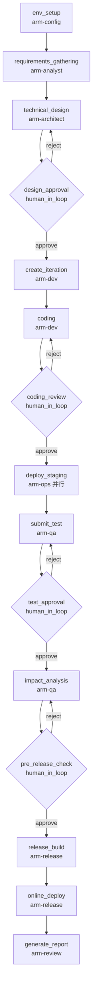

# Plateco 前端需求开发 - Agent 角色说明

本文档详细说明了 `plateco-frontend-dev` 工作流中各 Agent 的职责和系统提示词。

---

## Agent 角色一览

| Agent ID | 角色名称 | 负责阶段 | 状态 |
|---------|---------|---------|------|
| arm-config | 环境配置专员 | 环境准备 | ✅ 已创建 |
| arm-analyst | 需求分析师 | 需求获取与理解 | ✅ 已创建 |
| arm-architect | 架构师 | 技术方案规划 | ✅ 已创建 |
| arm-dev | 开发工程师 | 创建迭代、编码 | ✅ 已创建 |
| arm-ops | 运维工程师 | 部署 Staging/PRT 环境 | ✅ 已创建 |
| arm-qa | 测试工程师 | 提测、影响面分析、巡检 | ✅ 已创建 |
| arm-release | 发布专员 | 发布构建、线上部署 | ✅ 已创建 |
| arm-review | 审查员 | 变更报告 | ✅ 已创建 |

---

## 工作流步骤与 Agent 分配



---

## 详细 Agent 说明

### 1. arm-config - 环境配置专员

**职责**：检查开发环境是否满足 plateco 前端开发要求

**检查项**：
- SSO 登录状态
- takumi CLI 安装与配置
- git 配置（用户名、邮箱）
- kdev 工具链
- Python3 环境
- 必要的环境变量

**系统提示词位置**：`~/.openclaw/agents/arm-config/SOUL.md`

---

### 2. arm-analyst - 需求分析师

**职责**：获取并理解需求内容

**输入**：
- Team 任务链接或 taskId
- 需求描述

**输出**：
- task_id, team_url, doc_url, prd_url
- task_title, task_description
- summary (需求理解摘要)

**系统提示词位置**：`~/.openclaw/agents/arm-analyst/SOUL.md`

---

### 3. arm-architect - 架构师

**职责**：制定技术方案

**输入**：
- 需求摘要
- 涉及的业务模块
- 现有代码仓库信息

**输出**：
- plan (技术方案文档)
- files_to_change (需要修改的文件列表)
- repo_url, branch

**系统提示词位置**：`~/.openclaw/agents/arm-architect/SOUL.md`

---

### 4. arm-dev - 开发工程师

**职责**：执行开发任务

**阶段 1 - 创建迭代**：
- 使用 iteration-create.py 创建 KFC 迭代
- 输出 iteration_id, kfc_id, kfc_flow_id, kfc_app_id, kfcIterationUrl

**阶段 2 - 编码开发**：
- 克隆代码仓库
- 创建分支并实现功能
- 提交代码并创建 MR
- 输出 mr_url, changed_files

**系统提示词位置**：`~/.openclaw/agents/arm-dev/SOUL.md`

---

### 5. arm-ops - 运维工程师

**职责**：部署应用到测试环境

**输入**：
- app_name, branch_name, lane

**输出**：
- staging_deploy_url
- prt_deploy_url

**系统提示词位置**：`~/.openclaw/agents/arm-ops/SOUL.md`

---

### 6. arm-qa - 测试工程师

**职责**：质量保证

**阶段 1 - 提测**：
- 使用 step-9-submit-test.py 提交测试
- 输出 kfc_url_test

**阶段 2 - 影响面分析**：
- 执行 git diff 获取改动
- 分析影响范围
- 输出 affected_routes, regression_suggestions

**阶段 3 - 巡检**：
- 创建巡检任务
- 获取巡检结果和截图
- 输出 test_report, screenshot_url

**系统提示词位置**：`~/.openclaw/agents/arm-qa/SOUL.md`

---

### 7. arm-release - 发布专员

**职责**：发布构建和线上部署

**阶段 1 - 发布构建**：
- 生成 release_branch
- 检查 MR 合并状态
- 执行发布构建
- 输出 release_deploy_url

**阶段 2 - 线上部署**：
- 执行线上部署
- 输出 kfc_url_online

**系统提示词位置**：`~/.openclaw/agents/arm-release/SOUL.md`

---

### 8. arm-review - 审查员

**职责**：生成变更报告

**输入**：
- 所有阶段的上下文信息

**输出**：
- report_md (变更报告 Markdown)
- report_summary (报告摘要)

**系统提示词位置**：`~/.openclaw/agents/arm-review/SOUL.md`

---

## Human-in-the-loop 审批点

工作流中有 4 个人工审批节点：

1. **design_approval** (技术方案审批)
   - approve → 进入开发阶段
   - reject → 重新设计技术方案

2. **coding_review** (代码审查确认)
   - approve → 进入部署阶段
   - reject → 重新编码

3. **test_approval** (测试完成确认)
   - approve → 进入影响面分析
   - reject → 重新提测

4. **pre_release_check** (发布前确认)
   - approve → 执行发布构建
   - reject → 重新检查

---

## Context 传递约定

各阶段之间通过 scratchpad 传递数据，常用 key：

```yaml
# 基础信息
run_id, user_token, user_name, user_username, user_email

# 需求阶段
task_id, team_url, doc_url, prd_url, task_title, task_description, summary

# 技术方案阶段
repo_url, repo_path, branch, plan, files_to_change

# 迭代阶段
iteration_id, kfc_id, kfc_flow_id, kfc_app_id, kfcIterationUrl, app_name, lane

# 部署阶段
staging_deploy_url, prt_deploy_url, online_url

# 提测阶段
kfc_url_test

# 质量阶段
affected_routes, regression_suggestions, test_report, screenshot_url

# 发布阶段
release_branch, release_deploy_url, mr_url, kfc_url_online, deployed_at

# 报告阶段
changed_files
```

---

## 文件位置

- **工作流定义**：`workflows/plateco-frontend-dev.yaml`
- **Agent 系统提示词**：`~/.openclaw/agents/<agent-id>/SOUL.md`
- **Agent 配置**：`~/.openclaw/openclaw.json`
- **插件定义**：`plugins/plateco/plugin.yaml`
